# Project Master Documentation

**Project:** QuerySheet — Backend & Frontend  
**Repositories:** `QuerySheet_Backend` · `QuerySheet_Frontend`  
**Backend Stack:** Node.js 18+, Express 5, Firebase Admin SDK, Groq, Google Gemini, Zod, Firestore  
**Frontend Stack:** React 19, Vite, Tailwind CSS v4, Zustand, Recharts, Firebase Client SDK v10  
**Deployment:** Render.com (Singapore, Free tier)  
**Document Version:** Phase 2, Week 1 + Frontend Flows  
**Last Updated:** 2026-06-25  
**Author:** Engineering Team via AI-Assisted Development

> **Living Document Policy:** This file is the single source of truth for all architectural decisions and feature development. Every new Phase/Week must append a new dated `##` section at the bottom of this file — never edit historical sections.

---

## Table of Contents

1. [Project Overview](#1-project-overview)
2. [System Architecture](#2-system-architecture)
3. [Infrastructure & Configuration](#3-infrastructure--configuration)
4. [Middleware Layer](#4-middleware-layer)
5. [Authentication System](#5-authentication-system)
6. [Firestore Data Model](#6-firestore-data-model)
7. [Analysis Pipeline](#7-analysis-pipeline)
8. [Chat System](#8-chat-system)
9. [User Management](#9-user-management)
10. [API Routes](#10-api-routes)
11. [Utilities](#11-utilities)
12. [Security & Deployment](#12-security--deployment)
13. [Phase 2, Week 1 — Refinements & Hardening](#13-phase-2-week-1--refinements--hardening)
14. [Frontend Architecture & Flows](#14-frontend-architecture--flows)
    - 14.1 [Frontend Overview](#141-frontend-overview)
    - 14.2 [Folder Structure](#142-folder-structure)
    - 14.3 [Firebase Client Configuration](#143-firebase-client-configuration)
    - 14.4 [State Management](#144-state-management)
    - 14.5 [API Layer](#145-api-layer)
    - 14.6 [Routing & Navigation](#146-routing--navigation)
    - 14.7 [Authentication Pages & Flows](#147-authentication-pages--flows)
    - 14.8 [Upload Page & File Parsing Flow](#148-upload-page--file-parsing-flow)
    - 14.9 [Dashboard Page](#149-dashboard-page)
    - 14.10 [Chat Page](#1410-chat-page)
    - 14.11 [History Page](#1411-history-page)
    - 14.12 [AppLayout & Navigation Shell](#1412-applayout--navigation-shell)
    - 14.13 [Hooks](#1413-hooks)
    - 14.14 [Full End-to-End User Journey Flows](#1414-full-end-to-end-user-journey-flows)
    - 14.15 [Components Reference](#1415-components-reference)
    - 14.16 [Frontend File Parser](#1416-frontend-file-parser)
    - 14.17 [Frontend Logger](#1417-frontend-logger)

---

## 1. Project Overview

**Prompts Used:**

> "I need you to analyze this entire Node.js/Express backend codebase and generate five software engineering diagrams as Mermaid code. Cross-reference the actual implementation with the master architecture document. Detail implemented features, mark planned but unimplemented features, and note deviations."

**Feature Description:**
QuerySheet is a business intelligence SaaS platform that accepts user-uploaded CSV/Excel datasets, processes them through a multi-provider LLM pipeline (Groq primary, Gemini fallback), and returns structured AI-generated insights, statistics, and chart configurations. Users can then hold contextual follow-up conversations about their data via a real-time streaming chat interface.

**Rationale:**
Traditional BI tools require SQL knowledge or complex setup. QuerySheet removes this barrier — any business user can upload a spreadsheet and immediately receive AI-generated insights, anomaly detection, and actionable recommendations in plain English, then drill deeper through natural language chat.

**Usage:**
The backend exposes a versioned REST API (`/api/v1`) consumed by the `QuerySheet_Frontend` React application. All analysis state is persisted in Firestore under a per-user subcollection hierarchy, enabling analysis history and cross-session chat continuity.

**Architecture:**

```mermaid
graph TB
    subgraph Client["QuerySheet Frontend (React)"]
        UI[Dashboard / Upload]
        Chat[Chat Interface]
        Auth[Auth Pages]
    end

    subgraph Backend["QuerySheet Backend (Express 5 / Node 18)"]
        subgraph MW["Middleware Chain"]
            RID[Request ID]
            HLM[Helmet]
            CRS[CORS]
            CKP[Cookie Parser]
            SAN[Sanitize]
            RLT[Rate Limit]
            AUT[Auth]
        end

        subgraph Routes["API v1"]
            AR[/auth]
            ANR[/analyze]
            CR[/chat]
            UR[/user]
        end

        subgraph Services["Service Layer"]
            AUS[Auth Service]
            ANS[Analyze Service]
            CS[Chat Service]
            US[User Service]
            LLM[LLM Service]
            CACHE[Cache Service]
        end

        subgraph LLMs["LLM Providers"]
            GROQ[Groq<br/>llama-4-scout]
            GEM[Gemini<br/>2.5-flash]
        end
    end

    subgraph Firebase["Firebase / GCP"]
        FST[Firestore DB]
        FAU[Firebase Auth]
    end

    Client --> MW --> Routes --> Services
    Services --> LLMs
    Services --> FST
    AUS --> FAU
```

---

## 2. System Architecture

**Prompts Used:**

> "Analyze this entire Node.js/Express backend codebase and generate five software engineering diagrams as Mermaid code."  
> "Can you create each one of these diagrams in a canvas."

**Feature Description:**
The backend follows a strict layered architecture: Entry Point → Middleware → Router → Controller → Service → Model/Utility → Firestore/LLM. Each layer has a single responsibility, making the codebase testable and maintainable.

**Rationale:**
Separation of concerns ensures that adding a new LLM provider, changing auth strategy, or extending the API does not require touching unrelated layers. The controller layer stays thin, services hold business logic, and utilities are pure functions.

**Usage:**

- `server.js` is the process entry point — starts HTTP server, registers graceful shutdown.
- `src/app.js` is the Express application factory — instantiated once, shared across tests.
- `src/routes/v1/index.js` mounts all sub-routers under `/api/v1`.

### 2.1 Middleware Chain

**Architecture:**

```mermaid
flowchart LR
    REQ[Incoming Request] --> RID[requestId\nattach UUID]
    RID --> HLM[helmet\nCSP / HSTS headers]
    HLM --> CRS[cors\norigin whitelist]
    CRS --> CKP[cookieParser\nparse signed cookies]
    CKP --> BP[express.json\n50 MB limit]
    BP --> SAN[sanitize\nSQL injection / prototype pollution]
    SAN --> MRG[morgan\nHTTP log]
    MRG --> GRL[globalRateLimiter\n200 req / 15 min]
    GRL --> RTE[Route Handler]
    RTE --> ERR[errorMiddleware\nglobal error handler]
```

### 2.2 Request Lifecycle

**Architecture:**

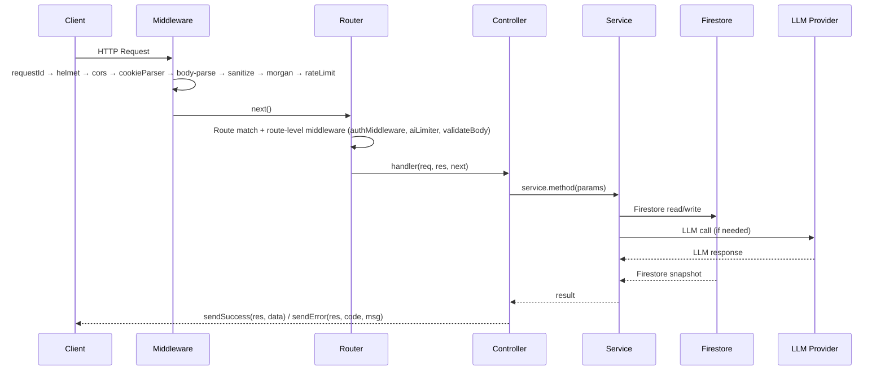

### 2.3 Layer Dependency Map

**Architecture:**

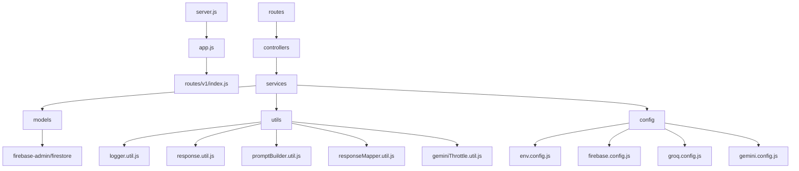

---

## 3. Infrastructure & Configuration

### 3.1 Environment Configuration

**Prompts Used:**

> Initial setup — "Build a production-grade Node.js/Express backend with validated environment configuration."

**Feature Description:**
All environment variables are parsed and validated at process startup using a Zod schema defined in `src/config/env.config.js`. If any required variable is missing or fails validation, the process exits immediately with code `1` and a descriptive error message.

**Rationale:**
Fail-fast on misconfiguration prevents the server from starting in a broken state. Freezing the parsed object (`Object.freeze`) ensures no runtime mutation of configuration values.

**Usage:**
Every other module imports `env` from `../config/env.config.js` and accesses strongly-typed, validated values. No `process.env` is read directly outside this module.

**Architecture:**

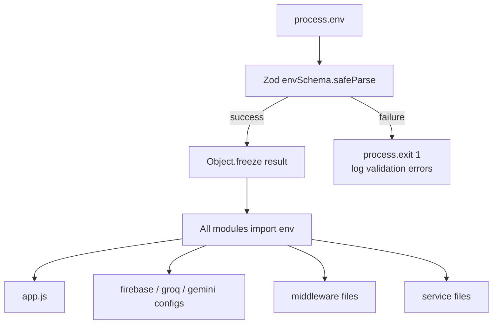

**Key Variables:**

| Variable                | Constraint                            | Purpose                            |
| ----------------------- | ------------------------------------- | ---------------------------------- |
| `PORT`                  | string, default `"8080"`              | HTTP port                          |
| `NODE_ENV`              | `development` / `production` / `test` | Environment mode                   |
| `FIREBASE_PROJECT_ID`   | min 1                                 | Firebase project                   |
| `FIREBASE_CLIENT_EMAIL` | valid email                           | Service account                    |
| `FIREBASE_PRIVATE_KEY`  | min 1, newlines normalized            | Service account key                |
| `GEMINI_API_KEY`        | min 1                                 | Gemini AI key                      |
| `GROQ_API_KEY`          | optional                              | Groq key (disables Groq if absent) |
| `LLM_PRIMARY_PROVIDER`  | `groq` / `gemini`, default `"groq"`   | LLM routing                        |
| `ALLOWED_ORIGINS`       | comma-separated URLs                  | CORS allowlist                     |
| `JWT_AUDIENCE`          | min 1                                 | Firebase JWT audience validation   |
| `SESSION_SECRET`        | min 32 chars                          | Cookie signing secret              |

---

### 3.2 Firebase Admin SDK Configuration

**Prompts Used:**

> Initial setup — "Configure Firebase Admin SDK for Auth and Firestore with singleton initialization."

**Feature Description:**
`src/config/firebase.config.js` initializes the Firebase Admin App exactly once (singleton guard via `getApps().length`). It exports three named objects used throughout the service layer: `adminApp`, `db` (Firestore), and `adminAuth` (Firebase Auth).

**Rationale:**
Singleton initialization prevents multiple Firebase app instances from being created during module re-evaluation in tests or hot-reload environments, which would cause authentication failures or connection pool exhaustion.

**Usage:**

- `db` → used by all service functions for Firestore reads and writes
- `adminAuth` → used by `auth.middleware.js` (token verification) and `auth.service.js` (user creation, custom token)
- `adminApp` → exported for graceful shutdown (`db.terminate()`)

**Architecture:**

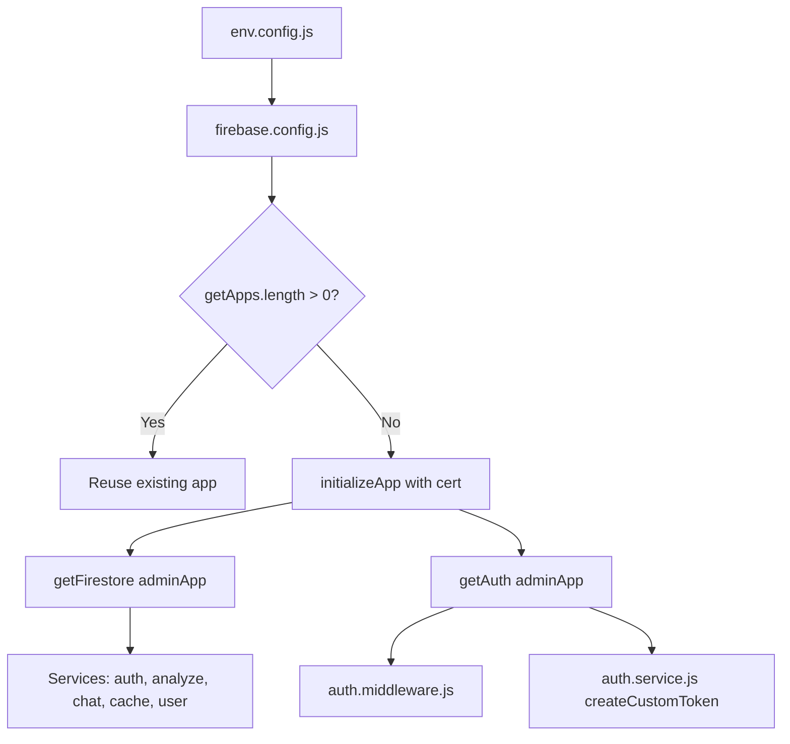

---

### 3.3 Gemini Configuration

**Prompts Used:**

> Initial AI integration — "Configure separate Gemini model instances for analysis (JSON mode) and chat (text mode)."

**Feature Description:**
`src/config/gemini.config.js` creates two distinct `GenerativeModel` instances from the same `GoogleGenerativeAI` client:

- `geminiFlash` — JSON response mode, 0.3 temperature, 8192 max tokens — used for structured analysis output.
- `geminiFlashChat` — plain text mode, 0.4 temperature, 2048 max tokens — used for conversational chat.

**Rationale:**
Separating model instances prevents accidental cross-contamination of generation settings. JSON mode for analysis ensures the LLM returns parseable output; text mode for chat produces natural language responses.

**Usage:**
`gemini.service.js` imports both instances and uses the appropriate one per operation type.

**Architecture:**

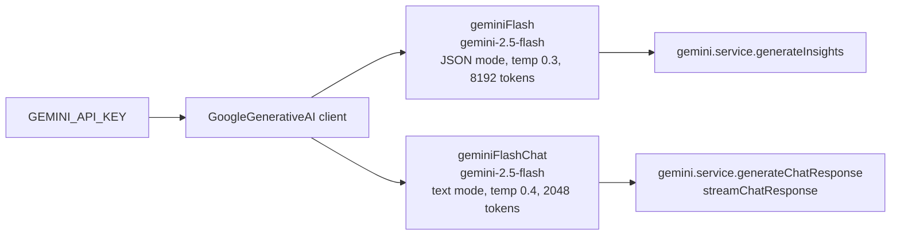

---

### 3.4 Groq Configuration

**Prompts Used:**

> Phase 2, Week 1 — "Which Groq model is better given these TPM limits? Switch to meta-llama/llama-4-scout-17b-16e-instruct."

**Feature Description:**
`src/config/groq.config.js` instantiates the Groq SDK client (only if `GROQ_API_KEY` is set) and exports model name constants and generation option objects. An `isGroqEnabled()` helper allows runtime feature detection.

**Rationale:**
Making Groq optional (no key → `groqClient = null`) allows development and testing without a Groq API key while still using Gemini as the fallback. The `isGroqEnabled()` check at the service boundary prevents hard failures.

**Usage:**
`groq.service.js` imports `groqClient`, `GROQ_MODEL`, `GROQ_INSIGHTS_OPTIONS`, and `GROQ_CHAT_OPTIONS`. `llm.service.js` calls `groqService.isEnabled()` to decide whether to attempt Groq first.

**Architecture:**

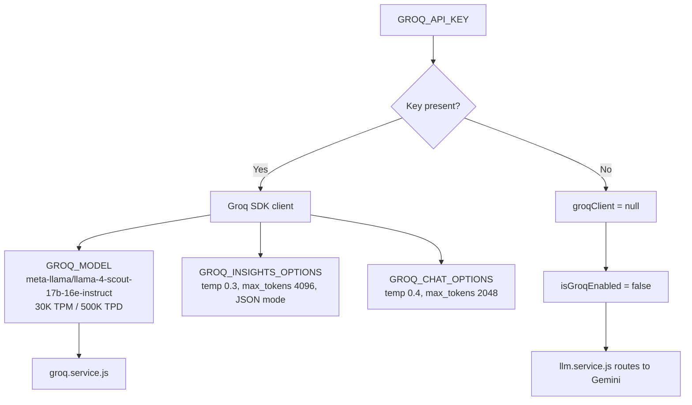

---

## 4. Middleware Layer

### 4.1 Request ID Middleware

**Prompts Used:**

> Initial setup — "Add a request ID middleware that attaches a UUID to every request for distributed tracing."

**Feature Description:**
`src/middleware/requestId.middleware.js` generates a UUID v4 for every incoming request, attaches it as `req.requestId`, and sets the `X-Request-ID` response header so clients can correlate frontend logs with backend logs.

**Rationale:**
In a distributed system where multiple services log independently, a shared request ID allows logs from different systems to be joined for a single request. This is essential for debugging production issues reported by users.

**Usage:**
All logger calls throughout the codebase include `requestId: req.requestId` in the meta object. Error responses also include `requestId` in the `meta` field.

**Architecture:**

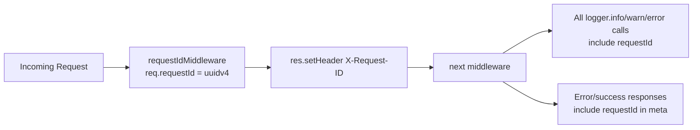

---

### 4.2 Helmet Security Headers

**Prompts Used:**

> Initial setup — "Harden the Express application with secure HTTP headers using helmet."

**Feature Description:**
`src/app.js` applies the `helmet` middleware which sets a suite of security-relevant HTTP response headers. In production, `hsts` (HTTP Strict Transport Security) is enabled with a 1-year max age and `includeSubDomains`. `frameguard` is set to `DENY` to prevent clickjacking.

**Rationale:**
Security headers are a low-effort, high-impact defence layer. They prevent XSS via CSP, MITM attacks via HSTS, and UI redressing attacks via frameguard — all without any application-level logic changes.

**Usage:**
Applied globally as the second middleware in the stack, immediately after request ID generation. The `contentSecurityPolicy` default is applied in all environments.

**Architecture:**

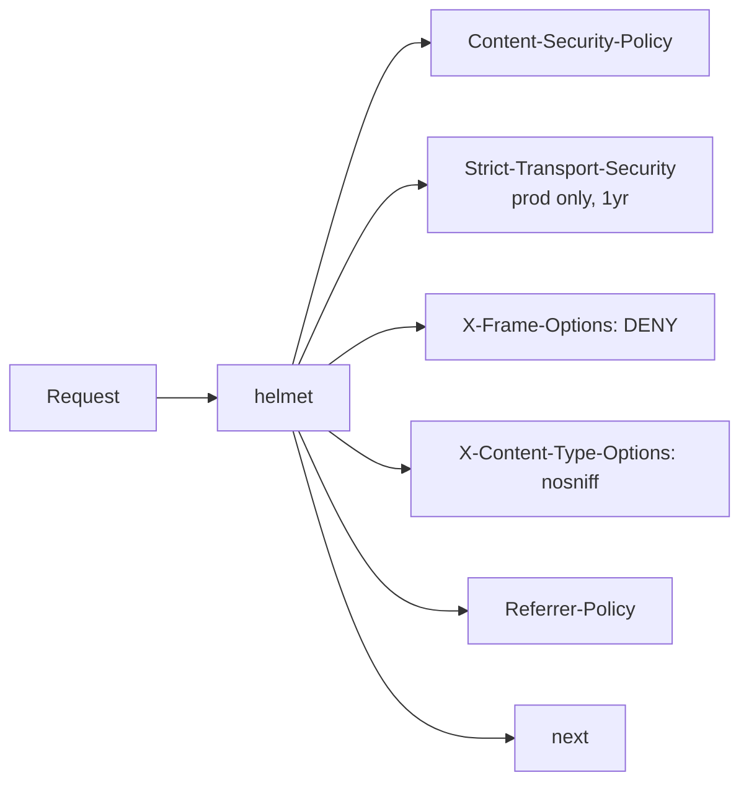

---

### 4.3 CORS Middleware

**Prompts Used:**

> Initial setup — "Configure CORS to allow only specific frontend origins, supporting credentials."

**Feature Description:**
`src/middleware/cors.middleware.js` builds a CORS options object from `env.ALLOWED_ORIGINS` (comma-split list of production URLs). In development, `http://localhost:5173` (Vite dev server) and `http://localhost:4173` (Vite preview) are automatically appended. Unrecognized origins result in a `CORS_POLICY_VIOLATION` error.

**Rationale:**
A restrictive CORS policy prevents unauthorized third-party sites from making credentialed requests to the API. Using `credentials: true` is required to enable cookie transmission for session management.

**Usage:**

- `Access-Control-Allow-Origin` is reflected only for allowed origins.
- `credentials: true` allows the frontend to send and receive `Set-Cookie` headers.
- `maxAge: 86400` caches preflight responses for 24 hours, reducing OPTIONS request overhead.

**Architecture:**

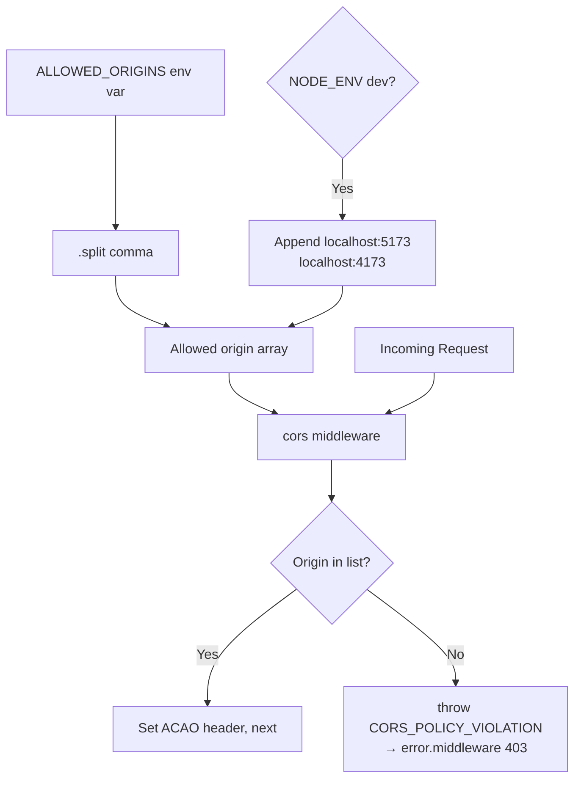

---

### 4.4 Cookie Parser

**Prompts Used:**

> Initial auth setup — "Parse and verify signed cookies for session management."

**Feature Description:**
`cookie-parser` is initialized with `env.SESSION_SECRET` as the signing key. This enables `req.signedCookies` to be populated with verified, tamper-proof cookie values. If a cookie's signature is invalid (i.e., tampered), it is silently dropped and absent from `req.signedCookies`.

**Rationale:**
Session IDs stored in cookies must be signed to prevent forgery. A client cannot fabricate a valid signed `sessionId` value without knowing the `SESSION_SECRET`. This is the foundation of the backend's session-based auth model.

**Usage:**
`auth.middleware.js` reads `req.signedCookies.sessionId` to identify the current session and validate it against Firestore.

---

### 4.5 Body Parser & Payload Limits

**Prompts Used:**

> Phase 2, Week 1 — "I tried to process a 6-sheet, 12,000-row dataset of 16MB and got PayloadTooLargeError. Fix the body limit."

**Feature Description:**
`express.json` and `express.urlencoded` are configured with a `limit` of `"50mb"`. This replaces the original `"10mb"` default.

**Rationale:**
JSON serialization of row arrays is approximately 1.5–2× the raw CSV file size. A 25MB raw CSV can produce a 40–50MB JSON body. The 50MB limit provides sufficient headroom for the current maximum dataset size while remaining a meaningful upper bound against DoS attacks.

**Usage:**
Applied globally in `app.js`. All POST bodies are parsed as JSON before reaching route handlers. The sanitize middleware runs after and imposes its own character-count limit as a secondary guard.

**Architecture:**

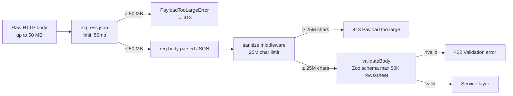

---

### 4.6 Sanitize Middleware

**Prompts Used:**

> Initial security setup — "Block prototype pollution, SQL injection patterns, and null byte injection. Limit total payload string length."  
> Phase 2, Week 1 — "Increase MAX_TOTAL_STRING_LENGTH to handle 25MB multi-sheet datasets."

**Feature Description:**
`src/middleware/sanitize.middleware.js` performs deep recursive sanitization of `req.body`, `req.query`, and `req.params`:

- Blocks `__proto__`, `constructor`, and `prototype` keys (prototype pollution prevention).
- Strips null bytes (`\0`) from string values.
- Rejects any string value matching `SQL_INJECTION_PATTERN = /['"\\;].*--/`.
- Tracks cumulative string length across the entire payload; throws 413 if it exceeds `MAX_TOTAL_STRING_LENGTH` (25,000,000 chars).

**Rationale:**
Prototype pollution can silently corrupt JavaScript runtime objects. SQL injection patterns in JSON bodies, while not directly exploitable against Firestore, could be forwarded to other systems. The character limit prevents memory exhaustion from extremely large string payloads that pass the byte-level JSON limit (e.g., millions of single-byte characters).

**Usage:**
Applied globally after body parsing. All input reaching route handlers is guaranteed to be clean. The `MAX_TOTAL_STRING_LENGTH` was increased from 500,000 to 25,000,000 to accommodate large dataset JSON bodies (12,000 rows × 16 columns × ~15 avg chars × 6 sheets ≈ 17M chars).

**Architecture:**

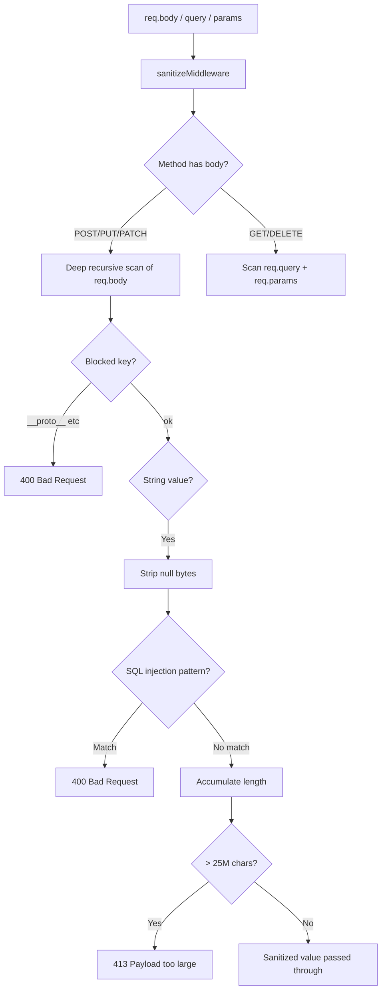

---

### 4.7 Morgan Logger

**Prompts Used:**

> Initial setup — "Log all HTTP requests with appropriate detail for development and production."

**Feature Description:**
`morgan` HTTP request logger is configured in `combined` format for production (includes IP, user agent, referrer) and `dev` format for development (colourised, minimal). Logs are written to stdout.

**Rationale:**
HTTP access logs are the first line of debugging for unexpected API behaviour, tracking latency regressions, and investigating security incidents. Combined format is compatible with log aggregation tools in production.

**Usage:**
Applied globally after sanitization. Logs appear on every request regardless of outcome.

---

### 4.8 Rate Limiting

**Prompts Used:**

> Initial setup — "Implement tiered rate limiting: global for all routes, strict for auth, tighter for AI endpoints."

**Feature Description:**
`src/middleware/rateLimit.middleware.js` exports four distinct rate-limiter instances:

| Limiter             | Window | Max Requests | Key                  |
| ------------------- | ------ | ------------ | -------------------- |
| `globalRateLimiter` | 15 min | 200          | IP                   |
| `authLimiter`       | 15 min | 20           | IP                   |
| `aiLimiter`         | 1 min  | 10           | `req.user.uid` or IP |
| `chatLimiter`       | 1 min  | 5            | `req.user.uid` or IP |

**Rationale:**
Different endpoint types have different risk profiles. Auth endpoints must be tightly limited to prevent brute-force attacks. AI endpoints are expensive (LLM API costs) and slow; tight per-user limits prevent abuse and protect free-tier quotas. Chat is real-time but must be metered to prevent message spam. The global limiter acts as a catch-all backstop.

**Usage:**

- `globalRateLimiter` — applied in `app.js` globally.
- `authLimiter` — applied on `auth.routes.js` router-level.
- `aiLimiter` — applied per-route on `POST /analyze`.
- `chatLimiter` — applied per-route on `POST /chat` and `GET /chat/stream`.

**Architecture:**

```mermaid
graph TD
    REQ[Any Request] --> GLB[globalRateLimiter\n200 / 15min IP]
    GLB --> AUTH_RT[/auth/*]
    GLB --> ANA_RT[/analyze/*]
    GLB --> CHAT_RT[/chat/*]
    AUTH_RT --> ALM[authLimiter\n20 / 15min IP]
    ANA_RT --> AIL[aiLimiter\n10 / 1min UID]
    CHAT_RT --> CLM[chatLimiter\n5 / 1min UID]
```

---

### 4.9 Auth Middleware

**Prompts Used:**

> Initial auth setup — "Build middleware to verify Firebase JWT tokens and validate Firestore session documents."  
> Phase 2, Week 1 — "GET /analyze returns 401 with userId_mismatch — add granular logging and clear stale cookies."

**Feature Description:**
`src/middleware/auth.middleware.js` is the core authentication enforcement point for all protected routes. It performs a two-step validation:

1. **Firebase JWT Verification** — verifies the Bearer token via `adminAuth.verifyIdToken(token, true)` (revocation check enabled). Returns 403 if email is unverified (except Google OAuth users).
2. **Session Cookie Validation** — reads `req.signedCookies.sessionId`, fetches the `authSessions/{sessionId}` Firestore document, and validates:
   - `userId` matches the JWT `uid` (prevents session fixation)
   - `isActive` is `true`
   - `expiresAt` is present and in the future

If session age > 30 minutes, the session is silently refreshed (sliding window). On `userId_mismatch`, the stale cookie is proactively cleared via `res.clearCookie`.

**Rationale:**
Two-factor session validation (JWT + Firestore session doc) provides defence-in-depth. A stolen JWT alone is insufficient — the attacker also needs a valid active session document in Firestore. The automatic stale cookie clearing on `userId_mismatch` prevents users from being permanently locked out by a leftover cookie from a previous account.

**Usage:**
Applied per-route on all protected endpoints via `import authMiddleware from "../../middleware/auth.middleware.js"`. Populates `req.user = { uid, email, sessionId, isAnonymous }` for downstream use.

**Architecture:**

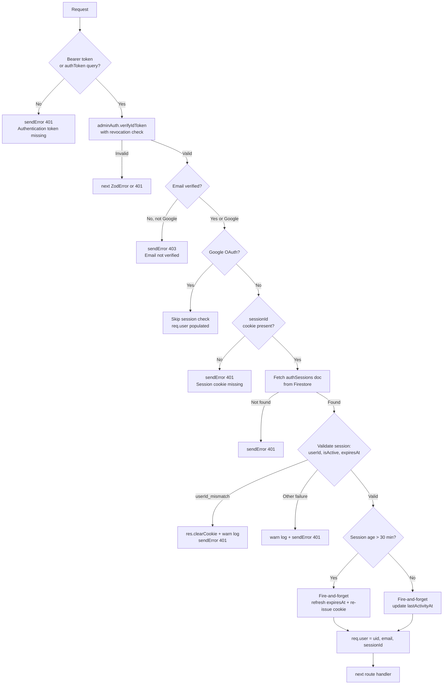

---

### 4.10 Validate Middleware

**Prompts Used:**

> Initial setup — "Create a middleware factory for Zod schema validation of request bodies, query params, and path params."

**Feature Description:**
`src/middleware/validate.middleware.js` exports three factory functions (`validateBody`, `validateQuery`, `validateParams`) that each accept a Zod schema and return an Express middleware. On validation failure, the parsed `ZodError` is passed to `next(error)`, which `error.middleware.js` catches and formats as a 422 response.

**Rationale:**
Centralised validation prevents invalid data from ever reaching service functions, keeps controllers clean, and provides consistent, field-level error messages to API consumers.

**Usage:**
Used in route definitions as middleware chained before the controller handler. Example: `router.post("/", authMiddleware, aiLimiter, validateBody(analyzeBodySchema), analyzeController.analyze)`.

---

### 4.11 Error Middleware

**Prompts Used:**

> Initial setup — "Build a global Express error handler that maps known error types to appropriate HTTP status codes."

**Feature Description:**
`src/middleware/error.middleware.js` is a 4-argument Express error handler registered last in `app.js`. It maps error `type` and `code` properties to HTTP status codes and standardized error response shapes.

**Error mappings:**

| Error Condition                        | HTTP Status | Response Code      |
| -------------------------------------- | ----------- | ------------------ |
| `entity.parse.failed` (malformed JSON) | 400         | `INVALID_JSON`     |
| `CORS_POLICY_VIOLATION`                | 403         | `FORBIDDEN`        |
| `ZodError`                             | 422         | `VALIDATION_ERROR` |
| `auth/id-token-expired`                | 401         | `INVALID_TOKEN`    |
| Any unknown error                      | 500         | `INTERNAL_ERROR`   |

**Rationale:**
A single error boundary ensures consistent error response shapes across the entire API. Stack traces are included in development responses but stripped in production to prevent information leakage.

**Architecture:**

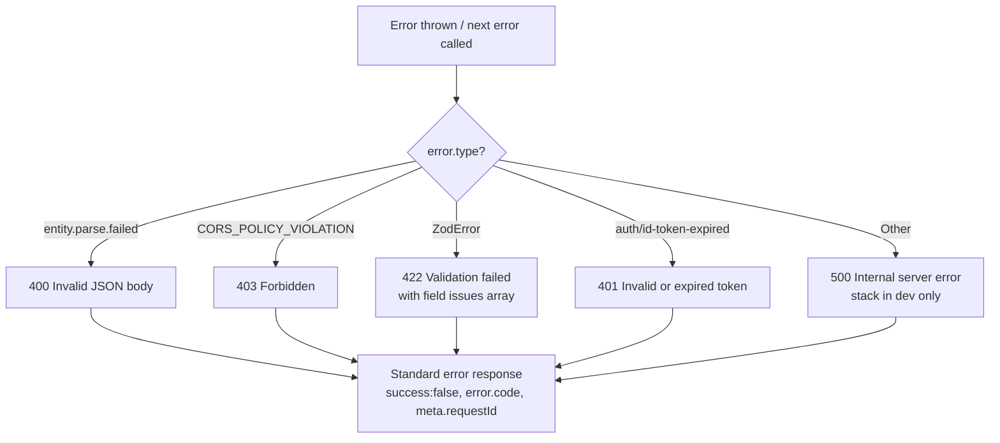

---

## 5. Authentication System

**Architecture (Overview):**

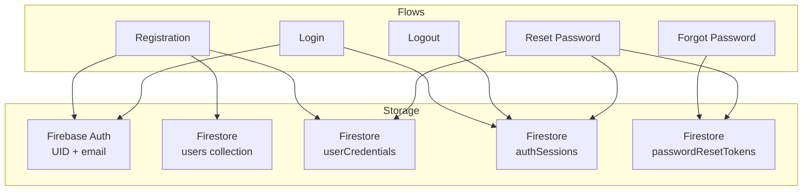

---

### 5.1 User Registration

**Prompts Used:**

> Initial auth setup — "Build secure user registration: hash password, create Firebase Auth user, and persist a user profile document to Firestore."

**Feature Description:**
`POST /api/v1/auth/register` accepts `{ email, password, displayName }`. The service:

1. Queries `users` collection for existing email (prevents duplicates).
2. Hashes the password with `bcryptjs` (12 salt rounds).
3. Creates a Firebase Auth user via `adminAuth.createUser`.
4. Performs a Firestore batch write: `users/{uid}` (profile), `users/{uid}/profile/data` (extended profile), and `userCredentials/{uid}` (credential document).
5. On any failure after Firebase user creation, rolls back by deleting the Firebase Auth user.
6. Logs a stub "verification email sent" message (email service not yet implemented).

**Rationale:**
Using Firestore `userCredentials` for password storage (instead of relying solely on Firebase Auth) enables custom lockout logic, password history tracking, and future MFA support without being constrained by Firebase Auth's built-in limitations.

**Usage:**
Called by the frontend registration form. Returns 201 with `{ success: true, data: { uid, email, displayName } }`.

**Architecture:**

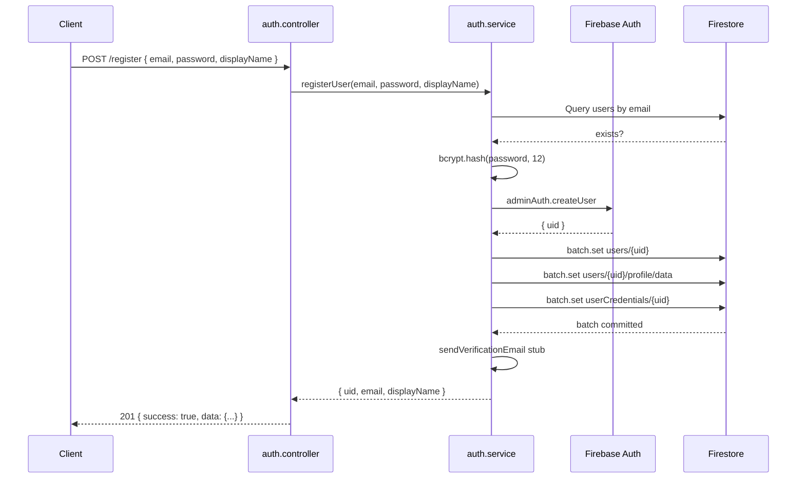

---

### 5.2 Login & Session Management

**Prompts Used:**

> Initial auth setup — "Build login with account lockout, session creation, and httpOnly signed cookie."  
> Phase 2, Week 1 — "Frontend onAuthStateChanged not firing after login — implement Firebase Custom Token bridge."

**Feature Description:**
`POST /api/v1/auth/login` accepts `{ email, password }`. The service:

1. Finds the user by email.
2. Checks `accountStatus` and `isDeleted`.
3. Checks `lockedUntil` — rejects with `ACCOUNT_LOCKED` if in the future.
4. Compares `bcrypt` hashes.
5. On failure, increments `failedLoginCount`; locks account for 15 minutes at 5 failures.
6. On success, resets `failedLoginCount`, invalidates any existing sessions (single-session enforcement), creates a new `authSessions/{sessionId}` document, and generates a `firebaseCustomToken` via `adminAuth.createCustomToken`.
7. The controller sets a signed, `httpOnly`, `sameSite: strict` `sessionId` cookie and returns `{ ...user, firebaseCustomToken }`.

**Rationale:**
The `firebaseCustomToken` bridges the gap between backend-managed sessions and the Firebase client SDK. Without it, `onAuthStateChanged` never fires on the frontend, leaving protected routes in an unauthenticated state even after a successful backend login. The frontend calls `signInWithCustomToken(firebaseCustomToken)` immediately after receiving the login response.

**Usage:**

- Cookie is used by all subsequent authenticated requests (read by `auth.middleware.js`).
- `firebaseCustomToken` is used once by the frontend, never stored — it has a short Firebase-enforced expiry (~1 hour).

**Architecture:**

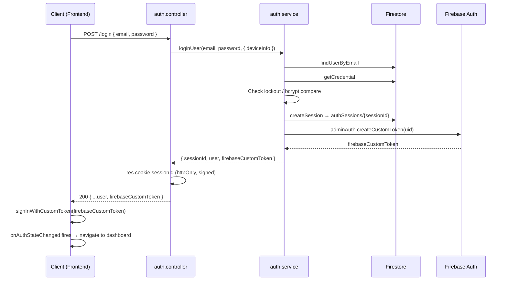

---

### 5.3 Logout

**Prompts Used:**

> Initial auth setup — "Implement logout that invalidates the server-side session and clears the cookie."

**Feature Description:**
`POST /api/v1/auth/logout` requires authentication (auth middleware populates `req.user.sessionId`). The service sets `isActive: false` on the `authSessions/{sessionId}` document. The controller clears the `sessionId` cookie.

**Rationale:**
Clearing only the client cookie without invalidating the server-side session would leave the session document active, allowing replay attacks if the cookie value was captured. Server-side invalidation is the authoritative action.

**Usage:**
Called by the frontend "Sign Out" button. After this call, any subsequent request with the old cookie will fail auth middleware validation (session is inactive).

---

### 5.4 Forgot Password

**Prompts Used:**

> Initial auth setup — "Implement forgot password flow with secure token generation."  
> Phase 2, Week 1 — "Fix forgotPassword in auth.service.js — it is not writing passwordResetTokens to Firestore."

**Feature Description:**
`POST /api/v1/auth/forgot-password` accepts `{ email }`. The service:

1. Finds the user by email (no-op / no error revealed if not found — prevents user enumeration).
2. Generates a cryptographically secure 64-character hex token (`randomBytes(32).toString("hex")`).
3. Hashes the token with SHA-256.
4. Stores the hash in `passwordResetTokens/{tokenHash}` with `userId`, `email`, and `expiresAt` (1 hour from now).
5. Passes the plain token to `sendVerificationEmail` (currently a stub that logs the token for development testing).

**Rationale:**
Only the hash is stored in Firestore — if the database is compromised, the hashes are useless without the plain tokens. The 1-hour TTL limits the window of exploitation if a token is intercepted. The fixed-length (64 chars) token requirement enforced by `resetPasswordSchema` prevents length extension attacks.

**Architecture:**

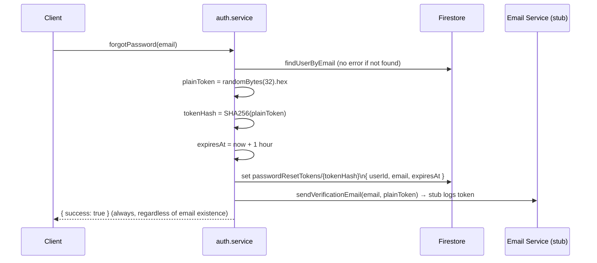

---

### 5.5 Reset Password

**Prompts Used:**

> Initial auth setup — "Implement reset password that verifies the token, updates the credential, and invalidates all sessions."

**Feature Description:**
`POST /api/v1/auth/reset-password` accepts `{ token (64 chars), newPassword }`. The service:

1. Hashes the provided token.
2. Fetches `passwordResetTokens/{hash}` — returns 400 if not found.
3. Validates `expiresAt` — returns 400 if expired.
4. Hashes the new password with bcrypt.
5. Updates `userCredentials/{uid}.passwordHash`.
6. Resets `failedLoginCount`, clears `lockedUntil`.
7. Batch-deletes the used token document.
8. Calls `invalidateUserSessions(uid)` — forces re-authentication.

**Rationale:**
Invalidating all sessions after a password reset prevents a compromised account from remaining authenticated. The token document is deleted immediately after use (one-time token pattern) to prevent replay attacks.

---

### 5.6 Account Lockout

**Prompts Used:**

> Initial auth setup — "Add account lockout after 5 failed login attempts to prevent brute-force attacks."

**Feature Description:**
`userCredentials/{uid}` tracks `failedLoginCount` and `lockedUntil`. On each failed password check:

- `failedLoginCount` is incremented.
- If `failedLoginCount >= LOCKOUT_THRESHOLD (5)`, `lockedUntil` is set to `now + 15 minutes`.

On each login attempt, if `lockedUntil` is in the future, an `ACCOUNT_LOCKED` error is thrown before the password is checked, preventing further attempts.

**Rationale:**
Brute-force protection is a baseline security requirement. The 15-minute sliding window is long enough to deter automated attacks while short enough that legitimate users who forgot their password are not permanently locked out.

**Architecture:**

```mermaid
stateDiagram-v2
    [*] --> Active: Account created
    Active --> FailedAttempt: Wrong password
    FailedAttempt --> Active: failedLoginCount < 5
    FailedAttempt --> Locked: failedLoginCount >= 5\nlockedUntil = now + 15min
    Locked --> Active: lockedUntil passed (auto-unlock)\nor password reset
    Active --> [*]: Account deleted
```

---

## 6. Firestore Data Model

**Prompts Used:**

> Phase 2, Week 1 — "Design a perfect data modelling of Firebase for this project. How do analyses and chat connect? How does duplicate dataset detection work?"

**Feature Description:**
All user data is isolated under `users/{uid}/` subcollections. No user can access another user's data through the client SDK due to Firestore Security Rules. The Admin SDK (backend) can access any document.

**Rationale:**
Per-user subcollection hierarchy is the standard Firestore pattern for multi-tenant applications. It maps directly to security rules (`resource.data.userId == request.auth.uid`) and enables efficient queries with collection-level indexes.

**Architecture (Full Firestore Schema):**

```mermaid
erDiagram
    USERS {
        string uid PK
        string email
        string displayName
        string photoURL
        string provider
        string accountStatus
        boolean isDeleted
        map preferences
        timestamp createdAt
        timestamp updatedAt
        timestamp lastLoginAt
        number schemaVersion
    }

    USER_PROFILE {
        string uid FK
        string bio
        string timezone
        string preferredChartType
        number analysisCount
        timestamp updatedAt
    }

    ANALYSES {
        string analysisId PK
        string userId FK
        string datasetName
        string dataHash
        array sheets
        number sheetCount
        array headers
        number rowCount
        map columnStats
        array insights
        map chartData
        map aiSummary
        string status
        number messageCount
        timestamp lastMessageAt
        timestamp createdAt
        timestamp updatedAt
        timestamp completedAt
        number schemaVersion
    }

    MESSAGES {
        string messageId PK
        string userId FK
        string analysisId FK
        string role
        string turnId
        number turnIndex
        string content
        timestamp createdAt
        number schemaVersion
    }

    INSIGHT_CACHE {
        string dataHash PK
        string userId FK
        map insights
        timestamp expiresAt
        number hitCount
        timestamp createdAt
    }

    USER_CREDENTIALS {
        string uid PK
        string passwordHash
        number failedLoginCount
        timestamp lastFailedLoginAt
        timestamp lastPasswordChangeAt
        timestamp lockedUntil
        timestamp createdAt
        timestamp updatedAt
        timestamp passwordExpiresAt
        number schemaVersion
    }

    AUTH_SESSIONS {
        string sessionId PK
        string userId FK
        string idTokenHash
        map deviceInfo
        boolean isActive
        timestamp createdAt
        timestamp lastActivityAt
        timestamp expiresAt
        number schemaVersion
    }

    PASSWORD_RESET_TOKENS {
        string tokenHash PK
        string userId FK
        string email
        timestamp expiresAt
        timestamp createdAt
    }

    USERS ||--o{ ANALYSES : "users/{uid}/analyses"
    ANALYSES ||--o{ MESSAGES : "analyses/{id}/messages"
    USERS ||--o{ INSIGHT_CACHE : "users/{uid}/insightCache"
    USERS ||--|| USER_PROFILE : "users/{uid}/profile/data"
    USERS ||--|| USER_CREDENTIALS : "userCredentials/{uid}"
    USERS ||--o{ AUTH_SESSIONS : "authSessions (by userId)"
    USERS ||--o{ PASSWORD_RESET_TOKENS : "passwordResetTokens (by userId)"
```

---

### 6.1 Analyses Collection

**Feature Description:**
`users/{uid}/analyses/{analysisId}` — one document per dataset upload. Contains all AI-generated content, computed column statistics, sheet metadata, and chat activity counters.

**Key design decisions:**

- `dataHash` (MD5 of sorted headers + rowCount) enables `insightCache` lookup to avoid re-running LLM analysis on duplicate uploads.
- `messageCount` and `lastMessageAt` are denormalized onto the analysis document to power the dashboard history list without subcollection scans.
- `status: "processing" | "completed" | "failed"` supports the async analysis job queue (202-then-poll pattern).
- `schemaVersion: 2` enables future migrations.

---

### 6.2 Messages Subcollection

**Feature Description:**
`users/{uid}/analyses/{analysisId}/messages/{messageId}` — one document per chat message. User questions and assistant responses are stored as separate documents.

**Key design decisions:**

- `turnId` (UUID) groups a user message and its assistant response into a single "turn." Both documents share the same `turnId`.
- `turnIndex: 0` = user question, `turnIndex: 1` = assistant answer. This provides explicit ordering within a turn, removing the fragility of relying purely on `createdAt` timestamps.
- Messages are never deleted individually (GDPR deletion cascades at the analysis level).

---

### 6.3 Insight Cache

**Feature Description:**
`users/{uid}/insightCache/{dataHash}` — stores the full structured LLM output keyed by a dataset fingerprint. TTL is 24 hours.

**Key design decisions:**

- Cache key is `dataHash` (MD5 of sorted headers + rowCount). Identical datasets uploaded multiple times within 24 hours reuse the same insights, saving LLM API costs.
- Per-user cache (not global) prevents data leakage between users who upload structurally identical datasets.
- `hitCount` is incremented on each cache hit for analytics.

---

### 6.4 Auth Sessions

**Feature Description:**
`authSessions/{sessionId}` — a top-level collection (not subcollection) for session documents. Indexed by `userId` and `isActive` for efficient queries.

**Key design decisions:**

- Storing sessions as a top-level collection (not under `users/{uid}`) allows efficient single-document lookups by `sessionId` without knowing the user's UID upfront (the middleware only has the sessionId from the cookie at initial lookup).
- `idTokenHash` provides an additional correlation point for audit logging.
- Sliding window refresh: every 30+ minute active session gets a new `expiresAt` without requiring re-login.

---

### 6.5 User Credentials

**Feature Description:**
`userCredentials/{uid}` — bcrypt hash + lockout state. Stored separately from the user profile to prevent accidental exposure in profile reads.

**Key design decisions:**

- Separate collection reduces the risk of accidentally including the password hash in a profile response.
- Lockout state (`failedLoginCount`, `lockedUntil`) colocated with credentials ensures atomic read-modify-write for security-critical operations.

---

## 7. Analysis Pipeline

**Architecture (Overview):**

```mermaid
flowchart TD
    UPLOAD[POST /analyze\nJSON dataset] --> VAL[Input Validation\nZod schema + Sanitize]
    VAL --> NORM[Normalize Sheets\nlegacy or multi-sheet]
    NORM --> STATS[Compute Column Stats\nper sheet]
    STATS --> HASH[Compute dataHash\nMD5 headers + rowCount]
    HASH --> CACHE_CHK{insightCache hit?}
    CACHE_CHK -->|Yes| CACHE_HIT[Return cached insights\nincrement hitCount]
    CACHE_CHK -->|No| PROMPT[Build Analysis Prompt\npromptBuilder.util.js]
    PROMPT --> LLM[LLM Router\nGroq → Gemini fallback]
    LLM --> PARSE[Parse + Validate LLM Output\nZod schema]
    PARSE --> MAP[Response Mapper\nresponseMapper.util.js]
    MAP --> CACHE_WRITE[Write insightCache\n24hr TTL]
    MAP --> DOC_WRITE[Write analyses/{analysisId}\nFirestore]
    DOC_WRITE --> RES[Return mapped response]
```

---

### 7.1 Input Validation & Sheet Normalization

**Prompts Used:**

> Initial setup — "Accept both legacy single-sheet and new multi-sheet dataset formats."  
> Phase 2, Week 1 — "Increase Zod row limit to 50,000 to support 12,000-row datasets."

**Feature Description:**
`analyzeBodySchema` (Zod) accepts either:

- Legacy format: top-level `headers` + `rows` (single sheet).
- New format: `sheets` array — up to 20 sheets, each with `name`, `headers`, and `rows` (up to 50,000 per sheet).

`normalizeSheets(body)` in `analyze.service.js` converts both formats into a uniform `[{ name, headers, rows }]` array used throughout the service.

**Rationale:**
Supporting the legacy single-sheet format ensures backward compatibility with the existing frontend upload flow while the multi-sheet format supports complex workbooks.

---

### 7.2 Column Statistics Computation

**Prompts Used:**

> Initial setup — "Compute per-column statistics server-side to avoid sending raw row data to the LLM (privacy and token savings)."

**Feature Description:**
`buildColumnStats(headers, rows)` in `analyze.service.js` computes, for each column:

- **Numeric columns** (>80% numeric values): `min`, `max`, `mean`, `stdDev`, `nullCount`, `uniqueCount`
- **Categorical columns**: `topValues` (top-5 by frequency), `uniqueCount`, `nullCount`
- **Date columns** (>80% parseable dates): `min`, `max`, `nullCount`
- Columns with >50% null values are excluded entirely.

Sample rows (up to 30) are attached alongside column stats in the LLM prompt.

**Rationale:**
Sending aggregated statistics instead of raw rows dramatically reduces token consumption (and thus LLM cost), while preserving the analytical signal the LLM needs to generate meaningful insights. It also prevents PII in individual rows from reaching external LLM providers.

**Architecture:**

```mermaid
flowchart TD
    ROWS[Raw rows array] --> ITER[Iterate columns]
    ITER --> NULL_CHK{>50% null?}
    NULL_CHK -->|Yes| SKIP[Skip column]
    NULL_CHK -->|No| TYPE_DET[detectColumnType]
    TYPE_DET --> NUM{>80% numeric?}
    NUM -->|Yes| NUMERIC[Compute min, max, mean, stdDev\nnullCount, uniqueCount]
    TYPE_DET --> DAT{>80% dates?}
    DAT -->|Yes| DATES[Compute min, max, nullCount]
    TYPE_DET --> CAT[Categorical\ntopValues top-5, uniqueCount, nullCount]
    NUMERIC --> STATS[columnStats object]
    DATES --> STATS
    CAT --> STATS
    STATS --> PROMPT[LLM Prompt payload]
    STATS --> MAPPER[responseMapper barStats]
```

---

### 7.3 Async Job Queue (Enqueue & Poll)

**Prompts Used:**

> Initial setup — "Support async analysis processing — return a 202 immediately and let the frontend poll for completion."

**Feature Description:**
For authenticated users, `analyzeController.analyze` calls `analyzeService.enqueueAnalysis`:

1. Creates an `analyses/{analysisId}` Firestore document with `status: "processing"`.
2. Returns 202 with `{ analysisId, status: "processing" }` immediately.
3. Fires-and-forgets `processAnalysisJob(uid, prep)`.

`processAnalysisJob` runs the full LLM pipeline in the background and patches the Firestore document to `status: "completed"` with all results, or `status: "failed"` with an error message.

The frontend polls `GET /analyze/:analysisId` until `status === "completed"`.

**Rationale:**
LLM API calls can take 3–30 seconds. Returning 202 immediately prevents frontend timeout and allows a responsive UX with a loading state.

**Architecture:**

```mermaid
sequenceDiagram
    participant C as Frontend
    participant CT as Controller
    participant SV as analyze.service
    participant FS as Firestore
    participant LLM as LLM Provider

    C->>CT: POST /analyze
    CT->>SV: enqueueAnalysis(uid, body)
    SV->>FS: write status: "processing"
    SV-->>CT: { analysisId, status: "processing" }
    CT-->>C: 202 Accepted
    Note over SV,LLM: Background job runs independently
    SV->>LLM: generateInsights
    LLM-->>SV: raw output
    SV->>FS: patch status: "completed" + full data
    loop Polling
        C->>CT: GET /analyze/:analysisId
        CT->>FS: getAnalysis
        FS-->>CT: { status, ...data }
        CT-->>C: 200 { status }
    end
    Note over C: status === "completed" → render dashboard
```

---

### 7.4 Insight Cache

**Prompts Used:**

> Initial setup — "Cache LLM insights by dataset fingerprint to avoid redundant API calls for the same dataset."

**Feature Description:**
Before every LLM call, `fetchOrGenerateInsights` checks `users/{uid}/insightCache/{dataHash}`. If a non-expired document exists, the cached insights are returned directly. On cache miss, the LLM is called and the result is written to the cache with a 24-hour TTL.

**Rationale:**
Users frequently re-upload the same dataset (e.g., an updated version of a recurring report). Without caching, each upload triggers a full LLM API call (~$0.001–0.01 per call, plus latency). The cache provides instant response and zero LLM cost for repeat uploads.

**Usage:**
Cache is per-user (no cross-user sharing). The `dataHash` is an MD5 of sorted column names + total row count — this fingerprint changes when the dataset structure changes.

---

### 7.5 LLM Provider Router

**Prompts Used:**

> Initial setup — "Build a provider router that uses Groq as primary and Gemini as fallback."

**Feature Description:**
`src/services/llm.service.js` abstracts the LLM provider behind a unified interface. For `generateInsights`, `generateChatResponse`, and `streamChatResponse`:

1. If Groq is the primary provider and `groqService.isEnabled()`, try Groq first.
2. On `GROQ_RATE_LIMITED`, `GROQ_TRANSIENT`, `GROQ_NOT_CONFIGURED`, or `LLM_INVALID_OUTPUT` errors — fall back to Gemini.
3. Non-retriable errors (e.g., `GROQ_INVALID_REQUEST`) are propagated directly.

**Rationale:**
Groq offers significantly lower latency than Gemini for generation. Using it as primary gives better UX. The Gemini fallback ensures reliability if Groq is unavailable or rate-limited during peak usage.

**Architecture:**

```mermaid
flowchart TD
    CALL[llm.generateInsights] --> GROQ_CHK{Groq enabled\n+ primary?}
    GROQ_CHK -->|Yes| GROQ[groq.generateInsightsRaw]
    GROQ_CHK -->|No| GEM[gemini.generateInsights]
    GROQ --> PARSE[parseAndValidateInsights\nZod schema]
    PARSE -->|Valid| RETURN[Return insights]
    PARSE -->|LLM_INVALID_OUTPUT| FALLBACK[Fall back to Gemini]
    GROQ --> ERR{Error code?}
    ERR -->|GROQ_RATE_LIMITED\nGROQ_TRANSIENT| FALLBACK
    ERR -->|GROQ_INVALID_REQUEST| RETHROW[Rethrow — not retryable]
    FALLBACK --> GEM
    GEM --> RETURN
```

---

### 7.6 Gemini Service

**Prompts Used:**

> Initial AI setup — "Build a Gemini service with retry logic, RPM rate limiting, and Zod output validation."

**Feature Description:**
`src/services/gemini.service.js` wraps the `@google/generative-ai` SDK. Key features:

- `callWithRetry(fn, maxRetries)` — implements exponential backoff with jitter for transient errors (1s → 2s → 4s → 8s base). Cooldown of 61s on 429 responses. No retry on `INVALID_ARGUMENT`.
- LLM output is validated against a strict Zod schema (`geminiOutputSchema`) including `insights[1-10]`, `chartData[]`, and `summary`.
- `parseGeminiJson` handles Gemini's occasional non-JSON wrapping with a brace-balanced fallback extractor.
- Chat responses are sanitized via `sanitizeChatReply` (strips code fences, unwraps JSON).

**Rationale:**
The Gemini free tier has strict RPM/TPM limits. The local `reserveGeminiSlot()` gate (12 req/min ceiling) prevents exceeding the limit before the API even responds. The Zod validation schema rejects malformed LLM output early, before it can corrupt Firestore documents.

---

### 7.7 Groq Service

**Prompts Used:**

> Initial AI setup — "Build a Groq service compatible with the LLM router interface."  
> Phase 2, Week 1 — "Switch Groq model to llama-4-scout for 30K TPM headroom."

**Feature Description:**
`src/services/groq.service.js` wraps the `groq-sdk` SDK. It implements the same interface as `gemini.service.js` (`generateInsightsRaw`, `generateChatRaw`, `streamChatRaw`). Error codes are normalized to a standard set (`GROQ_RATE_LIMITED`, `GROQ_TRANSIENT`, etc.) that `llm.service.js` understands for fallback decisions.

**Rationale:**
The model `meta-llama/llama-4-scout-17b-16e-instruct` offers 30K TPM vs. the previous model's 12K TPM — a 2.5× improvement in effective throughput. TPM was identified as the real bottleneck for large multi-sheet analysis prompts, not RPM.

---

### 7.8 Response Mapper

**Prompts Used:**

> Phase 2, Week 1 — "The frontend expects chartData as { barStats, timeSeries, charts }, insights severity as low/medium/high, and aiSummary with qualityNote. Fix the data contract."

**Feature Description:**
`src/utils/responseMapper.util.js` transforms raw LLM output into the frontend-expected data contract:

1. **`barStats`** — built server-side from numeric `columnStats` (not from LLM output). Contains `column`, `sheetName`, `mean`, `min`, `max`, `stdDev`, `nullCount`, `uniqueCount`.
2. **`timeSeries`** — currently an empty array (placeholder for future server-side date aggregation).
3. **`charts`** — original LLM-generated chart configurations with synthetic data points injected from `columnStats.topValues`.
4. **`insights[].severity`** — mapped via `SEVERITY_MAP: { info → low, warning → medium, critical → high }`.
5. **`aiSummary`** — `{ dataQuality, qualityNote (from LLM keyFindings), recommendedActions }`.

**Rationale:**
Decoupling the frontend data contract from the LLM output format means the LLM can change its output schema without requiring frontend changes, and vice versa. Server-side computation of `barStats` from actual column statistics (rather than LLM-generated values) ensures accuracy — the LLM is not reliable for arithmetic.

**Architecture:**

```mermaid
flowchart TD
    LLM_OUT[Raw LLM Output\ngeminiOutput] --> NORM[normalizeInsight each insight\nSEVERITY_MAP + UUID assignment]
    LLM_OUT --> CHARTS[LLM chartData array\n+ synthetic data points from topValues]
    COL_STATS[Server-computed columnStats\nfrom sheetSummaries] --> BAR[buildBarStats\nnumeric columns only]
    NORM --> INSIGHTS_OUT[insights array\nseverity: low/medium/high]
    CHARTS --> CHARTS_OUT[charts array]
    BAR --> CHART_DATA[chartData object\n{ barStats, timeSeries: [], charts }]
    LLM_OUT --> AI_SUMM[aiSummary\ndataQuality, qualityNote from keyFindings]
    INSIGHTS_OUT --> RESP[Final API Response]
    CHART_DATA --> RESP
    AI_SUMM --> RESP
```

---

### 7.9 Analysis CRUD API

**Feature Description:**
Four endpoints manage analysis lifecycle:

| Endpoint                             | Description                                  |
| ------------------------------------ | -------------------------------------------- |
| `POST /api/v1/analyze`               | Upload dataset, trigger analysis, return 202 |
| `GET /api/v1/analyze`                | List all analyses for the authenticated user |
| `GET /api/v1/analyze/:analysisId`    | Get a specific analysis (used for polling)   |
| `DELETE /api/v1/analyze/:analysisId` | Delete analysis + all chat messages          |

**Usage:**

- The frontend polls `GET /analyze/:id` after receiving a 202 until `status === "completed"`.
- `GET /analyze` (list) is used by the dashboard history sidebar, ordered by `createdAt desc`.
- `DELETE` performs a cascading delete — all `messages` subcollection documents are batch-deleted before the analysis document itself.

---

## 8. Chat System

**Architecture (Overview):**

```mermaid
flowchart TD
    MSG[User Message] --> FAST{Metadata\nfast-path?}
    FAST -->|Row/sheet/column count, name| METADATA[Return immediate\nstructured answer]
    FAST -->|No| QA_CACHE{In-memory\nQ&A cache?}
    QA_CACHE -->|Hit| CACHE_ANS[Return cached answer\n5 min TTL]
    QA_CACHE -->|Miss| CTX[Build chat context\nfrom analysis doc]
    CTX --> HIST[Load last 5 messages\nfrom Firestore]
    HIST --> PROMPT[Build system prompt\n+ context + history]
    PROMPT --> LLM[LLM Service\nGroq or Gemini]
    LLM --> SANITIZE[sanitizeChatReply\nstrip code fences]
    SANITIZE --> PERSIST[Persist user doc +\nassistant doc to Firestore]
    PERSIST --> TOUCH[touchAnalysisActivity\nlastMessageAt + messageCount++]
    TOUCH --> RES[Return reply]
```

---

### 8.1 Send Message (Synchronous)

**Prompts Used:**

> Initial setup — "Build a chat endpoint that answers questions about a specific analysis document."

**Feature Description:**
`POST /api/v1/chat` accepts `{ analysisId, message }`. The service fetches the analysis document, builds a context object (column stats, sheet names, sample insights), constructs a system prompt, calls the LLM, persists both the user and assistant messages, and returns the assistant reply.

**Rationale:**
The synchronous path is simpler for basic clients that don't need streaming. The `chatLimiter` (5 req/min per user) prevents LLM cost abuse.

**Usage:**
Returns `{ reply, content, answer, messageId, turnId, role, timestamp }`.

---

### 8.2 SSE Streaming

**Prompts Used:**

> Initial setup — "Build a server-sent events streaming chat endpoint for real-time token-by-token responses."

**Feature Description:**
`GET /api/v1/chat/stream?analysisId=...&message=...` upgrades the connection to Server-Sent Events (`text/event-stream`). The controller sets appropriate headers (`Cache-Control: no-cache`, `Connection: keep-alive`) and iterates over the `chatService.streamMessage` async generator, emitting `data: {...}\n\n` chunks. On completion, `data: [DONE]\n\n` is emitted.

**Rationale:**
Streaming dramatically improves perceived responsiveness — users see the first tokens in under 1 second rather than waiting 3–10 seconds for the full response. This is the standard UX expectation for modern AI chat interfaces.

**Architecture:**

```mermaid
sequenceDiagram
    participant C as Frontend (EventSource)
    participant CT as chat.controller
    participant SV as chat.service
    participant LLM as Groq / Gemini Stream

    C->>CT: GET /chat/stream?analysisId=...&message=...
    CT->>CT: Set SSE headers
    CT->>SV: streamMessage*(uid, analysisId, message)
    SV->>SV: Metadata fast-path check
    SV->>LLM: stream.create(prompt)
    loop Token chunks
        LLM-->>SV: content delta
        SV-->>CT: yield { chunk }
        CT-->>C: data: {"chunk":"Hello"}\n\n
    end
    SV->>SV: Assemble full response
    SV->>SV: Persist user + assistant messages
    SV->>SV: touchAnalysisActivity
    CT-->>C: data: [DONE]\n\n
```

---

### 8.3 Chat History

**Prompts Used:**

> Initial setup — "Return paginated chat history for a given analysis, ordered chronologically."

**Feature Description:**
`GET /api/v1/chat/history/:analysisId` returns the last 50 messages ordered by `createdAt asc`. Assistant replies are sanitized (code fences stripped). Firestore `Timestamp` objects are coerced to ISO strings. `turnId` and `turnIndex` are included for client-side message pairing.

---

### 8.4 Turn-based Message Pairing

**Prompts Used:**

> Phase 2, Week 1 — "How are user questions and assistant answers connected in Firestore? They are two separate message documents."

**Feature Description:**
Each user-assistant exchange generates a shared `turnId` (UUID) at the start of `sendMessage`/`streamMessage`. Both the user message document (`turnIndex: 0`) and the assistant message document (`turnIndex: 1`) are written with this same `turnId`.

**Rationale:**
Relying solely on `createdAt` ordering to pair messages is fragile — Firestore's `ServerTimestamp` can have the same millisecond precision for rapidly inserted documents, and ordering can be inconsistent in the history view. An explicit `turnId` provides a deterministic, correct pairing regardless of insertion timing.

**Architecture:**

```mermaid
flowchart LR
    MSG[sendMessage called] --> TID[turnId = uuidv4]
    TID --> UD[User doc\nturnId: same UUID\nturnIndex: 0]
    TID --> AD[Assistant doc\nturnId: same UUID\nturnIndex: 1]
    UD --> FS[(Firestore\nmessages subcollection)]
    AD --> FS
    FS --> HIST[getHistory returns\nboth with same turnId]
    HIST --> FE[Frontend can pair\nuser + assistant by turnId]
```

---

### 8.5 Metadata Fast-Path

**Prompts Used:**

> Initial setup — "Answer simple structural questions (row count, sheet count, column names) without calling the LLM."

**Feature Description:**
`answerFromMetadata(question, analysis)` in `chat.service.js` uses regular expressions to detect structural questions and returns immediate answers:

- "how many rows/records?" → `analysis.rowCount`
- "how many sheets?" → `analysis.sheetCount`
- "what are the columns/headers?" → `analysis.headers.join(", ")`
- "what is the dataset name?" → `analysis.datasetName`

If matched, both the user and assistant documents are still persisted (with `turnId`), and `touchAnalysisActivity` is still called.

**Rationale:**
These questions are extremely common ("how many rows does my data have?") and require zero LLM tokens. This fast-path saves API costs and provides near-instant responses.

---

### 8.6 In-Memory Q&A Cache

**Prompts Used:**

> Initial setup — "Cache chat answers in memory to avoid repeated LLM calls for the same question about the same analysis."

**Feature Description:**
`src/utils/geminiThrottle.util.js` includes a Map-based Q&A cache:

- Key: `MD5(uid + analysisId + normalised question)`
- TTL: 5 minutes
- Max entries: 500 (LRU-like eviction)

On a cache hit, the stored answer is returned without an LLM call. The answer is still persisted to Firestore (different message IDs each time).

**Rationale:**
Users frequently ask the same questions about the same dataset. A 5-minute TTL is short enough that updated analyses don't return stale answers, while long enough to capture session-level repeated queries.

---

### 8.7 Chat Activity Tracking

**Prompts Used:**

> Phase 2, Week 1 — "Add lastMessageAt and messageCount to the analysis document so the dashboard can show recent activity."

**Feature Description:**
`touchAnalysisActivity(uid, analysisId, messageIncrement = 2)` is called after every message exchange (send or stream). It fire-and-forgets a `cacheService.updateAnalysis` call that:

- Sets `lastMessageAt: FieldValue.serverTimestamp()`
- Increments `messageCount: FieldValue.increment(messageIncrement)` (default 2 per exchange — user + assistant)

Errors from this update are caught and logged as warnings (non-blocking).

**Rationale:**
Denormalizing activity metadata onto the parent analysis document allows the dashboard to sort analyses by recent activity (`ORDER BY lastMessageAt DESC`) and display message counts without issuing a `COUNT` query on the messages subcollection. Firestore does not support aggregate queries natively without additional paid features.

---

## 9. User Management

**Architecture:**

```mermaid
graph LR
    GET_PROFILE[GET /user/me] --> US[user.service.getProfile]
    UPDATE_PREF[POST /user/preferences] --> US2[user.service.updatePreferences]
    DELETE_ACCT[DELETE /user/me] --> US3[user.service.deleteAccount]

    US --> FS_READ[Firestore users/{uid}]
    US2 --> FS_MERGE[Firestore merge-set\nusers/{uid}]
    US3 --> CASCADE[Delete all messages\n→ all analyses\n→ user doc\n→ Firebase Auth user]
```

---

### 9.1 User Profile

**Feature Description:**
`GET /api/v1/user/me` returns the Firestore `users/{uid}` document. If the document doesn't exist (e.g., for Google OAuth users where Firestore profile creation may be pending), a minimal fallback object is returned.

---

### 9.2 User Preferences

**Feature Description:**
`POST /api/v1/user/preferences` accepts `{ preferredChartType?, timezone?, bio? }` (all optional). Uses Firestore `merge: true` to upsert — never overwrites unrelated fields. `updatedAt` is always refreshed.

---

### 9.3 Account Deletion (GDPR Cascade)

**Feature Description:**
`DELETE /api/v1/user/me` performs a full GDPR-compliant cascade:

1. Fetches all `analyses` documents for the user.
2. For each analysis, batch-deletes all `messages` subcollection documents.
3. Batch-deletes all analysis documents.
4. Deletes the `users/{uid}` profile document.
5. Calls `adminAuth.deleteUser(uid)` to remove the Firebase Auth account.

**Rationale:**
GDPR "right to erasure" requires all personal data to be deleted. Firestore does not cascade-delete subcollections automatically — every level must be explicitly deleted. The service handles this programmatically.

---

## 10. API Routes

**Architecture (Full Route Map):**

```mermaid
graph TD
    API[/api/v1] --> AUTH[/auth]
    API --> ANA[/analyze]
    API --> CHAT[/chat]
    API --> USER[/user]

    AUTH --> AR1[POST /register]
    AUTH --> AR2[POST /login]
    AUTH --> AR3[POST /logout]
    AUTH --> AR4[POST /forgot-password]
    AUTH --> AR5[POST /reset-password]

    ANA --> AN1[GET / - list analyses]
    ANA --> AN2[POST / - submit analysis]
    ANA --> AN3[GET /:analysisId - get analysis]
    ANA --> AN4[DELETE /:analysisId - delete analysis]

    CHAT --> CH1[POST / - send message]
    CHAT --> CH2[GET /history/:analysisId - get history]
    CHAT --> CH3[GET /stream - SSE streaming]

    USER --> US1[GET /me - get profile]
    USER --> US2[POST /preferences - update preferences]
    USER --> US3[DELETE /me - delete account]
```

**Route Middleware Summary:**

| Route                        | Middleware Chain                                                   |
| ---------------------------- | ------------------------------------------------------------------ |
| All `/auth/*`                | `authLimiter`                                                      |
| `POST /auth/register`        | `authLimiter` → `validateBody(registerBodySchema)`                 |
| `POST /auth/login`           | `authLimiter` → `validateBody(loginBodySchema)`                    |
| `POST /auth/logout`          | `authLimiter` → `authMiddleware`                                   |
| `POST /auth/forgot-password` | `authLimiter` → `validateBody(forgotPasswordSchema)`               |
| `GET /analyze`               | `authMiddleware`                                                   |
| `POST /analyze`              | `authMiddleware` → `aiLimiter` → `validateBody(analyzeBodySchema)` |
| `GET /analyze/:id`           | `authMiddleware`                                                   |
| `DELETE /analyze/:id`        | `authMiddleware`                                                   |
| `POST /chat`                 | `authMiddleware` → `chatLimiter` → `validateBody(chatBodySchema)`  |
| `GET /chat/history/:id`      | `authMiddleware`                                                   |
| `GET /chat/stream`           | `authMiddleware` → `chatLimiter`                                   |
| `GET /user/me`               | `authMiddleware`                                                   |
| `POST /user/preferences`     | `authMiddleware` → `validateBody(preferencesSchema)`               |
| `DELETE /user/me`            | `authMiddleware`                                                   |

---

## 11. Utilities

### 11.1 Prompt Builder

**Prompts Used:**

> Initial setup — "Build an analysis system prompt that instructs the LLM to behave as a senior business data analyst and output strict JSON."

**Feature Description:**
`src/utils/promptBuilder.util.js` exports `buildAnalysisPrompt(sheetSummaries, datasetName)`. It composes:

- A `ANALYSIS_SYSTEM_PROMPT` constant — defines the LLM's role as a "senior business data analyst," mandates JSON-only output, and specifies multi-sheet awareness instructions.
- A dataset payload JSON block — includes `datasetName`, each sheet's `name`, `headers`, `columnStats`, and `sampleRows` (up to 30).
- A strict output schema JSON block — communicates the expected `insights[]`, `chartData[]`, and `summary` structure.
- Enforcement notes — ensures valid enum values for `severity` and `type` fields.

**Rationale:**
Keeping the prompt construction in a dedicated utility makes it testable (3 unit tests verify: column names present, raw row values absent, "JSON" keyword present) and ensures prompt changes don't require modifying service logic.

**Architecture:**

```mermaid
flowchart LR
    SYS[ANALYSIS_SYSTEM_PROMPT\nrole + rules + JSON mandate] --> BUILDER[buildAnalysisPrompt]
    SHEETS[sheetSummaries\ncolumnStats + sampleRows] --> BUILDER
    SCHEMA[Output schema\ninsights + chartData + summary] --> BUILDER
    BUILDER --> PROMPT[Full analysis prompt\nsent to LLM]
    PROMPT --> GROQ_SVC[groq.service.generateInsightsRaw]
    PROMPT --> GEM_SVC[gemini.service.generateInsightsRaw]
```

---

### 11.2 Response Utility

**Prompts Used:**

> Initial setup — "Standardize all API responses with a consistent shape including request ID and timestamp metadata."

**Feature Description:**
`src/utils/response.util.js` exports two functions:

- `sendSuccess(res, data, statusCode = 200)` — returns `{ success: true, data, meta: { requestId, timestamp, version: "1.0" } }`.
- `sendError(res, code, message, details?)` — returns `{ success: false, error: { code, message, details? }, meta: { requestId, timestamp } }`.

**Rationale:**
Every API response follows the same envelope schema. Frontend code can always check `response.success` and access `response.data` or `response.error.message`. The `meta.requestId` field allows frontend logs to be correlated with backend logs.

---

### 11.3 Logger

**Prompts Used:**

> Initial setup — "Build a structured JSON logger that writes to stdout with different verbosity in dev vs. production."

**Feature Description:**
`src/utils/logger.util.js` exports a `logger` object with `info`, `warn`, `error`, and `debug` methods. Each method calls `writeLog(level, message, meta)` which produces `{ level, message, timestamp, ...meta }`. In development, output is pretty-printed (`JSON.stringify(log, null, 2)`). In production, single-line JSON. `debug` is suppressed in production.

**Rationale:**
Structured JSON logs are parseable by log aggregation services (Datadog, Papertrail, etc.) without regex parsing. All sensitive data should be passed as `meta` fields — never embedded in the message string — to enable field-level filtering and redaction.

---

### 11.4 Gemini Throttle & Q&A Cache

**Prompts Used:**

> Initial setup — "Build an in-process RPM gate for Gemini to prevent exceeding the free-tier rate limit. Add a Q&A cache to avoid redundant chat LLM calls."

**Feature Description:**
`src/utils/geminiThrottle.util.js` maintains two in-process data structures:

1. **RPM gate** — a sliding window array of request timestamps. `reserveGeminiSlot()` prunes timestamps older than 60 seconds, then throws `GEMINI_LOCAL_RPM_GATE` if 12+ slots are occupied, otherwise appends the current timestamp.
2. **Q&A cache** — a `Map<key, { answer, expiresAt }>` with 5-minute TTL and 500-entry max. Key is `MD5(uid + analysisId + normalisedQuestion)`.

**Rationale:**
The local RPM gate prevents the application from even attempting an API call that will be rejected, saving round-trip time and avoiding error-log noise. The Q&A cache reduces LLM API costs for repeated questions within the same session.

---

## 12. Security & Deployment

### 12.1 Firestore Security Rules

**Prompts Used:**

> Initial setup — "Write Firestore security rules that ensure all writes are backend-only (Admin SDK) and clients can only read their own data."

**Feature Description:**
`firestore.rules` restricts all database access:

- `authSessions` and `userCredentials` — no client access at all (Admin SDK only).
- `users/{uid}` — owner can read; write: false (all writes via Admin SDK).
- `users/{uid}/profile/data` — owner can read and update (only `bio`, `timezone`, `preferredChartType`, `updatedAt` fields); no create/delete.
- `users/{uid}/analyses/{analysisId}` — owner can read (requires `email_verified`); write: false.
- `users/{uid}/analyses/{analysisId}/messages/{messageId}` — same as analyses.
- `users/{uid}/insightCache/{dataHash}` — Admin SDK only.

**Rationale:**
Defence-in-depth: even if a client-side vulnerability allows arbitrary Firestore SDK calls, security rules prevent unauthorized reads and all writes. The backend Admin SDK bypasses rules entirely (intended for server-to-server operations).

---

### 12.2 Firestore Indexes

**Feature Description:**
`firestore.indexes.json` defines composite indexes required for efficient multi-field queries:

| Collection         | Fields                                    | Purpose                       |
| ------------------ | ----------------------------------------- | ----------------------------- |
| `authSessions`     | `userId ASC, isActive ASC`                | Find active sessions per user |
| `authSessions`     | `userId ASC, isActive ASC, expiresAt ASC` | Find expiring sessions        |
| `authSessions`     | `userId ASC, createdAt DESC`              | Session history               |
| `analyses` (group) | `isDeleted ASC, createdAt DESC`           | Deleted filter + time sort    |
| `analyses` (group) | `status ASC, createdAt DESC`              | Status filter + time sort     |
| `messages` (group) | `isDeleted ASC, createdAt ASC`            | Message history               |

---

### 12.3 Render.com Deployment

**Feature Description:**
`render.yaml` defines the Render.com deployment configuration:

- Web service, Node.js, Singapore region
- Build: `npm install` | Start: `node server.js`
- Health check: `GET /health`
- `SESSION_SECRET` auto-generated by Render. Firebase and AI API keys manually configured.

**Architecture:**

```mermaid
flowchart LR
    GH[GitHub Repository] --> RENDER[Render.com CI/CD]
    RENDER --> BUILD[npm install]
    BUILD --> START[node server.js]
    START --> HEALTH[GET /health → 200]
    RENDER --> ENV[Environment Variables\nmanual sync in dashboard]
    ENV --> KEYS[FIREBASE_PRIVATE_KEY\nGEMINI_API_KEY\nGROQ_API_KEY\nJWT_AUDIENCE\nALLOWED_ORIGINS]
```

---

## 13. Phase 2, Week 1 — Refinements & Hardening

**Timeline:** June 2026  
**Theme:** Data contract alignment, scalability for large datasets, auth robustness, chat data model improvements, LLM optimization.

---

### 13.1 Architecture Diagrams (Canvas)

**Prompts Used:**

> "I need you to analyze this entire Node.js/Express backend codebase and generate five software engineering diagrams as Mermaid code."  
> "Can you create each one of these diagrams in a canvas."

**Feature Description:**
Five Mermaid.js architecture diagrams were generated and placed in canvas files to document the system:

1. Middleware chain flowchart
2. API route map with middleware annotations
3. Service layer dependency graph
4. Authentication sequence diagram
5. AI pipeline flowchart

**Rationale:**
Visual documentation bridges the gap between code-level understanding and system-level reasoning. Diagrams make onboarding faster and serve as the basis for this living documentation.

---

### 13.2 Firestore Data Model Design

**Prompts Used:**

> "Design a perfect data modelling of Firebase for this project. How do analyses and chat connect? How does duplicate dataset detection work? How should the analysis history dashboard work?"

**Feature Description:**
A comprehensive Firestore schema review and design session established:

- Analyses and chat messages are connected via `analysisId` (parent document reference).
- Duplicate dataset uploads are detected via `dataHash` (MD5 fingerprint) — same-dataset uploads reuse cached insights.
- Analysis history dashboard should fetch `GET /api/v1/analyze` list, sorted by `lastMessageAt desc`.
- Chat page should be wrapped in AppLayout and route should be `/chat/:analysisId`.

**Rationale:**
The data model was the primary source of confusion for the team. Documenting it explicitly prevents future architectural drift and clarifies what "connecting" analyses to chat means in Firestore's document model.

---

### 13.3 Analysis List Endpoint

**Prompts Used:**

> Backend todo from data model design — "Add GET /api/v1/analyze route that lists all analyses for the authenticated user."

**Feature Description:**
Added `GET /api/v1/analyze` route, `listAnalyses` controller method, and `analyzeService.listAnalyses` delegating to `cacheService.getAllAnalyses(uid)`.

**Files Changed:**

- `src/routes/v1/analyze.routes.js` — added `analyzeRouter.get("/", authMiddleware, analyzeController.listAnalyses)` before `GET /:analysisId`
- `src/controllers/analyze.controller.js` — added and exported `listAnalyses`
- `src/services/analyze.service.js` — added `listAnalyses` delegating to `cacheService`

**Rationale:**
Without this endpoint, the frontend had no way to display an analysis history list. The route is placed before `/:analysisId` to prevent Express from treating `""` (empty segment for GET /) as an analysis ID match.

**Architecture:**

```mermaid
sequenceDiagram
    participant FE as Frontend Dashboard
    participant RT as GET /analyze
    participant CT as analyze.controller.listAnalyses
    participant SV as analyze.service.listAnalyses
    participant FS as Firestore

    FE->>RT: GET /api/v1/analyze (with sessionId cookie + Bearer token)
    RT->>CT: authMiddleware → listAnalyses(req, res)
    CT->>SV: listAnalyses(req.user.uid)
    SV->>FS: getAllAnalyses(uid)\nusers/{uid}/analyses ORDER BY createdAt DESC
    FS-->>SV: analysis documents array
    SV-->>CT: results
    CT-->>FE: 200 { success: true, data: [...analyses] }
```

---

### 13.4 Chat Activity Tracking

**Prompts Used:**

> Backend todo — "Add lastMessageAt and messageCount to analysis documents. Update them after each chat exchange."

**Feature Description:**
Three coordinated changes:

1. `src/models/analysis.model.js` — added `messageCount: 0` and `lastMessageAt: null` to `createAnalysisDocument`.
2. `src/services/chat.service.js` — added `touchAnalysisActivity` helper; called it in `sendMessage` and both `streamMessage` paths.
3. Both fields are updated via `FieldValue.serverTimestamp()` and `FieldValue.increment(2)` respectively (fire-and-forget, non-blocking).

**Rationale:**
The dashboard needs to sort analyses by most recent chat activity and display message counts. Without denormalization, this would require a `COUNT` aggregation query on the messages subcollection — not natively supported by Firestore without the paid Aggregation Queries feature.

---

### 13.5 Forgot Password Fix

**Prompts Used:**

> Backend todo — "Fix forgotPassword in auth.service.js — it was logging a reset link but not writing a passwordResetTokens document to Firestore."

**Feature Description:**
Rewrote `forgotPassword` in `auth.service.js`:

- Generates `plainToken = randomBytes(32).toString("hex")` (64 hex chars).
- Stores SHA-256 hash as document ID in `passwordResetTokens/{tokenHash}`.
- Sets `expiresAt = now + 1 hour` using `Timestamp.fromDate`.
- Passes `plainToken` to `sendVerificationEmail` stub for development logging.

This fixes the architectural inconsistency where `resetPassword` expected a token from Firestore, but `forgotPassword` was never writing one.

---

### 13.6 Groq Model Upgrade

**Prompts Used:**

> "Here are the Groq model rate limits. Which model is better with the TPM issue?"  
> "Yes" (confirming the switch recommendation)

**Feature Description:**
Changed `GROQ_MODEL` from `"llama-3.3-70b-versatile"` to `"meta-llama/llama-4-scout-17b-16e-instruct"` and reduced `GROQ_INSIGHTS_OPTIONS.max_tokens` from `8192` to `4096`.

**Comparison:**

| Model                                  | TPM        | TPD         | Decision                    |
| -------------------------------------- | ---------- | ----------- | --------------------------- |
| `llama-3.3-70b-versatile` (old)        | 12,000     | 100,000     | Bottleneck on large prompts |
| `llama-4-scout-17b-16e-instruct` (new) | **30,000** | **500,000** | 2.5× TPM, 5× TPD            |

**Rationale:**
A 6-sheet, 12,000-row dataset generates analysis prompts of ~3,000–5,000 input tokens + system prompt. The 12K TPM limit meant only 2–4 concurrent analyses could run per minute. At 30K TPM, this rises to 6–10 concurrent analyses.

---

### 13.7 Chat Turn ID Implementation

**Prompts Used:**

> "How are question and answer chat messages connected in Firestore? They are stored as separate documents."  
> "Yes" (confirming the turnId implementation plan)

**Feature Description:**
Added `turnId` (UUID) and `turnIndex` (0 = user, 1 = assistant) to:

- `src/models/chat.model.js` — factory now accepts and includes both fields; `schemaVersion` bumped to `2`.
- `src/services/chat.service.js` — `sendMessage` and both internal paths of `streamMessage` generate a `turnId` at the start of each exchange and pass `turnIndex` to both documents.
- `getHistory` now returns `turnId` and `turnIndex` on each message object.

**Rationale:**
Pairs of messages were previously linked only by chronological ordering and `role`. Firestore `ServerTimestamp` values for rapidly inserted documents can share the same millisecond, making ordering unreliable. An explicit shared `turnId` provides a deterministic, correct pairing.

---

### 13.8 Payload Size Limit Increases

**Prompts Used:**

> "I tried to process a 6-sheet, 12,000-row, 16-column dataset of 16,393 KB. It gave me PayloadTooLargeError."

**Feature Description:**
Three coordinated limit increases:

| Location                                                            | Old Limit       | New Limit          | Reason                                                |
| ------------------------------------------------------------------- | --------------- | ------------------ | ----------------------------------------------------- |
| `src/app.js` — `express.json` limit                                 | `"10mb"`        | `"50mb"`           | 25 MB raw CSV → ~40–50 MB JSON body                   |
| `src/middleware/sanitize.middleware.js` — `MAX_TOTAL_STRING_LENGTH` | `500_000` chars | `25_000_000` chars | 12K rows × 16 cols × ~15 chars × 6 sheets ≈ 17M chars |
| `src/schemas/analyze.schema.js` — `rowsSchema` max                  | `5_000`         | `50_000`           | Matches the actual max per-sheet row count            |

**Rationale:**
Each limit was an independent gate that rejected valid large-dataset payloads before they reached the LLM pipeline. All three must be consistent for large dataset uploads to succeed.

---

### 13.9 Firebase Custom Token Bridge

**Prompts Used:**

> "Frontend is not re-navigating to dashboard after email sign-in. onAuthStateChanged is not firing."

**Feature Description:**
Modified the login flow to generate and return a `firebaseCustomToken`:

- `src/services/auth.service.js` — calls `adminAuth.createCustomToken(uid)` after session creation and returns `firebaseCustomToken` in the return object.
- `src/controllers/auth.controller.js` — destructures `firebaseCustomToken` and includes it in `sendSuccess(res, { ...user, firebaseCustomToken }, 200)`.

The frontend calls `signInWithCustomToken(auth, firebaseCustomToken)` immediately upon receiving the login response. This triggers `onAuthStateChanged`, allowing React Router protected routes to navigate correctly.

**Rationale:**
The backend uses its own session management (Firestore sessions + httpOnly cookies) independent of Firebase client Auth. Without the custom token, the Firebase client-side auth state is never set, so `onAuthStateChanged` never fires and protected routes remain in the "loading/unauthenticated" state. The custom token is a one-time-use bridge that synchronizes the two auth systems.

**Architecture:**

```mermaid
sequenceDiagram
    participant FE as Frontend
    participant BE as Backend /auth/login
    participant FA_ADMIN as Firebase Admin SDK
    participant FA_CLIENT as Firebase Client SDK

    FE->>BE: POST /login { email, password }
    BE->>FA_ADMIN: adminAuth.createCustomToken(uid)
    FA_ADMIN-->>BE: firebaseCustomToken (JWT, ~1hr TTL)
    BE-->>FE: 200 { uid, email, firebaseCustomToken } + Set-Cookie: sessionId
    FE->>FA_CLIENT: signInWithCustomToken(firebaseCustomToken)
    FA_CLIENT-->>FE: onAuthStateChanged fires with user
    FE->>FE: Navigate to /dashboard
    Note over FE,BE: All subsequent API calls use sessionId cookie (backend auth)\nnot Firebase client token (frontend auth state only)
```

---

### 13.10 Response Contract Fix

**Prompts Used:**

> "The number column statistics show irrelevant Revenue/Units Sold axes not related to the dataset. Data Quality always shows Good. AI Insights are static. The frontend expects: chartData: { barStats, timeSeries, charts }, insights[].severity: low/medium/high, aiSummary: { dataQuality, qualityNote }."

**Feature Description:**
Comprehensive update to `src/utils/responseMapper.util.js`:

1. Added `SEVERITY_MAP = { info: "low", warning: "medium", critical: "high" }`.
2. Added `buildBarStats(sheetSummaries)` — derives `barStats` from server-computed numeric `columnStats` (not LLM output).
3. Modified `normalizeInsight` to apply `SEVERITY_MAP`.
4. Restructured `chartData` from a flat array to `{ barStats: buildBarStats(...), timeSeries: [], charts: [...LLM configs] }`.
5. Transformed `aiSummary`: `keyFindings → qualityNote`.
6. Removed misleading `geminiModel: "gemini-2.5-flash"` field (wrong when Groq is the provider).

**Impact:** Frontend eliminated all `MOCK_*` constants and hardcoded fallback data. Charts now display actual column statistics from the uploaded dataset.

---

### 13.11 Auth Middleware Hardening

**Prompts Used:**

> "GET /api/v1/analyze returned 401 Session invalid or expired. How do I debug the exact reason?"

**Feature Description:**
Two improvements to `src/middleware/auth.middleware.js`:

1. **Removed** `console.log("MY SESSION TZOKEN:", token)` — a security vulnerability that printed raw JWT tokens to logs.
2. **Added granular session validation logging** — when session validation fails, the `reason` field (`userId_mismatch`, `session_inactive`, `missing_expiresAt`, `session_expired`) is logged via `logger.warn`. In development only, additional detail fields (`sessionUserId`, `isActive`, `expiresAt`) are logged.
3. **Added automatic stale cookie clearing** — on `userId_mismatch`, `res.clearCookie(SESSION_COOKIE_NAME, COOKIE_CLEAR_OPTIONS)` is called before returning 401. This prevents a user from being permanently locked out by a leftover cookie from a previous account.

**Rationale:**
The raw JWT in logs was a P0 security issue. The granular logging was essential to diagnose the `userId_mismatch` root cause (stale cookie from a different user logged in on the same browser). Auto-clearing the cookie provides a smooth recovery path without requiring manual browser cookie deletion.

---

## 14. Frontend Architecture & Flows

**Repository:** `QuerySheet_Frontend`  
**Stack:** React 19, Vite, Tailwind CSS v4, Zustand, Recharts, Firebase Client SDK v10, React Router v6  
**Added to documentation:** 2026-06-25

---

### 14.1 Frontend Overview

**Feature Description:**
The frontend is a single-page application (SPA) that provides the complete user interface for QuerySheet. It manages authentication state, file parsing, dataset upload, real-time analysis polling, interactive charts, AI insight display, streaming chat, and analysis history — all communicating with the backend via a centralised API client that attaches Firebase ID tokens and the backend session cookie automatically.

**Rationale:**
A React SPA enables a fluid, app-like experience with client-side routing, zero full-page reloads, and immediate local state updates (optimistic UI). Vite provides fast HMR in development and optimised production bundles. Tailwind CSS v4 enables design-system-level consistency through a shared token vocabulary.

**Architecture (Full Frontend System):**

```mermaid
graph TD
    subgraph Browser
        subgraph Pages
            LP[Login / Register\nForgotPw / ResetPw]
            DP[Dashboard]
            UP[Upload]
            CP[Chat]
            HP[History]
        end

        subgraph State["Zustand Stores"]
            AS[auth.store\nuser · idToken · isLoading]
            ANS[analysis.store\ncurrent analysis · historyList]
        end

        subgraph APILayer["API Layer"]
            CLI[apiClient\naxios + token interceptor]
            AAPI[auth.api]
            NAPI[analyze.api]
            CAPI[chat.api]
        end

        subgraph Hooks
            UA[useAuth\nonAuthStateChanged]
            UAP[useAnalysisPoller\npoll GET /analyze/:id]
        end

        subgraph Firebase["Firebase Client SDK"]
            FBAUTH[Firebase Auth\nsignInWithCustomToken\nsignInWithPopup]
        end
    end

    subgraph Backend
        BE[QuerySheet Backend\n/api/v1/*]
    end

    Pages --> State
    Pages --> APILayer
    Pages --> Hooks
    Hooks --> State
    Hooks --> FBAUTH
    APILayer --> CLI
    CLI --> BE
    FBAUTH --> UA
```

---

### 14.2 Folder Structure

```
src/
├── App.jsx                   # Router, route guards, 404
├── main.jsx                  # React root mount
├── api/
│   ├── client.js             # Axios instance + token interceptor
│   ├── ApiError.js           # Typed error class
│   ├── auth.api.js           # login, register, logout, forgotPassword, resetPassword
│   ├── analyze.api.js        # submitAnalysis, getAnalysis, listAnalyses, deleteAnalysis
│   └── chat.api.js           # sendChatMessage, streamChatMessage, getChatHistory
├── components/
│   ├── auth/
│   │   └── AuthBrandPanel.jsx       # Left-column brand panel for auth pages
│   ├── chat/
│   │   ├── MessageBubble.jsx        # Single message rendering (user / assistant)
│   │   └── TypingIndicator.jsx      # Animated "..." while streaming
│   ├── common/
│   │   ├── AppLayout.jsx            # Sticky nav bar + <Outlet /> shell
│   │   ├── ErrorBoundary.jsx        # React error boundary wrapper
│   │   ├── Loader.jsx               # Spinner, PageLoader, AnalysisLoader
│   │   └── ProtectedRoute.jsx       # Auth guard → redirects to /login
│   ├── dashboard/
│   │   ├── HeroWelcome.jsx          # Full-bleed empty state for Dashboard
│   │   └── InsightCard.jsx          # AI insight card (severity, type, description)
│   └── upload/
│       └── FileDropZone.jsx         # Drag-and-drop / click file picker
├── hooks/
│   ├── useAuth.js                   # Registers onAuthStateChanged listener
│   └── useAnalysisPoller.js         # Polls GET /analyze/:id until status=completed
├── lib/
│   └── firebase.client.js           # Firebase app init + auth helpers
├── pages/
│   ├── Login.page.jsx
│   ├── Register.page.jsx
│   ├── ForgotPassword.page.jsx
│   ├── ResetPassword.page.jsx
│   ├── Dashboard.page.jsx
│   ├── Upload.page.jsx
│   ├── Chat.page.jsx
│   └── History.page.jsx
├── store/
│   ├── auth.store.js                # Zustand auth state
│   └── analysis.store.js            # Zustand analysis + history state
└── utils/
    ├── fileParser.util.js           # XLSX/CSV → { sheets, headers, rows }
    └── logger.util.js               # Scoped console logger
```

---

### 14.3 Firebase Client Configuration

**Feature Description:**
`src/lib/firebase.client.js` initialises the Firebase client app (singleton guard) and exports thin wrappers around Firebase Auth methods. `browserSessionPersistence` is set so auth state is discarded when the browser tab closes — preventing session leakage on shared machines.

**Key exports:**

| Function                       | Firebase SDK call                          | Usage                                                      |
| ------------------------------ | ------------------------------------------ | ---------------------------------------------------------- |
| `signInWithGoogle()`           | `signInWithPopup(auth, googleProvider)`    | Google OAuth login and registration                        |
| `signInWithToken(customToken)` | `signInWithCustomToken(auth, customToken)` | Bridge backend session to Firebase client auth state       |
| `signInWithEmail(email, pw)`   | `signInWithEmailAndPassword`               | Direct Firebase email auth (not used for backend sessions) |
| `registerWithEmail(email, pw)` | `createUserWithEmailAndPassword`           | Unused directly — registration goes through backend        |
| `signOut()`                    | `firebaseSignOut(auth)`                    | Client-side sign-out after backend logout                  |

**Architecture:**

```mermaid
flowchart LR
    APP[Firebase App\nsingleton init] --> AUTH[Firebase Auth\nbrowserSessionPersistence]
    AUTH --> GP[GoogleAuthProvider\nprompt: select_account]
    AUTH --> FUNS[signInWithGoogle\nsignInWithToken\nsignOut]
    FUNS --> OASC[onAuthStateChanged\nfires in useAuth hook]
```

---

### 14.4 State Management

#### 14.4.1 Auth Store (`auth.store.js`)

**Feature Description:**
Zustand store holding the current Firebase user object, the current ID token string, and a loading flag. A `getIdToken()` action refreshes the token silently (or forces a refresh on failure) and clears the user on a second failure.

**State shape:**

| Field       | Type                   | Purpose                                                   |
| ----------- | ---------------------- | --------------------------------------------------------- |
| `user`      | `FirebaseUser \| null` | Firebase user object from `onAuthStateChanged`            |
| `idToken`   | `string \| null`       | Current Firebase ID token (attached to every API request) |
| `isLoading` | `boolean`              | `true` until first `onAuthStateChanged` callback fires    |

**Selectors:**

| Selector                | Returns                                                            |
| ----------------------- | ------------------------------------------------------------------ |
| `selectUser`            | `user`                                                             |
| `selectIdToken`         | `idToken`                                                          |
| `selectIsLoading`       | `isLoading`                                                        |
| `selectIsAuthenticated` | `user !== null && idToken !== null`                                |
| `selectAuthStatus`      | `'loading' \| 'authed' \| 'anon'` — primitive, prevents re-renders |

**Architecture:**

```mermaid
stateDiagram-v2
    [*] --> Loading: App mounts\nisLoading = true
    Loading --> Authed: onAuthStateChanged fires\nsetUser(user, token)
    Loading --> Anon: onAuthStateChanged fires\nno user
    Authed --> Anon: clearUser()\nor sign-out
    Authed --> Authed: Same UID refresh\ntoken updated
    Authed --> Anon: UID change detected\nclearAnalysis + clearHistory\nthen clearUser
```

---

#### 14.4.2 Analysis Store (`analysis.store.js`)

**Feature Description:**
Zustand store with Immer and `persist` (sessionStorage). Manages two independent concerns:

1. **Current analysis** — the analysis document the user is currently viewing on Dashboard/Chat.
2. **History list cache** — the list of all analyses fetched from `GET /api/v1/analyze`, with a staleness timestamp to avoid redundant re-fetches.

**Current analysis fields:** `analysisId`, `datasetName`, `rowCount`, `headers`, `insights`, `chartData`, `aiSummary`, `createdAt`, `status`

**History fields:** `historyList[]`, `historyFetchedAt` (ms timestamp)

**Actions:**

| Action                  | Behaviour                                                                         |
| ----------------------- | --------------------------------------------------------------------------------- |
| `setAnalysis(payload)`  | Replaces all current analysis fields                                              |
| `clearAnalysis()`       | Nulls all current analysis fields                                                 |
| `setHistory(list)`      | Replaces `historyList`, stamps `historyFetchedAt = Date.now()`                    |
| `removeFromHistory(id)` | Optimistic delete from list, resets staleness timer                               |
| `invalidateHistory()`   | Sets `historyFetchedAt = null` — forces background re-fetch on next History mount |
| `clearHistory()`        | Wipes list and timestamp (used on sign-out / UID change)                          |

**Architecture:**

```mermaid
flowchart TD
    UPLOAD[Upload succeeds] --> SET[setAnalysis result\nstatus: processing]
    SET --> INV[invalidateHistory\nhistoryFetchedAt = null]
    POLL[useAnalysisPoller\nstatus = completed] --> SET2[setAnalysis full result]
    HIST[History page mounts] --> STALE{historyFetchedAt\nnull or > 5min?}
    STALE -->|Yes, no cache| LOAD[Full-screen loader → listAnalyses]
    STALE -->|Yes, has cache| BG[Show stale list\nbackground refetch]
    STALE -->|No| CACHED[Render cached list instantly]
    DELETE[User deletes analysis] --> REMOVE[removeFromHistory optimistic]
    SIGNOUT[Sign-out / UID change] --> CLEAR[clearAnalysis + clearHistory]
```

---

### 14.5 API Layer

#### 14.5.1 API Client (`client.js`)

**Feature Description:**
A centralised Axios instance configured with the backend base URL (`VITE_API_BASE_URL`). Two interceptors are registered:

1. **Request interceptor** — calls `authStore.getIdToken()` and attaches it as `Authorization: Bearer <token>`. Logs outgoing method + path in development.
2. **Response interceptor** — unwraps `response.data.data` (the backend envelope), logs status, and maps HTTP/network errors to typed `ApiError` instances.

**`ApiError` fields:** `message`, `code` (backend error code string), `status` (HTTP status), `detail` (backend error details object)

**Architecture:**

```mermaid
flowchart LR
    REQ[API call e.g. apiClient.post] --> REQ_INT[Request interceptor\ngetIdToken → Bearer header]
    REQ_INT --> AXIOS[Axios HTTP request\nwith sessionId cookie]
    AXIOS -->|2xx| RES_INT[Response interceptor\nunwrap .data.data]
    AXIOS -->|4xx/5xx| ERR_INT[Error interceptor\nmapToApiError code+status]
    AXIOS -->|network fail| NET[ApiError code=NETWORK]
    AXIOS -->|timeout| TMO[ApiError code=TIMEOUT]
    RES_INT --> CALLER[API function caller]
    ERR_INT --> CALLER
```

---

#### 14.5.2 Auth API (`auth.api.js`)

| Function                               | Method | Endpoint                | Returns                                            |
| -------------------------------------- | ------ | ----------------------- | -------------------------------------------------- |
| `loginWithEmailPassword(email, pw)`    | POST   | `/auth/login`           | `{ uid, email, displayName, firebaseCustomToken }` |
| `registerUser(email, pw, displayName)` | POST   | `/auth/register`        | `{ uid, email, displayName, firebaseCustomToken }` |
| `logoutUser()`                         | POST   | `/auth/logout`          | `{ message }`                                      |
| `forgotPassword(email)`                | POST   | `/auth/forgot-password` | `{ message }` (always succeeds)                    |
| `resetPassword(token, newPassword)`    | POST   | `/auth/reset-password`  | `{ message }`                                      |

---

#### 14.5.3 Analyze API (`analyze.api.js`)

| Function                     | Method | Endpoint       | Notes                                                                        |
| ---------------------------- | ------ | -------------- | ---------------------------------------------------------------------------- |
| `submitAnalysis(payload)`    | POST   | `/analyze`     | 120s timeout; payload has `datasetName`, `sheets[]`, legacy `headers`+`rows` |
| `getAnalysis(analysisId)`    | GET    | `/analyze/:id` | Used by poller and dashboard switch                                          |
| `listAnalyses()`             | GET    | `/analyze`     | Returns `analysis[]` ordered by `createdAt DESC`                             |
| `deleteAnalysis(analysisId)` | DELETE | `/analyze/:id` | Cascade-deletes messages                                                     |

---

#### 14.5.4 Chat API (`chat.api.js`)

| Function                                                      | Method  | Endpoint            | Notes                                                                       |
| ------------------------------------------------------------- | ------- | ------------------- | --------------------------------------------------------------------------- |
| `sendChatMessage(analysisId, message)`                        | POST    | `/chat`             | Sync fallback when SSE fails                                                |
| `streamChatMessage({ analysisId, message, signal, onToken })` | GET SSE | `/chat/stream`      | Yields token deltas via `onToken` callback; returns accumulated full string |
| `getChatHistory(analysisId)`                                  | GET     | `/chat/history/:id` | Returns last 50 messages with `turnId`, `turnIndex`                         |

---

### 14.6 Routing & Navigation

**Feature Description:**
`App.jsx` defines all routes using React Router v6's nested layout pattern. Route guards are implemented as inline components — `PublicOnlyRoute` redirects authenticated users away from auth pages, `ProtectedRoute` redirects unauthenticated users to `/login`.

**Route table:**

| Path               | Guard             | Layout      | Page                                      |
| ------------------ | ----------------- | ----------- | ----------------------------------------- |
| `/`                | None              | None        | `RootRedirect` → `/dashboard` or `/login` |
| `/login`           | `PublicOnlyRoute` | None        | `LoginPage`                               |
| `/register`        | `PublicOnlyRoute` | None        | `RegisterPage`                            |
| `/forgot-password` | `PublicOnlyRoute` | None        | `ForgotPasswordPage`                      |
| `/reset-password`  | None              | None        | `ResetPasswordPage`                       |
| `/dashboard`       | `ProtectedRoute`  | `AppLayout` | `DashboardPage`                           |
| `/upload`          | `ProtectedRoute`  | `AppLayout` | `UploadPage`                              |
| `/history`         | `ProtectedRoute`  | `AppLayout` | `HistoryPage`                             |
| `/chat`            | `ProtectedRoute`  | `AppLayout` | `ChatPage`                                |
| `*`                | None              | None        | `NotFoundPage` (404)                      |

**Architecture:**

```mermaid
flowchart TD
    ROOT[/ RootRedirect] --> STATUS{Auth status}
    STATUS -->|authed| DASH[/dashboard]
    STATUS -->|anon| LOGIN[/login]
    STATUS -->|loading| WAIT[null — render nothing]

    PUBROUTE[PublicOnlyRoute] --> STATUS2{Auth status}
    STATUS2 -->|authed| REDIRECT[→ /dashboard]
    STATUS2 -->|anon| CHILDREN[Render children]
    STATUS2 -->|loading| WAIT2[null]

    PROTECT[ProtectedRoute] --> STATUS3{Auth status}
    STATUS3 -->|authed| LAYOUT[AppLayout + Outlet]
    STATUS3 -->|anon| RLOGIN[→ /login]
    STATUS3 -->|loading| WAIT3[null]
```

---

### 14.7 Authentication Pages & Flows

#### 14.7.1 Login Page

**Feature Description:**
Two login methods: Google OAuth (popup) and email/password. The email path calls the backend (not Firebase email auth directly) so the backend creates the session cookie. On success, `signInWithToken(firebaseCustomToken)` bridges the session to the Firebase client SDK, firing `onAuthStateChanged` → `useAuth` updates the store → `PublicOnlyRoute` redirects to `/dashboard`.

**Error handling:** Maps Firebase codes (`auth/invalid-credential`, `auth/too-many-requests`) and backend codes (`ACCOUNT_LOCKED` with lockout duration) to user-friendly messages. Includes a "Forgot password?" link inline with the password label.

**Architecture:**

```mermaid
sequenceDiagram
    participant U as User
    participant LP as LoginPage
    participant BA as auth.api
    participant BE as Backend /auth/login
    participant FC as Firebase Client
    participant AS as auth.store

    U->>LP: Enter email + password → Submit
    LP->>BA: loginWithEmailPassword(email, pw)
    BA->>BE: POST /auth/login
    BE-->>BA: { firebaseCustomToken, uid, email } + Set-Cookie: sessionId
    BA-->>LP: { firebaseCustomToken, ... }
    LP->>FC: signInWithToken(firebaseCustomToken)
    FC-->>AS: onAuthStateChanged fires → setUser(user, token)
    AS-->>LP: selectAuthStatus = 'authed'
    LP-->>U: PublicOnlyRoute redirects → /dashboard
```

---

#### 14.7.2 Register Page

**Feature Description:**
Name + email + password + confirm-password form, plus Google OAuth. Client-side validation (min 8 chars, passwords match) runs before the API call. The backend returns `firebaseCustomToken` — the frontend immediately calls `signInWithToken` to land directly on `/dashboard` without a separate login step. If no token (future compatibility), it falls back to navigating to `/login` with `{ state: { registered: true } }`.

**Architecture:**

```mermaid
sequenceDiagram
    participant U as User
    participant RP as RegisterPage
    participant BA as auth.api
    participant BE as Backend /auth/register
    participant FC as Firebase Client

    U->>RP: Fill form → Create Account
    RP->>RP: Client-side validate (name, email, pw match)
    RP->>BA: registerUser(email, pw, displayName)
    BA->>BE: POST /auth/register
    BE-->>BA: 201 { uid, email, displayName, firebaseCustomToken }
    BA-->>RP: { firebaseCustomToken, ... }
    RP->>FC: signInWithToken(firebaseCustomToken)
    FC-->>RP: onAuthStateChanged fires → authed
    RP-->>U: PublicOnlyRoute redirects → /dashboard
```

---

#### 14.7.3 Forgot Password Page

**Feature Description:**
Single email-input form. On submit, calls `forgotPassword(email)`. The page always shows a "Check your inbox" confirmation regardless of whether the email exists — this is intentional to prevent user enumeration. A "try again" button resets the form state.

**Architecture:**

```mermaid
flowchart TD
    FORM[Email input + Submit] --> API[forgotPassword email]
    API --> BE[POST /auth/forgot-password]
    BE --> ALWAYS[Always returns success\nno matter if email exists]
    ALWAYS --> SENT[Show inbox confirmation\nwith email address displayed]
    SENT --> RETRY[Try again button\nresets form]
    SENT --> BACK[Back to Sign In link]
```

---

#### 14.7.4 Reset Password Page

**Feature Description:**
Reads `?token=` from the URL query string. Client-side validates the token is exactly 64 hex characters before rendering the form. Shows an "Invalid link" state immediately if the token is malformed. On successful submission navigates to `/login`.

**States:**

1. **No / invalid token** → "Invalid reset link" with a link to `/forgot-password`
2. **Valid token, form** → new password + confirm, Submit
3. **Success** → confirmation panel + "Sign in" button

**Architecture:**

```mermaid
flowchart TD
    URL[URL ?token=...] --> VALID{Token is 64 hex chars?}
    VALID -->|No| INVALID[Invalid link state\n→ Request new link]
    VALID -->|Yes| FORM[Password + Confirm form]
    FORM --> SUBMIT[resetPassword token newPassword]
    SUBMIT --> BE[POST /auth/reset-password]
    BE -->|200| SUCCESS[Password updated state\nAll sessions invalidated]
    BE -->|INVALID_TOKEN or EXPIRED_TOKEN| ERR[Error message\nask user to re-request]
    SUCCESS --> NAV[navigate /login]
```

---

### 14.8 Upload Page & File Parsing Flow

**Feature Description:**
Three-step wizard: (1) File selection → (2) Data preview → (3) Confirm & analyze. The file is parsed entirely client-side using `fileParser.util.js` (XLSX library for `.xlsx`, native `FileReader` + manual CSV parsing for `.csv`). The parsed data is previewed in a scrollable table before the API call is made.

**`fileParser.util.js` output shape:**

```json
{
  "sheets": [{ "name": "Sheet1", "headers": [...], "rows": [{...}] }],
  "headers": [...],
  "rows": [...]
}
```

**Architecture:**

```mermaid
flowchart TD
    S1[Step 1: File Drop / Click] --> FILE[File selected\n.csv or .xlsx]
    FILE --> PARSE[parseFile file\nfileParser.util.js]
    PARSE --> XLSX{.xlsx?}
    XLSX -->|Yes| XLSXLIB[XLSX library\nread all sheets\nextract headers + rows]
    XLSX -->|No| CSV[FileReader readAsText\nmanual CSV line split\nquote-aware tokeniser]
    XLSXLIB --> SHAPE[{ sheets, headers, rows }]
    CSV --> SHAPE
    SHAPE --> S2[Step 2: Preview\nfirst 10 rows in table\nsheet count + column count shown]
    S2 --> S3[Step 3: Confirm\ndatasetName, rowCount, columns, fileSize]
    S3 --> SUBMIT[submitAnalysis payload\nsheets + legacy headers+rows]
    SUBMIT --> BE[POST /api/v1/analyze\n202 Accepted]
    BE --> SET[setAnalysis status:processing\nanalysisId stored]
    SET --> INV[invalidateHistory]
    INV --> NAV[navigate /dashboard\npoller starts]
```

---

### 14.9 Dashboard Page

**Feature Description:**
The main analysis results view. Reads all data from `analysis.store`. Contains five visual areas:

1. **`AnalysisContextBar`** — shows `datasetName`, `rowCount`, `createdAt`, and a "Switch dataset" dropdown populated from `historyList` (up to 10 other analyses). Selecting one calls `getAnalysis(id)` and calls `setAnalysis(result)`.
2. **Summary cards** — Total Rows, Insights Generated, Data Quality badge (`good/fair/poor/unknown`), Dataset name + column count.
3. **Column Statistics** (`ColumnStatsChart`) — dynamic horizontal bar chart driven by `chartData.barStats`. Metric tabs (Average, Maximum, Minimum, Std Deviation, Null Count, Unique Values) are generated dynamically from whichever fields are non-zero in the data.
4. **LLM charts** (`DynamicChart`) — one chart per entry in `chartData.charts`, supporting `bar` (multi-colour per category) and `line` (area gradient) types.
5. **AI Insights grid** — `InsightCard` components from `insights[]`, coloured by severity (`low/medium/high`).

While `status === 'processing'` or `isPolling`, charts and insights are replaced by the `AnalyzingBanner` loading component. If `timedOut` (poller exceeded limit), a timeout banner links to History.

**Architecture:**

```mermaid
flowchart TD
    STORE[analysis.store\nanalysisId · chartData · insights · aiSummary] --> DASH[DashboardPage]
    DASH --> NO_ANALYSIS{analysisId\npresent?}
    NO_ANALYSIS -->|No| HERO[HeroWelcome\nfull-bleed empty state]
    NO_ANALYSIS -->|Yes| LAYOUT[Dashboard layout]
    LAYOUT --> CTX_BAR[AnalysisContextBar\ndatasetName · rowCount · Switch dropdown]
    LAYOUT --> CARDS[Summary Cards\nrows · insights · quality · dataset]
    LAYOUT --> POLL{isPolling or\ntimedOut?}
    POLL -->|Yes| BANNER[AnalyzingBanner\nor timeout state]
    POLL -->|No| CHARTS[Charts section]
    CHARTS --> BAR[ColumnStatsChart\nbarStats from server stats\ndynamic metric tabs]
    CHARTS --> LLM_C[DynamicChart per\nchartData.charts entry]
    CHARTS --> TREND[Trend Over Time\nonly if timeSeries populated]
    LAYOUT --> INSIGHTS[AI Insights grid\nInsightCard per insight\nseverity low/medium/high]
    LAYOUT --> ACTIONS[Recommended Actions list]
```

---

### 14.10 Chat Page

**Feature Description:**
Full-viewport chat interface nested under `AppLayout`. Height is `calc(100vh - 3.5rem)` to sit flush below the nav bar. Uses a contextual sub-header showing `datasetName` and AI status.

**Message flow:**

1. User types → `Enter` sends (or `Shift+Enter` for new line). Character counter (max 500 chars).
2. User message and a streaming placeholder assistant bubble are added to local state immediately (optimistic UI).
3. `streamChatMessage` is called — each SSE token delta calls `appendDelta`, updating the placeholder in real-time.
4. On stream completion, the full accumulated text is run through `extractAssistantText` (handles JSON-wrapped responses, Gemini candidates format, direct `reply/content/answer` fields) and replaces the streaming placeholder.
5. If streaming fails → automatic fallback to `sendChatMessage` (POST).
6. On mount, `getChatHistory` is called and history is restored into the message list (after the WELCOME_MESSAGE).
7. If no `analysisId` in store → `NoDatasetBanner` shown with links to History/Upload.

**Architecture:**

```mermaid
sequenceDiagram
    participant U as User
    participant CP as ChatPage
    participant SAPI as chat.api
    participant BE as Backend /chat/stream
    participant STORE as analysis.store

    U->>CP: Type message + Enter
    CP->>CP: Add user bubble + streaming placeholder
    CP->>SAPI: streamChatMessage { analysisId, message, onToken }
    SAPI->>BE: GET /chat/stream?analysisId=...&message=...
    BE-->>SAPI: SSE: data: {"chunk":"Hello"}\n\n
    SAPI-->>CP: onToken("Hello") → appendDelta
    CP->>CP: Update streaming bubble in real-time
    BE-->>SAPI: SSE: data: [DONE]\n\n
    SAPI-->>CP: return full accumulated string
    CP->>CP: extractAssistantText → replace streaming bubble
    CP->>CP: setIsLoading(false)

    Note over CP,BE: On stream failure
    CP->>SAPI: sendChatMessage(analysisId, message) fallback
    SAPI->>BE: POST /chat
    BE-->>SAPI: { reply }
    SAPI-->>CP: finalise reply

    Note over CP: On mount
    CP->>SAPI: getChatHistory(analysisId)
    SAPI->>BE: GET /chat/history/:id
    BE-->>CP: messages[] with turnId + turnIndex
    CP->>CP: Restore history into message list
```

---

### 14.11 History Page

**Feature Description:**
Shows all past analyses grouped by `dataHash`. Analyses with the same structural fingerprint (same columns + row count) are displayed in a single section with a "N runs" badge — enabling users to identify repeated uploads of the same dataset.

**Features per analysis card:**

- `datasetName` + `messageCount` badge (chat bubble icon + count)
- `createdAt` — full date + relative time ("2h ago")
- `lastMessageAt` — "Last chat: Jun 3 at 4:15 PM (2h ago)"
- `rowCount`
- **Chat** button → sets analysis in store, navigates to `/chat`
- **Dashboard** button → fetches full analysis via `getAnalysis`, sets in store, navigates to `/dashboard`
- **Delete** button → inline confirmation ("Delete this analysis and all its chats?") → `deleteAnalysis` → `removeFromHistory` (optimistic)

**Cache strategy:** `historyFetchedAt` timestamp with 5-minute staleness window. On page mount:

- If stale + no cache → full-screen `PageLoader` while fetching
- If stale + has cache → render stale list immediately, background re-fetch with top-bar pulse indicator
- If fresh → render cache instantly, no API call

**Architecture:**

```mermaid
flowchart TD
    MOUNT[History page mounts] --> STALE{historyFetchedAt\nnull or > 5min?}
    STALE -->|No| CACHED[Render cached groups instantly]
    STALE -->|Yes + cache| BG[Show stale list\nsetIsRefreshing true\nfetchHistory background]
    STALE -->|Yes + no cache| FULL[setIsLoading true\nfetchHistory foreground]

    BG --> GROUPS[groupByDataHash historyList]
    FULL --> WAIT[PageLoader spinner] --> API[listAnalyses]
    API --> SET[setHistory list\nhistoryFetchedAt = now]
    SET --> GROUPS

    GROUPS --> SECTIONS[Render sections per dataHash group\nGroupName + N runs badge]
    SECTIONS --> CARDS[AnalysisCard per analysis]

    CARDS --> CHAT_BTN[Chat button\nsetAnalysis → /chat]
    CARDS --> DASH_BTN[Dashboard button\ngetAnalysis full → setAnalysis → /dashboard]
    CARDS --> DEL_BTN[Delete button → confirm inline\ndeleteAnalysis → removeFromHistory]
```

---

### 14.12 AppLayout & Navigation Shell

**Feature Description:**
`AppLayout` is the shared chrome for all authenticated pages. It renders a sticky top nav bar (`h-14`) and an `<Outlet />` below it. The nav bar contains:

- QuerySheet logo (links to `/dashboard`)
- NavLinks: Dashboard, Upload, History, and Chat (Chat only shown if `analysisId` is present in the store)
- User display name / email (hidden on mobile)
- "Sign out" button

**Sign-out flow:** Calls `logoutUser()` (backend invalidates session) → `signOut()` (Firebase client) → `clearUser()` (store) → `navigate('/login')`. The backend call happens first so the Bearer token is still valid for that request.

**Architecture:**

```mermaid
flowchart LR
    ALAYOUT[AppLayout\nsticky h-14 nav] --> LOGO[QuerySheet → /dashboard]
    ALAYOUT --> NAV[Nav Links]
    NAV --> N1[Dashboard]
    NAV --> N2[Upload]
    NAV --> N3[History]
    NAV --> N4[Chat\nonly if analysisId in store]
    ALAYOUT --> USER[displayName or email]
    ALAYOUT --> SIGNOUT[Sign out button]
    SIGNOUT --> LOGOUT[logoutUser backend\nFirebase signOut\nclearUser store\nnavigate /login]
    ALAYOUT --> OUTLET[main Outlet\nDashboard / Upload / History / Chat]
```

---

### 14.13 Hooks

#### 14.13.1 `useAuth`

**Feature Description:**
Registered once in `App.jsx` via `useAuth()`. Sets up a single `onAuthStateChanged` subscription for the lifetime of the app. On each callback:

- **User signed in, same UID as before** → token refresh — calls `setUser(firebaseUser, token)`.
- **User signed in, different UID** → account switch — calls `clearAnalysis()` + `clearHistory()` before `setUser`, preventing data leakage between accounts.
- **No user** → calls `clearAnalysis()` + `clearHistory()` + `clearUser()`.

**Architecture:**

```mermaid
flowchart TD
    MOUNT[App.jsx mounts\nuseAuth called once] --> SUB[onAuthStateChanged subscription]
    SUB -->|User present| UIDCHK{prevUid !== null\n&& prevUid !== uid?}
    UIDCHK -->|Yes account switch| WIPE[clearAnalysis\nclearHistory]
    WIPE --> SET[setUser user token]
    UIDCHK -->|No same uid| SET
    SUB -->|No user| CLEAR[clearAnalysis\nclearHistory\nclearUser]
    CLEAR --> PREVNULL[prevUid = null]
```

---

#### 14.13.2 `useAnalysisPoller`

**Feature Description:**
Used in `DashboardPage`. Polls `GET /analyze/:analysisId` every 3 seconds while `status === 'processing'`. On receiving `status === 'completed'`, calls `setAnalysis(result)` and stops. Exposes `{ isPolling, timedOut }`. After a configurable timeout (default ~90s), sets `timedOut = true` and stops polling — the timeout banner then links the user to the History page.

**Architecture:**

```mermaid
flowchart TD
    DASH[DashboardPage mounts] --> POLL[useAnalysisPoller\nstarts if status=processing]
    POLL --> INTERVAL[setInterval 3s]
    INTERVAL --> FETCH[getAnalysis analysisId]
    FETCH --> STATUS{status?}
    STATUS -->|processing| WAIT[isPolling = true\nwait for next interval]
    STATUS -->|completed| DONE[setAnalysis full result\nclearInterval\nisPolling = false]
    STATUS -->|failed| FAIL[setAnalysis with failed status\nclearInterval\nisPolling = false]
    INTERVAL --> TIMEOUT{Elapsed > max?}
    TIMEOUT -->|Yes| TOUT[timedOut = true\nclearInterval\nshow timeout banner]
    DASH -->|unmount| CLEANUP[clearInterval\ncancelled = true]
```

---

### 14.14 Full End-to-End User Journey Flows

#### Flow 1 — New User Registration → Dashboard

```mermaid
sequenceDiagram
    participant U as User
    participant FE as Frontend
    participant BE as Backend
    participant FS as Firestore
    participant FA as Firebase Auth

    U->>FE: /register → fill form → Create Account
    FE->>BE: POST /auth/register { email, pw, displayName }
    BE->>FA: adminAuth.createUser
    FA-->>BE: { uid }
    BE->>FS: batch.set users/{uid} + credentials + profile
    BE->>FA: adminAuth.createCustomToken(uid)
    FA-->>BE: firebaseCustomToken
    BE-->>FE: 201 { uid, email, displayName, firebaseCustomToken }
    FE->>FA: signInWithCustomToken(firebaseCustomToken)
    FA-->>FE: onAuthStateChanged fires → authed
    FE->>FE: PublicOnlyRoute → navigate /dashboard
    FE->>FE: DashboardPage renders HeroWelcome (no analysis yet)
```

---

#### Flow 2 — Returning User Login → Dashboard

```mermaid
sequenceDiagram
    participant U as User
    participant FE as Frontend
    participant BE as Backend
    participant FS as Firestore

    U->>FE: /login → email + password → Sign In
    FE->>BE: POST /auth/login { email, pw }
    BE->>FS: findUserByEmail → check lockout → bcrypt.compare
    BE->>FS: createSession → authSessions/{sessionId}
    BE->>BE: adminAuth.createCustomToken(uid)
    BE-->>FE: 200 { uid, email, firebaseCustomToken } + Set-Cookie: sessionId
    FE->>FE: signInWithToken(firebaseCustomToken)
    FE->>FE: onAuthStateChanged → auth.store.setUser
    FE->>FE: PublicOnlyRoute redirects → /dashboard
    Note over FE: Persisted analysis in sessionStorage auto-restored
```

---

#### Flow 3 — Upload Dataset → AI Analysis → Dashboard

```mermaid
sequenceDiagram
    participant U as User
    participant FE as Frontend
    participant BE as Backend
    participant LLM as Groq / Gemini
    participant FS as Firestore

    U->>FE: /upload → drop .xlsx file
    FE->>FE: parseFile → { sheets, headers, rows }
    U->>FE: Preview → Continue → Analyze with AI
    FE->>BE: POST /analyze { datasetName, sheets, headers, rows }
    BE->>FS: write analyses/{id} status:processing
    BE-->>FE: 202 { analysisId, status: processing }
    FE->>FE: setAnalysis { analysisId, status: processing }
    FE->>FE: invalidateHistory
    FE->>FE: navigate /dashboard
    FE->>FE: useAnalysisPoller starts

    par Background job
        BE->>BE: validateAndPrepare → computeColumnStats
        BE->>FS: getCachedInsights (cache check)
        FS-->>BE: INSIGHT_CACHE_MISS
        BE->>LLM: generateInsights (Groq → Gemini fallback)
        LLM-->>BE: raw JSON insights
        BE->>BE: parseAndValidate → mapInsightsToResponse
        BE->>FS: patch analyses/{id} status:completed + full data
        BE->>FS: setCachedInsights (24hr TTL)
    and Frontend polling
        loop every 3s
            FE->>BE: GET /analyze/:analysisId
            BE-->>FE: { status, ... }
        end
    end

    BE->>FE: status = completed (via poll)
    FE->>FE: setAnalysis full result
    FE->>FE: isPolling = false → charts + insights render
```

---

#### Flow 4 — Chat with Dataset (Streaming)

```mermaid
sequenceDiagram
    participant U as User
    participant CP as ChatPage
    participant BE as Backend /chat/stream
    participant LLM as LLM Provider
    participant FS as Firestore

    Note over CP: Mount: getChatHistory loads previous messages
    U->>CP: Type question → Enter
    CP->>CP: Add user bubble + streaming placeholder
    CP->>BE: GET /chat/stream?analysisId=...&message=...
    BE->>BE: Metadata fast-path check (row count, column names etc.)
    alt Metadata question
        BE-->>CP: SSE: full answer in one shot
    else LLM needed
        BE->>FS: getAnalysis (context)
        BE->>FS: getChatHistory (last 5 messages)
        BE->>LLM: stream completion (Groq → Gemini fallback)
        loop Token deltas
            LLM-->>BE: content delta
            BE-->>CP: SSE: data: {"chunk":"..."}\n\n
            CP->>CP: appendDelta → streaming bubble updates
        end
    end
    BE-->>CP: SSE: data: [DONE]\n\n
    CP->>CP: extractAssistantText → finalise bubble
    BE->>FS: save user message + assistant message\n(same turnId, turnIndex 0+1)
    BE->>FS: touchAnalysisActivity\n(lastMessageAt + messageCount++)
```

---

#### Flow 5 — History Page → Switch Analysis to Dashboard

```mermaid
sequenceDiagram
    participant U as User
    participant HP as HistoryPage
    participant BE as Backend
    participant STORE as analysis.store

    U->>HP: Navigate /history
    HP->>HP: Check historyFetchedAt staleness
    HP->>BE: GET /analyze (if stale)
    BE-->>HP: analyses[] ordered by createdAt DESC
    HP->>STORE: setHistory(analyses)
    HP->>HP: groupByDataHash → render grouped cards

    U->>HP: Click "Dashboard" on a card
    HP->>BE: GET /analyze/:analysisId (full data)
    BE-->>HP: full analysis document
    HP->>STORE: setAnalysis(full)
    HP->>HP: navigate /dashboard
    Note over HP: Dashboard renders with new analysis context
```

---

#### Flow 6 — Password Reset End-to-End

```mermaid
sequenceDiagram
    participant U as User
    participant FE as Frontend
    participant BE as Backend
    participant FS as Firestore
    participant LOG as Server Log (dev stub)

    U->>FE: /forgot-password → enter email → Submit
    FE->>BE: POST /auth/forgot-password { email }
    BE->>FS: findUserByEmail
    BE->>BE: randomBytes(32).hex → plainToken
    BE->>BE: SHA256(plainToken) → tokenHash
    BE->>FS: set passwordResetTokens/{tokenHash}\n{ userId, email, expiresAt +1hr }
    BE->>LOG: log plainToken (dev stub — no real email)
    BE-->>FE: { success: true } (always)
    FE->>U: "Check your inbox" confirmation

    Note over U: User receives reset URL: /reset-password?token=<plainToken>
    U->>FE: /reset-password?token=<64hex> → new password → Submit
    FE->>FE: Validate token is 64 hex chars (client-side)
    FE->>BE: POST /auth/reset-password { token, newPassword }
    BE->>BE: SHA256(token) → lookup passwordResetTokens
    BE->>BE: Check expiresAt not expired
    BE->>FS: update userCredentials/{uid}.passwordHash
    BE->>FS: delete passwordResetTokens/{tokenHash}
    BE->>FS: invalidateUserSessions(uid) → all sessions isActive:false
    BE-->>FE: { success: true }
    FE->>U: "Password updated" confirmation
    U->>FE: "Sign in with new password" → /login
```

---

### 14.15 Components Reference

| Component         | File                                   | Purpose                                                                                                                  |
| ----------------- | -------------------------------------- | ------------------------------------------------------------------------------------------------------------------------ |
| `AppLayout`       | `components/common/AppLayout.jsx`      | Sticky nav bar + Outlet shell for all protected pages                                                                    |
| `ProtectedRoute`  | `components/common/ProtectedRoute.jsx` | Redirects unauthenticated users to `/login`                                                                              |
| `ErrorBoundary`   | `components/common/ErrorBoundary.jsx`  | Catches React render errors, shows fallback UI                                                                           |
| `Spinner`         | `components/common/Loader.jsx`         | Inline animated spinner (sizes: xs/sm/md; tones: ink/white)                                                              |
| `PageLoader`      | `components/common/Loader.jsx`         | Full-area centered spinner with optional label                                                                           |
| `AnalysisLoader`  | `components/common/Loader.jsx`         | Analysis-in-progress animation with timeout state slot                                                                   |
| `AuthBrandPanel`  | `components/auth/AuthBrandPanel.jsx`   | Left-side brand panel on all auth pages (hidden on mobile)                                                               |
| `MessageBubble`   | `components/chat/MessageBubble.jsx`    | Renders a single chat message with Markdown support (user: right-aligned; assistant: left-aligned with streaming cursor) |
| `TypingIndicator` | `components/chat/TypingIndicator.jsx`  | Three-dot bounce animation while streaming response loads                                                                |
| `InsightCard`     | `components/dashboard/InsightCard.jsx` | AI insight card — severity badge, type icon, title, description, related columns                                         |
| `HeroWelcome`     | `components/dashboard/HeroWelcome.jsx` | Full-bleed dashboard empty state — prompt to upload a dataset                                                            |
| `FileDropZone`    | `components/upload/FileDropZone.jsx`   | Drag-and-drop and click file picker — validates `.csv`/`.xlsx` MIME types                                                |

---

### 14.16 Frontend File Parser

**Feature Description:**
`src/utils/fileParser.util.js` parses user-uploaded files entirely client-side using the XLSX library for Excel files and a custom CSV parser for `.csv` files. All sheets are extracted from `.xlsx` workbooks. The output is normalised into a `{ sheets, headers, rows }` object that matches the backend's multi-sheet API schema exactly.

**Architecture:**

```mermaid
flowchart TD
    FILE[File object] --> EXT{Extension?}
    EXT -->|.xlsx / .xls| XLSX_LIB[XLSX.read arrayBuffer\nread all worksheets]
    XLSX_LIB --> SHEETS[For each sheet\nXLSX.utils.sheet_to_json\n{ header: 1, defval: null }]
    SHEETS --> NORM[Normalise each sheet\n{ name, headers, rows }]
    EXT -->|.csv| CSV_READ[FileReader.readAsText]
    CSV_READ --> CSV_PARSE[Split lines\nquote-aware token split\nbuild { headers, rows }]
    CSV_PARSE --> SINGLE_SHEET[Wrap in single-element sheets array]
    NORM --> OUT[{ sheets: [...], headers: first sheet headers, rows: first sheet rows }]
    SINGLE_SHEET --> OUT
```

---

### 14.17 Frontend Logger

**Feature Description:**
`src/utils/logger.util.js` exports a `log` object with `scope(name)` that creates a prefixed logger. Methods include `info`, `warn`, `error`, and `groupCollapsed`. In production builds (`import.meta.env.PROD`), `info` and `groupCollapsed` calls are suppressed. All calls include a `[ScopeName]` prefix and use `→` / `←` conventions for request/response logging.

**Usage:**

```js
const uploadLog = log.scope("Upload");
uploadLog.info("analyzing", { datasetName, sheetCount });
// → [Upload] analyzing { datasetName: '...', sheetCount: 6 }
```

---

## Appendix — Future Sections

> The following section headers are reserved for future documentation entries. Append new content here when beginning each new phase/week.

---

## 15. Phase 2, Week 2 — [To Be Documented]

<!-- Append Phase 2, Week 2 content here -->

---

## 16. Phase 2, Week 3 — [To Be Documented]

<!-- Append Phase 2, Week 3 content here -->

---

## 17. Phase 3 — [To Be Documented]

<!-- Append Phase 3 content here -->
