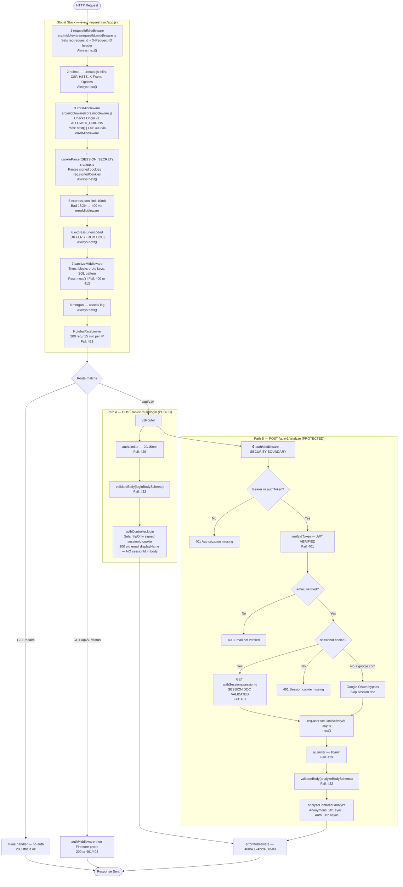

# DIAGRAM 1 — Middleware Chain & Request Lifecycle

**IMPLEMENTATION STATUS:** Fully built. Global middleware matches master doc plus `express.urlencoded`. Route-level auth/rate-limit/validate fully implemented. `health.controller.js` is unused (health is inline in `app.js`).

**DEVIATIONS FROM DOC:**
- `express.urlencoded` added after `express.json`
- Google OAuth bypasses session cookie in `auth.middleware.js`
- JWT also accepted via `?authToken=` query param
- Debug `console.log` of token in auth middleware

---

---

## KEY INSIGHTS

- **Security boundary** for protected routes is `authMiddleware` — JWT verification plus Firestore session validation for email/password users.
- Global middleware runs identically for public and protected routes; auth/rate-limit/validate stack after the global chain.
- Google OAuth is an exception: Firebase JWT alone suffices with no Firestore session lookup.
