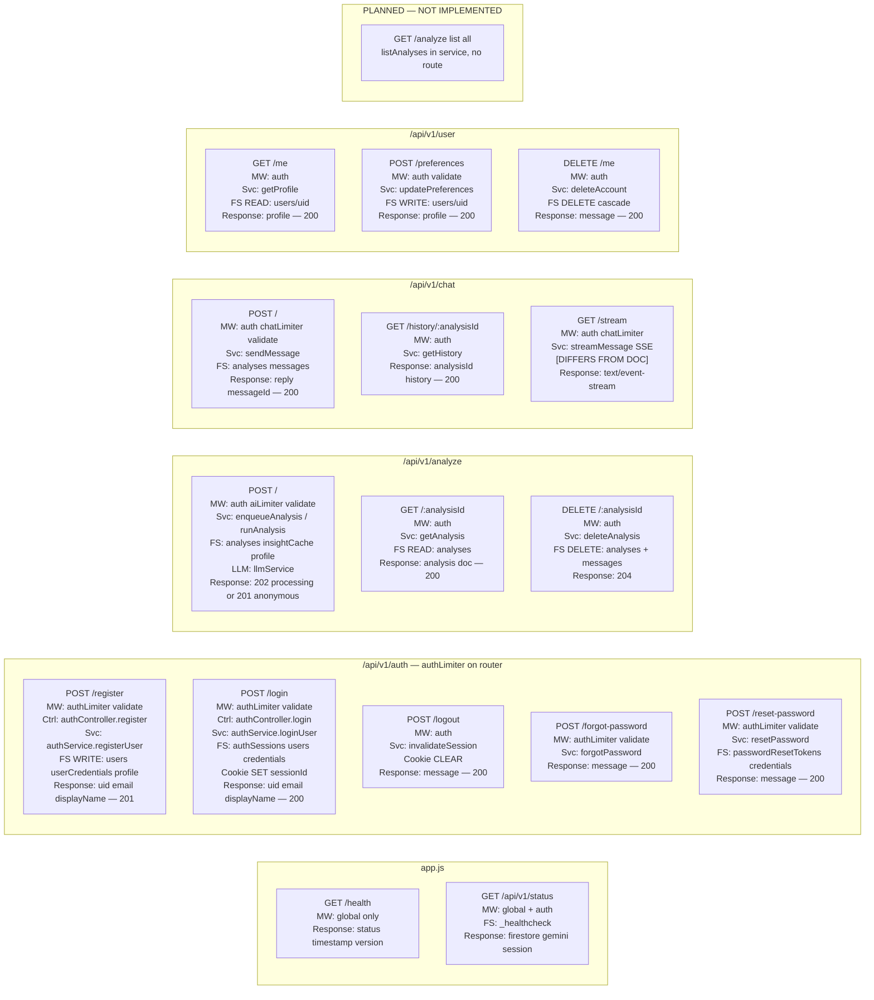

# DIAGRAM 2 — API Route Map with Security and Rate Limit Layers

**IMPLEMENTATION STATUS:** All documented auth/analyze/chat/user routes implemented. Extra routes: `GET /health`, `GET /api/v1/status`, `GET /api/v1/chat/stream`. `listAnalyses` has no route. `health.controller.js` is unused.

**DEVIATIONS FROM DOC:**
- User routes: `/user/me`, `/user/preferences`, `DELETE /user/me` (not flat `/user`)
- Authenticated `POST /analyze` returns **202** async job
- Groq primary LLM, Gemini fallback
- Chat SSE streaming not in master doc

---

---

## KEY INSIGHTS

- **Data isolation** via path scoping `users/{uid}/...` rather than `.where('userId')` on every query.
- Rate limits layer: global 200/15min → auth 20/15min → ai 10/min or chat 5/min.
- Login **sets** httpOnly cookie; logout clears it; protected routes **read** it in authMiddleware.
