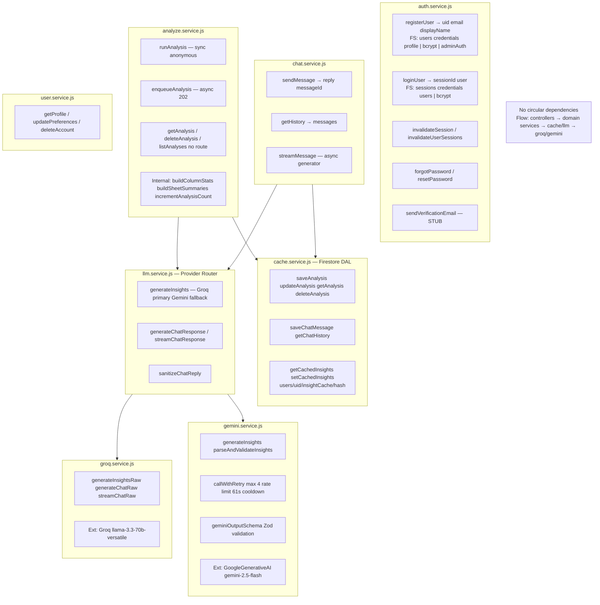

# DIAGRAM 3 — Service Layer Architecture & Inter-Service Dependencies

**IMPLEMENTATION STATUS:** Six service modules fully implemented. No circular dependencies. `cache.service.js` is the Firestore data-access layer.

**DEVIATIONS FROM DOC:**
- `llm.service.js` + `groq.service.js` not in master doc (Groq primary, Gemini fallback)
- `cache.service.js` handles analyses/messages/insightCache — not pure cache
- In-memory Q&A cache via `geminiThrottle.util.js`

---

---

## KEY INSIGHTS

- `cache.service.js` is the **single Firestore gateway** for analyses, messages, and insight cache under `users/{uid}/`.
- `llm.service.js` routes to Groq first when `LLM_PRIMARY_PROVIDER=groq`, Gemini on fallback error codes.
- `auth.service.js` is self-contained with no dependency on other domain services.
