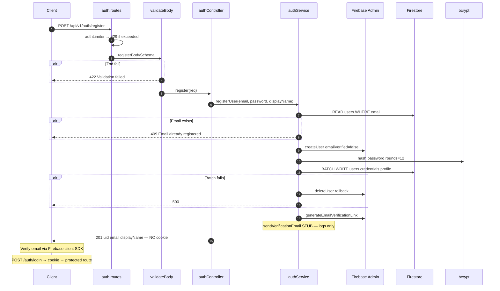
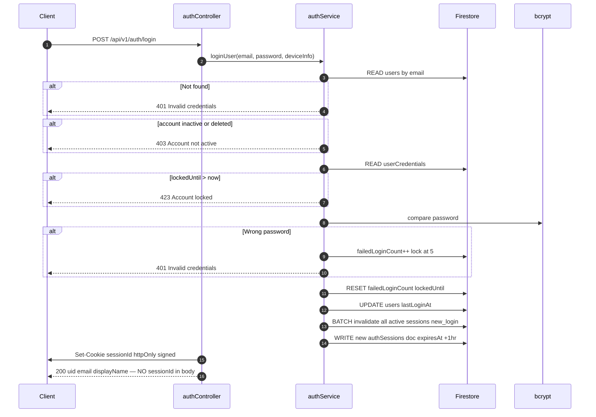
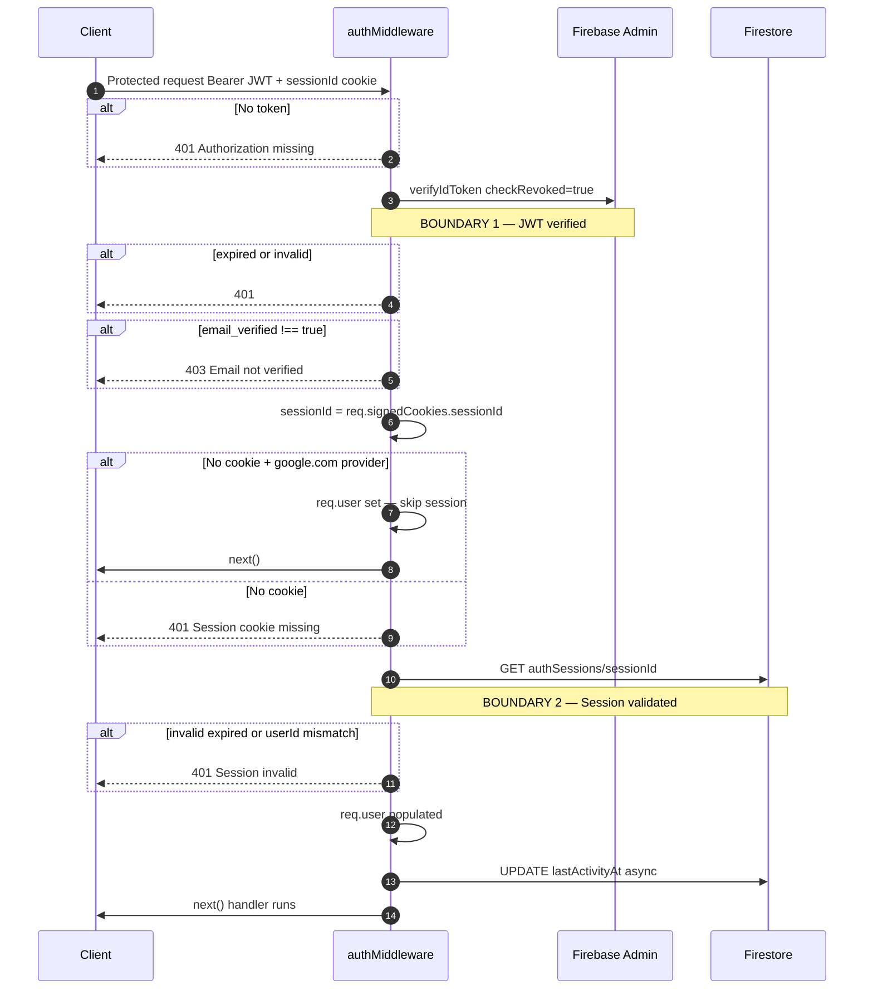
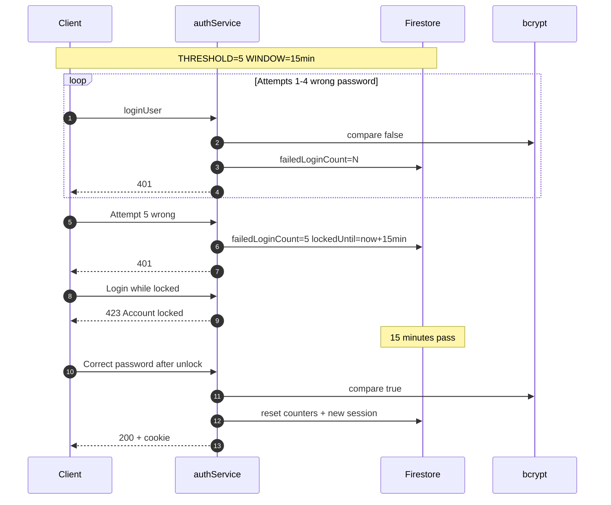

# DIAGRAM 4 — Complete Auth & Session Security Flow

**IMPLEMENTATION STATUS:** Registration, login, session validation, and lockout fully implemented. Email sending is stubbed. `reset-password` expects `passwordResetTokens` but `forgot-password` does not populate it.

**DEVIATIONS FROM DOC:**
- Registration does not auto-login — verify email then login required
- Google OAuth bypasses session cookie
- Login validates bcrypt locally; optional `x-firebase-id-token` for session hash
- `sendVerificationEmail` logs only — no real email provider

---

## Flow A — Email/Password Registration

---

## Flow B — Login with Single-Session Enforcement

---

## Flow C — Protected Request Validation

---

## Flow D — Account Lockout

---

## KEY INSIGHTS

- **Two-factor session** for email/password: Firebase JWT plus Firestore session doc.
- Registration returns **no session** — 403 on protected routes until email verified and login completes.
- Lockout is credential-level: 5 failures → 15-minute lock in `userCredentials`.
