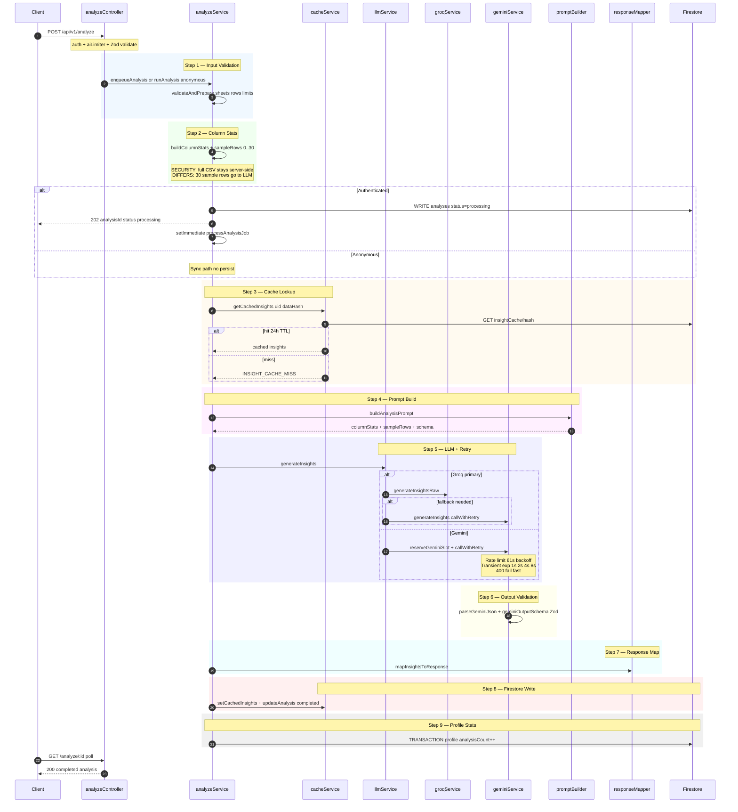
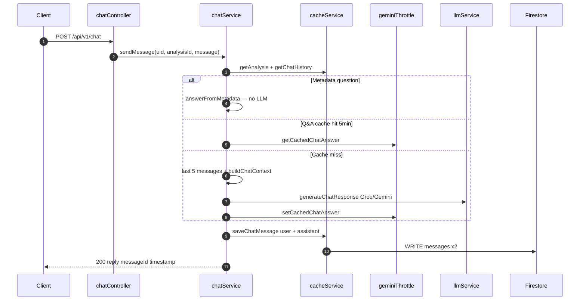

# DIAGRAM 5 — Gemini AI Pipeline & Data Flow

**IMPLEMENTATION STATUS:** Full analyze pipeline with async jobs, insight cache, multi-sheet support, Groq/Gemini routing, chat with metadata bypass and streaming.

**DEVIATIONS FROM DOC:**
- Groq primary (`LLM_PRIMARY_PROVIDER=groq`), Gemini fallback
- Up to 30 `sampleRows` per sheet sent to LLM — doc says columnStats only
- Authenticated analyze is async 202 + poll GET
- In-memory RPM gate and Q&A cache not in doc

---

## Analyze Pipeline

---

## Chat AI Flow

---

## KEY INSIGHTS

- Raw CSV never appears in API responses, but **up to 30 sample rows per sheet** are sent to the LLM.
- Authenticated analysis is **async** — client polls until `status=completed` or `failed`.
- LLM routing: Groq Llama 3.3 70B default, Gemini 2.5 Flash fallback with separate retry/throttle.
