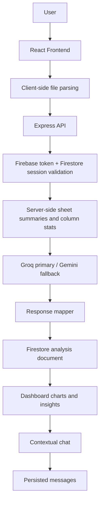

# High-Level Overview

## What The Application Is

BizPulseAI is a spreadsheet-to-insights web application. Users upload CSV or Excel datasets, the frontend parses the file into tabular rows and sheet metadata, and the backend computes column statistics, generates AI insights, persists the analysis, and enables follow-up chat about the uploaded data.

The implemented system has two deployable applications:

- `BizPulseAI_Backend`: Node.js 18+, Express 5 API, Firebase Admin SDK, Firestore persistence, Firebase Auth integration, Groq and Gemini LLM providers.
- `BizPulseAI_Frontend`: React 19, Vite, Tailwind CSS v4, Zustand, Firebase Client SDK, Recharts, Papa Parse, SheetJS/XLSX.

## Business Problem

The app reduces the effort needed to inspect business data. Instead of asking users to write SQL, configure dashboards, or manually inspect spreadsheets, it accepts familiar file formats and produces:

- Column statistics and data quality summaries.
- AI-generated trends, anomalies, correlations, and recommendations.
- Suggested chart configurations and Recharts visualizations.
- Conversational follow-up analysis scoped to the persisted dataset.

## Intended Users

The implementation is built for authenticated business users who need quick interpretation of spreadsheet data. The UI supports email/password and Google sign-in, and the backend supports an anonymous Firebase provider path for token-authenticated anonymous users, with a stricter analysis row limit.

## Primary Use Cases

- Register or log in.
- Upload CSV, XLS, or XLSX files up to 5 MB from the frontend.
- Preview parsed rows and submit a dataset for analysis.
- Poll for asynchronous analysis completion.
- View charts, AI insights, data quality notes, and recommended actions.
- Browse prior analyses grouped by dataset hash.
- Chat with a selected analysis, including streaming Server-Sent Events responses.
- Delete an analysis and its chat messages.
- Update user preferences.
- Delete an account.
- Request and complete password reset using backend-generated reset tokens.

## Overall Workflow



## Technology Stack

| Layer | Technologies | Where Used | Why It Fits |
|---|---|---|---|
| Frontend runtime | React 19, Vite | `BizPulseAI_Frontend/src` | Component-driven SPA with fast local builds. |
| Frontend routing | React Router DOM | `src/App.jsx` | Route guards and nested protected layout. |
| Frontend state | Zustand, immer, persist middleware | `src/store` | Small global stores for auth and analysis history without Redux boilerplate. |
| Styling | Tailwind CSS v4 | `src/index.css`, JSX class names | Design tokens and utility styling across pages. |
| Charts | Recharts | `Dashboard.page.jsx` | Declarative React chart rendering from backend chart data. |
| File parsing | Papa Parse, SheetJS/XLSX | `fileParser.util.js` | CSV and multi-sheet Excel parsing before API submission. |
| Auth client | Firebase Client SDK | `firebase.client.js` | Browser Firebase session, ID token generation, Google popup login. |
| API server | Node.js 18+, Express 5 | `server.js`, `src/app.js` | REST API, middleware pipeline, route/controller/service layering. |
| Validation | Zod | `src/schemas`, `env.config.js`, `gemini.service.js` | Runtime validation for env vars, request bodies, and LLM output. |
| Persistence | Firebase Firestore | `cache.service.js`, service modules | Per-user document hierarchy, admin SDK access, simple serverless storage. |
| Auth admin | Firebase Admin SDK | `firebase.config.js`, `auth.middleware.js`, `auth.service.js` | User creation, token verification, custom token issuance, account deletion. |
| Password hashing | bcryptjs | `auth.service.js` | Salted password hashing for backend-owned credentials. |
| AI providers | Groq SDK, Google Generative AI SDK | `llm.service.js`, `groq.service.js`, `gemini.service.js` | Groq primary route for throughput, Gemini fallback and JSON/text model instances. |
| Security middleware | Helmet, CORS, cookie-parser, express-rate-limit | `src/app.js`, `src/middleware` | Headers, origin allowlist, signed cookies, request throttling. |
| Logging | Morgan, custom JSON logger | `src/app.js`, `logger.util.js` | HTTP logs and structured app logs with request IDs. |
| Tests | Jest, Supertest dependency | `__tests__` | Unit tests for auth, analysis helpers, and prompt builder. |
| Deployment | Render | `render.yaml` | Web service deployment with health check and managed env vars. |

## System Architecture

```mermaid
graph TB
    subgraph Browser["Browser"]
        UI[React UI]
        FirebaseClient[Firebase Client SDK]
        Stores[Zustand Stores]
    end

    subgraph API["Express Backend"]
        App[app.js]
        Middleware[Request ID / Helmet / CORS / Cookies / JSON / Sanitize / Morgan / Rate Limit]
        Routes[/api/v1 routes]
        Controllers[Controllers]
        Services[Services]
        Utils[Utilities and schemas]
    end

    subgraph Firebase["Firebase"]
        Auth[Firebase Auth]
        Firestore[Firestore]
    end

    subgraph AI["LLM Providers"]
        Groq[Groq Llama 4 Scout]
        Gemini[Gemini 2.5 Flash]
    end

    UI --> Stores
    UI --> FirebaseClient
    UI -->|Bearer ID token + signed cookie| Middleware
    Middleware --> Routes --> Controllers --> Services
    Services --> Utils
    Services --> Firestore
    Services --> Auth
    Services --> Groq
    Services --> Gemini
    FirebaseClient --> Auth
```

## High-Level Design Decisions

- The backend owns email/password credential validation and server-side sessions, while Firebase Client SDK still owns browser auth state through custom tokens.
- Analyses for authenticated users are asynchronous. The API returns a `processing` document quickly and the dashboard polls until completion.
- Chat can stream via SSE using `fetch`, because standard `EventSource` cannot attach the Firebase bearer token.
- Firestore writes are backend-managed for sensitive records. Firestore rules deny client writes to credentials, sessions, analyses, messages, and insight cache.
- LLM output is treated as untrusted. Structured insights are parsed, normalized, and Zod-validated before being mapped to frontend response shapes.

