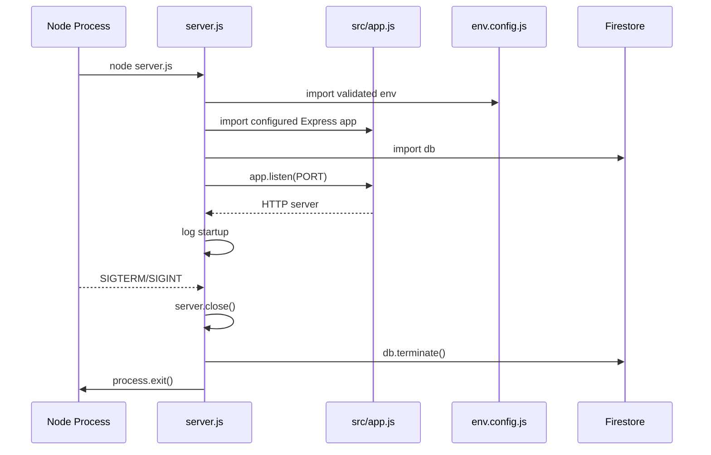
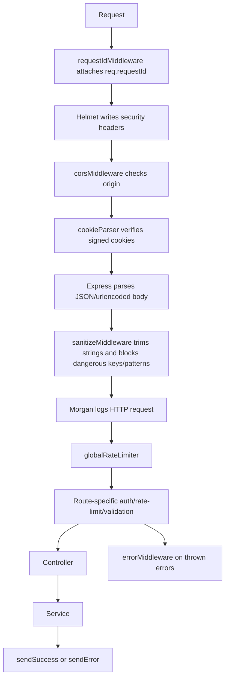
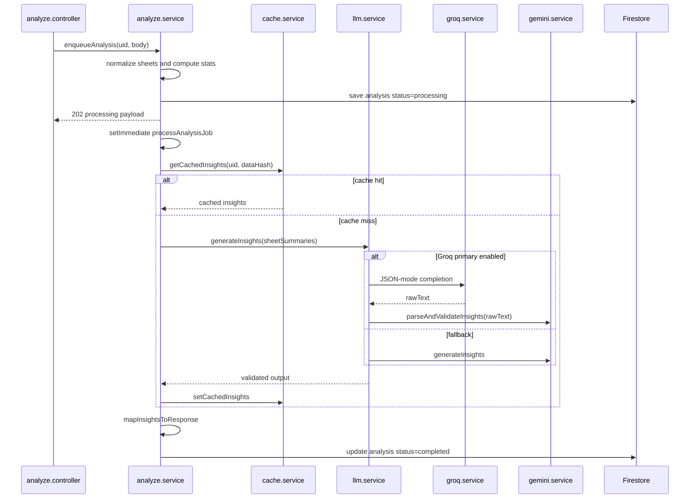
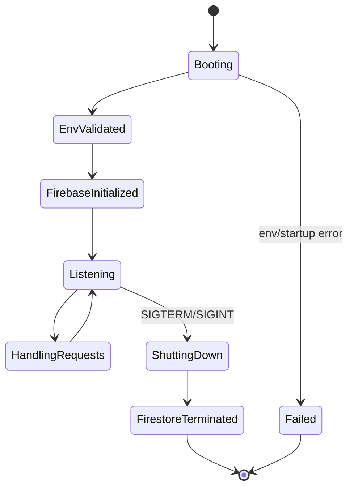

# Backend Architecture

## Backend Summary

The backend is an Express 5 application with layered structure:

```text
server.js -> src/app.js -> middleware -> routes -> controllers -> services -> models/utils/config -> Firestore/Auth/LLMs
```

The backend is the architectural center of the project. It owns:

- Environment validation and process startup.
- Firebase Admin initialization.
- Security middleware and response envelopes.
- Email/password registration and login.
- Firestore session validation.
- Dataset analysis orchestration.
- AI provider routing and fallback.
- Chat history and streaming chat persistence.
- User profile and account deletion.

## Server Initialization

`server.js` imports the Express app, validated `env`, Firestore `db`, and the JSON logger. It calls `app.listen(env.PORT)` and logs process metadata. Startup errors are caught and terminate the process with exit code `1`.

The same file handles `SIGTERM` and `SIGINT`. On shutdown it closes the HTTP server, calls `db.terminate()`, logs graceful shutdown, and exits.



## Application Assembly

`src/app.js` creates the Express app and mounts middleware in this order:

1. `requestIdMiddleware`
2. `helmet`
3. `corsMiddleware`
4. `cookieParser(env.SESSION_SECRET)`
5. `express.json({ limit: "50mb" })`
6. `express.urlencoded({ extended: false, limit: "50mb" })`
7. `sanitizeMiddleware`
8. `morgan`
9. `globalRateLimiter`
10. `/health`
11. `/api/v1/status` with `authMiddleware`
12. `/api/v1` router
13. `errorMiddleware`

```mermaid
flowchart LR
    REQ[Incoming request] --> RID[requestId]
    RID --> HELMET[Helmet headers]
    HELMET --> CORS[CORS allowlist]
    CORS --> COOKIES[Signed cookie parser]
    COOKIES --> BODY[JSON/urlencoded 50mb]
    BODY --> SAN[Sanitize body/query/params]
    SAN --> LOG[Morgan]
    LOG --> RL[Global rate limit]
    RL --> ROUTE[Health/status/v1 routes]
    ROUTE --> ERR[Error middleware]
```



## Configuration Loading

`src/config/env.config.js` uses Zod to validate required environment variables at import time. It normalizes escaped newlines in `FIREBASE_PRIVATE_KEY`, freezes the resulting config object, and exits the process if validation fails.

Validated variables:

- `PORT`, default `"8080"`.
- `NODE_ENV`, one of `development`, `production`, `test`.
- `FIREBASE_PROJECT_ID`.
- `FIREBASE_CLIENT_EMAIL`.
- `FIREBASE_PRIVATE_KEY`.
- `GEMINI_API_KEY`.
- `GROQ_API_KEY`, optional.
- `LLM_PRIMARY_PROVIDER`, default `groq`.
- `ALLOWED_ORIGINS`, comma-separated valid URLs.
- `JWT_AUDIENCE`.
- `SESSION_SECRET`, minimum 32 characters.

`JWT_AUDIENCE` is validated as required but is not used elsewhere in the current implementation. Firebase Admin token verification is delegated to `adminAuth.verifyIdToken(token, true)`.

## Firebase Initialization

`src/config/firebase.config.js` builds a service account from env vars and uses `getApps()` to avoid duplicate initialization. It exports:

- `adminApp`.
- `db`, a Firestore instance.
- `adminAuth`, a Firebase Admin Auth instance.

## Dependency Injection Pattern

There is no formal dependency injection container. Dependencies are imported directly as ES modules. Test files use `jest.unstable_mockModule` to replace imports. This keeps runtime simple but couples modules to concrete implementations. If the codebase grows, service factories or explicit interfaces would improve testability.

## Routes And Controllers

The v1 router mounts feature routers:

```mermaid
graph TD
    V1[src/routes/v1/index.js] --> AUTH[/auth]
    V1 --> ANALYZE[/analyze]
    V1 --> CHAT[/chat]
    V1 --> USER[/user]
    AUTH --> AuthController[auth.controller.js]
    ANALYZE --> AnalyzeController[analyze.controller.js]
    CHAT --> ChatController[chat.controller.js]
    USER --> UserController[user.controller.js]
```

Controllers are intentionally thin. They validate request-level preconditions, call service methods, and send standardized success/error responses.

## Middleware Pipeline



## Validation

`validate.middleware.js` exports `validateBody`, `validateQuery`, and `validateParams`. The current route files use `validateBody` for auth, analysis, chat, and preferences.

Request schemas:

- `auth.schema.js`: login, register, forgot password, reset password.
- `analyze.schema.js`: multi-sheet `sheets` payload or legacy `headers` + `rows`.
- `chat.schema.js`: `message` max 500 characters and UUID `analysisId`.
- `user.schema.js`: preferences fields.

Param validation helpers exist but route params such as `:analysisId` are not currently validated by `validateParams`.

## Error Handling

`error.middleware.js` logs unhandled errors and maps known cases:

- Invalid JSON body -> `400`.
- CORS policy violation -> `403`.
- Zod validation errors -> `422` with issue details.
- Expired Firebase token -> `401`.
- Unknown errors -> `500` with generic message.

Service-specific errors, such as `AuthServiceError`, are caught in controllers and mapped before reaching the global handler.

## Logging

- `logger.util.js` writes JSON lines to stdout.
- Debug logs are suppressed in production.
- Development logs are pretty-printed.
- `requestId` is passed by many service/controller logs to correlate events.
- `morgan` provides HTTP access logs.

The password reset email stub logs the plain reset token for development. This is explicitly a placeholder and must be replaced before production email delivery.

## Services

### `auth.service.js`

Responsibilities:

- Find user by normalized email.
- Register Firebase Auth user and Firestore user/credential/profile docs.
- Hash passwords with bcrypt salt rounds `12`.
- Generate Firebase email verification link.
- Generate custom tokens for frontend bridge login.
- Validate login password and lock accounts after 5 failed attempts for 15 minutes.
- Enforce single active session by invalidating existing sessions on new login.
- Store session docs in `authSessions`.
- Create and verify password reset tokens via SHA-256 hashes.
- Invalidate sessions after password reset.

### `analyze.service.js`

Responsibilities:

- Normalize legacy and multi-sheet payloads.
- Validate non-empty rows.
- Enforce anonymous demo limit of 100 total rows.
- Compute column stats: type, null count, unique count, numeric min/max/mean/stdDev, categorical top values.
- Skip columns with more than 50 percent null-like values.
- Compute data hashes.
- Check 24-hour insight cache.
- Generate insights through `llm.service.js`.
- Save `processing`, `completed`, or `failed` analysis documents.
- Increment profile analysis count.
- List, fetch, and delete analyses through `cache.service.js`.

### `chat.service.js`

Responsibilities:

- Fetch analysis context.
- Answer simple metadata questions without LLM calls.
- Cache repeat chat answers in memory for 5 minutes.
- Build compact multi-sheet chat context.
- Generate non-streaming or streaming LLM responses.
- Persist user and assistant messages with shared `turnId` and `turnIndex`.
- Update parent analysis `lastMessageAt` and `messageCount`.

### `llm.service.js`

Provider router:

- Uses Groq first when `LLM_PRIMARY_PROVIDER === "groq"` and `GROQ_API_KEY` is configured.
- Falls back to Gemini for recoverable Groq failures: not configured, rate limited, transient, invalid output.
- Reuses Gemini parsing and validation for structured insight output.

### `gemini.service.js`

Responsibilities:

- Generate structured JSON insights.
- Generate non-streaming chat replies.
- Generate streaming chat responses.
- Retry transient Gemini errors with backoff.
- Fail fast on local RPM gate errors for chat.
- Parse raw JSON defensively and validate against Zod schema.
- Sanitize chat replies that are accidentally JSON-wrapped.

### `groq.service.js`

Responsibilities:

- Convert Gemini-style string prompts into OpenAI-style chat completion messages.
- Generate raw JSON-mode insights.
- Generate raw chat text.
- Stream chat deltas.
- Normalize SDK errors into project error codes.

### `cache.service.js`

Despite its name, this is both Firestore persistence and insight-cache access:

- Save/update/get/delete analysis docs.
- Delete chat messages when deleting an analysis.
- List analyses ordered by `createdAt desc`.
- Save chat messages.
- Fetch chat history ordered by `createdAt asc`.
- Store and retrieve per-user `insightCache/{dataHash}` docs with 24-hour expiry.

### `user.service.js`

Responsibilities:

- Get root user document.
- Update root user preferences.
- Delete analysis messages, analysis docs, user doc, and Firebase Auth account.

Limitations: account deletion does not delete `userCredentials`, `authSessions`, `passwordResetTokens`, or `insightCache` documents in the current code.

## AI Pipeline



## Application Lifecycle



