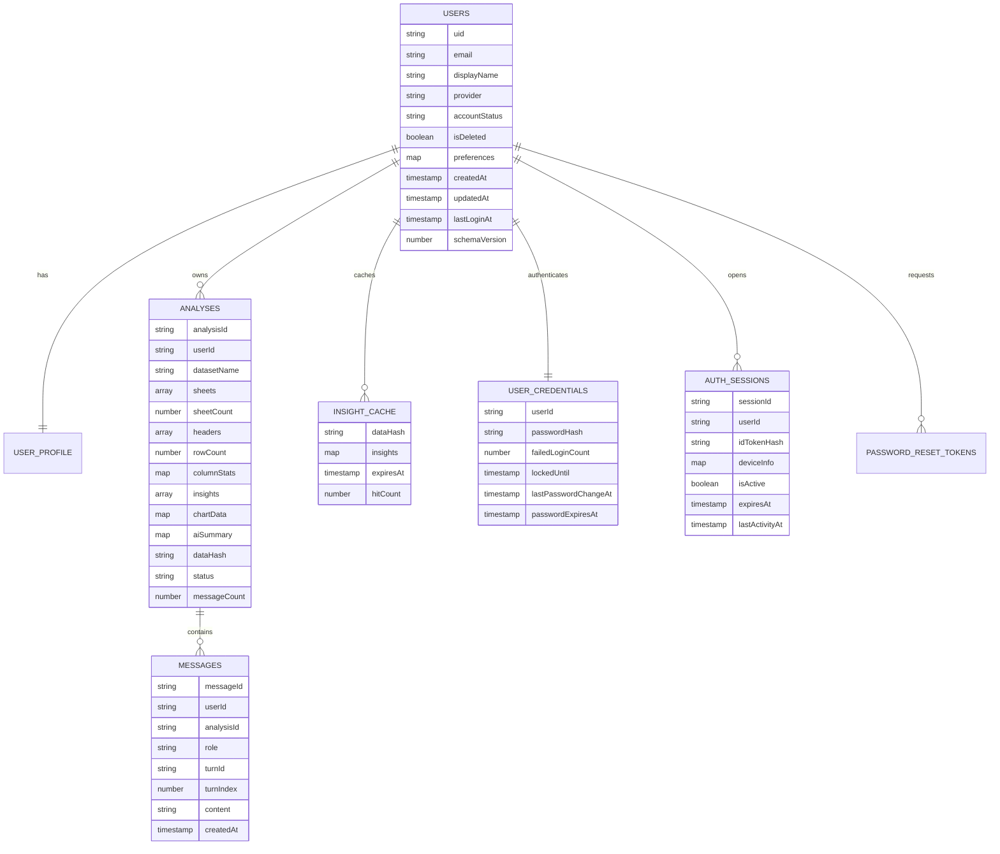

# API And Database Documentation

## Response Envelope

Successful responses use `sendSuccess` from `src/utils/response.util.js`:

```json
{
  "success": true,
  "data": {},
  "meta": {
    "requestId": "uuid",
    "timestamp": "ISO-8601",
    "version": "1.0"
  }
}
```

Errors use `sendError` or `error.middleware.js`:

```json
{
  "success": false,
  "error": {
    "code": 401,
    "message": "Invalid or expired token"
  },
  "meta": {
    "requestId": "uuid",
    "timestamp": "ISO-8601"
  }
}
```

The frontend Axios client unwraps successful envelopes so page code receives `response.data.data` directly.

## Common Headers

Protected endpoints require:

| Header/Cookie | Required | Purpose |
|---|---:|---|
| `Authorization: Bearer <Firebase ID token>` | Yes | Verified by `auth.middleware.js`. |
| Signed `sessionId` cookie | Yes for backend email/password sessions | Validates active Firestore session. |
| `Content-Type: application/json` | For JSON bodies | Required by Express body parser. |
| `Accept: text/event-stream` | For chat stream | Used by frontend `fetch` stream client. |

Google OAuth users can pass auth with a valid Firebase token even without the backend `sessionId` cookie because `auth.middleware.js` allows `firebase.sign_in_provider === "google.com"` through.

## Endpoint Summary

| Method | Path | Auth | Rate Limit | Controller |
|---|---|---:|---|---|
| `GET` | `/health` | No | None | Inline in `app.js` |
| `GET` | `/api/v1/status` | Yes | Global | Inline in `app.js` |
| `POST` | `/api/v1/auth/register` | No | Auth limiter | `auth.controller.register` |
| `POST` | `/api/v1/auth/login` | No | Auth limiter | `auth.controller.login` |
| `POST` | `/api/v1/auth/logout` | Yes | Auth limiter + global | `auth.controller.logout` |
| `POST` | `/api/v1/auth/forgot-password` | No | Auth limiter | `auth.controller.forgotPassword` |
| `POST` | `/api/v1/auth/reset-password` | No | Auth limiter | `auth.controller.resetPassword` |
| `GET` | `/api/v1/analyze` | Yes | Global | `analyze.controller.listAnalyses` |
| `POST` | `/api/v1/analyze` | Yes | AI limiter | `analyze.controller.analyze` |
| `GET` | `/api/v1/analyze/:analysisId` | Yes | Global | `analyze.controller.getAnalysis` |
| `DELETE` | `/api/v1/analyze/:analysisId` | Yes | Global | `analyze.controller.deleteAnalysis` |
| `POST` | `/api/v1/chat` | Yes | Chat limiter | `chat.controller.chat` |
| `GET` | `/api/v1/chat/history/:analysisId` | Yes | Global | `chat.controller.getHistory` |
| `GET` | `/api/v1/chat/stream` | Yes | Chat limiter | `chat.controller.stream` |
| `GET` | `/api/v1/user/me` | Yes | Global | `user.controller.getProfile` |
| `POST` | `/api/v1/user/preferences` | Yes | Global | `user.controller.updatePreferences` |
| `DELETE` | `/api/v1/user/me` | Yes | Global | `user.controller.deleteAccount` |

## Auth Endpoints

### `POST /api/v1/auth/register`

Purpose: Create a Firebase Auth user, Firestore user document, credential document, profile subdocument, generate verification link, and return a Firebase custom token.

Request body:

```json
{
  "email": "user@example.com",
  "password": "Password123",
  "displayName": "Demo User"
}
```

Validation:

- `email`: valid email, lowercased and trimmed.
- `password`: 8-128 characters, at least one uppercase letter and one number.
- `displayName`: 2-100 characters, trimmed.

Response `201`:

```json
{
  "uid": "firebase-uid",
  "email": "user@example.com",
  "displayName": "Demo User",
  "firebaseCustomToken": "jwt"
}
```

Errors:

- `409 EMAIL_ALREADY_EXISTS`.
- `422` validation failure.
- `500` for Firebase/Firestore failures after rollback attempt.

Security considerations:

- Password is stored only as bcrypt hash in `userCredentials`.
- Backend returns a custom token so the frontend can establish Firebase client auth state immediately.
- Email verification link generation is attempted, but sending is a stub.

### `POST /api/v1/auth/login`

Purpose: Validate backend password credentials, create a Firestore session, set signed `sessionId` cookie, and return a Firebase custom token.

Request body:

```json
{
  "email": "user@example.com",
  "password": "Password123"
}
```

Optional header:

- `x-firebase-id-token`: included in session token hash if present; otherwise a random UUID is hashed.

Response `200` sets cookie:

```http
Set-Cookie: sessionId=<signed>; HttpOnly; SameSite=Strict; Max-Age=3600
```

Response data:

```json
{
  "uid": "firebase-uid",
  "email": "user@example.com",
  "displayName": "Demo User",
  "firebaseCustomToken": "jwt"
}
```

Errors:

- `401 INVALID_CREDENTIALS`.
- `403 ACCOUNT_INACTIVE`.
- `423 ACCOUNT_LOCKED`.
- `422` validation failure.

Business logic:

- Failed password increments `failedLoginCount`.
- Five failures locks the credential for 15 minutes.
- Successful login resets failure counters.
- New login invalidates prior active sessions.

### `POST /api/v1/auth/logout`

Purpose: Invalidate current session and clear cookie.

Auth: Firebase bearer token plus signed session cookie.

Response `200`:

```json
{ "message": "Logged out" }
```

Edge case: Google OAuth users use `sessionId: "google-oauth-session"` in `req.user`. Calling logout with that synthetic value is harmless because `invalidateSession` returns when no Firestore doc exists.

### `POST /api/v1/auth/forgot-password`

Purpose: Generate a 64-character reset token for existing accounts and store only its SHA-256 hash in Firestore.

Request:

```json
{ "email": "user@example.com" }
```

Response always returns `200`:

```json
{ "message": "If the account exists, a reset email has been sent." }
```

Security:

- Non-enumerating response.
- Plain token is logged by the current development stub. A real email provider is not implemented.

### `POST /api/v1/auth/reset-password`

Purpose: Hash a new password, update `userCredentials/{uid}`, delete reset token, and invalidate active sessions.

Request:

```json
{
  "token": "64-char-hex-token",
  "newPassword": "NewPassword123"
}
```

Validation:

- `token`: exactly 64 characters.
- `newPassword`: 8-128 characters.

Response:

```json
{ "message": "Password reset successful" }
```

Errors:

- `400 INVALID_TOKEN`.
- `400 EXPIRED_TOKEN`.
- `422` validation failure.

Current limitation: reset schema does not enforce uppercase/number complexity on `newPassword`, unlike registration.

## Analysis Endpoints

### `GET /api/v1/analyze`

Purpose: List authenticated user's analyses ordered by `createdAt desc`.

Response:

```json
[
  {
    "analysisId": "uuid",
    "datasetName": "sales",
    "status": "completed",
    "rowCount": 1200,
    "sheetCount": 2,
    "messageCount": 4
  }
]
```

Dependencies: `cache.service.getAllAnalyses`.

### `POST /api/v1/analyze`

Purpose: Submit parsed dataset for AI analysis.

Request body, preferred multi-sheet shape:

```json
{
  "datasetName": "sales",
  "sheets": [
    {
      "name": "Sheet1",
      "headers": ["region", "revenue"],
      "rows": [
        { "region": "APAC", "revenue": 1000 }
      ]
    }
  ]
}
```

Legacy shape:

```json
{
  "datasetName": "sales",
  "headers": ["region", "revenue"],
  "rows": [
    { "region": "APAC", "revenue": 1000 }
  ]
}
```

Validation:

- `datasetName`: 1-100 chars.
- `sheets`: 1-20 sheets.
- sheet `name`: 1-200 chars.
- headers: 1-100 strings, each 1-200 chars.
- rows: 1-50,000 per sheet.
- Must provide either `sheets` or both `headers` and `rows`.

Authenticated user response: `202`.

```json
{
  "analysisId": "uuid",
  "status": "processing",
  "datasetName": "sales",
  "rowCount": 1200,
  "sheetCount": 2,
  "sheets": [
    { "name": "Sheet1", "headers": ["region"], "rowCount": 1200 }
  ]
}
```

Anonymous user response: `201` with full analysis data, because there is no persisted job to poll.

Business logic:

- Computes stats server-side.
- Authenticated flow persists initial `processing` doc and starts background job via `setImmediate`.
- Background job updates doc to `completed` or `failed`.
- Anonymous flow is synchronous and limited to 100 total rows.

Performance considerations:

- Body parser allows 50 MB JSON.
- Sanitizer caps total string length at 25 million characters.
- Insight cache avoids repeat LLM calls for identical user/data hash within 24 hours.

### `GET /api/v1/analyze/:analysisId`

Purpose: Fetch one analysis document for the authenticated user.

Response `200`: Firestore analysis document. During async analysis it may have `status: "processing"`, empty `insights`, empty `chartData`, and no `completedAt`.

Errors:

- `404 Analysis not found`.

Security: The UID comes from `req.user.uid`, so users can only read their own subcollection path.

### `DELETE /api/v1/analyze/:analysisId`

Purpose: Delete one analysis and its `messages` subcollection.

Response: `204 No Content`.

Current behavior: deleting a nonexistent doc does not throw in Firestore. The endpoint can return `204` even if the analysis did not exist.

## Chat Endpoints

### `POST /api/v1/chat`

Purpose: Ask a non-streaming question about a saved analysis.

Request:

```json
{
  "analysisId": "uuid",
  "message": "Which region had the highest revenue?"
}
```

Validation:

- `analysisId`: UUID.
- `message`: 1-500 chars.

Response:

```json
{
  "reply": "The APAC region had the highest revenue...",
  "content": "The APAC region had the highest revenue...",
  "answer": "The APAC region had the highest revenue...",
  "messageId": "uuid",
  "turnId": "uuid",
  "role": "assistant",
  "timestamp": "ISO-8601"
}
```

Business logic:

- Fetches analysis.
- Answers metadata questions locally when possible.
- Uses in-memory Q&A cache for repeated questions.
- Calls LLM otherwise.
- Persists user and assistant messages.

### `GET /api/v1/chat/history/:analysisId`

Purpose: Return the last 50 normalized chat messages for an analysis.

Response:

```json
{
  "analysisId": "uuid",
  "history": [
    {
      "messageId": "uuid",
      "role": "user",
      "turnId": "uuid",
      "turnIndex": 0,
      "reply": "Question",
      "content": "Question",
      "createdAt": "ISO-8601"
    }
  ]
}
```

Current limitation: `analysisId` route param is not validated as UUID in this route.

### `GET /api/v1/chat/stream`

Purpose: Stream assistant response through Server-Sent Events.

Query params:

- `analysisId`.
- `message`.
- `authToken` is accepted by auth middleware, but frontend uses `Authorization` header through `fetch`.

Response headers:

```http
Content-Type: text/event-stream
Cache-Control: no-cache
Connection: keep-alive
```

Frames:

```text
data: {"content":"partial text"}

data: [DONE]
```

Current validation: controller checks only that `analysisId` and `message` query params exist. It does not apply `chatBodySchema` to query params.

## User Endpoints

### `GET /api/v1/user/me`

Purpose: Fetch root user profile document.

Fallback: if the document does not exist, returns `{ uid, preferences: {} }`.

### `POST /api/v1/user/preferences`

Request:

```json
{
  "preferredChartType": "bar",
  "timezone": "UTC",
  "bio": "Analyst"
}
```

Validation:

- `preferredChartType`: `bar`, `line`, or `pie`.
- `timezone`: max 50 chars.
- `bio`: max 500 chars.

Current behavior: writes preferences into the root `users/{uid}` document with `updatedAt` as an ISO string, while model factories use Firestore server timestamps elsewhere.

### `DELETE /api/v1/user/me`

Purpose: Delete account data and Firebase Auth user.

Current deletion scope:

- Deletes chat messages under each analysis.
- Deletes analysis docs.
- Deletes root user doc.
- Deletes Firebase Auth user.

Not deleted in current code:

- `userCredentials/{uid}`.
- `authSessions` documents for the user.
- `passwordResetTokens`.
- `users/{uid}/insightCache`.
- `users/{uid}/profile/data` explicitly, unless root delete removes subcollections in the deployed Firestore behavior. Firestore document deletion does not automatically delete subcollections.

## Database Technology

The database is Firebase Firestore, accessed from the backend through Firebase Admin SDK. The frontend Firebase client can read a limited set of owner-owned documents based on Firestore rules, but most writes are backend-only.

## Firestore Collections And Documents



## Physical Firestore Paths

```text
authSessions/{sessionId}
userCredentials/{uid}
passwordResetTokens/{tokenHash}
users/{uid}
users/{uid}/profile/data
users/{uid}/analyses/{analysisId}
users/{uid}/analyses/{analysisId}/messages/{messageId}
users/{uid}/insightCache/{dataHash}
```

## Indexes

`firestore.indexes.json` defines composite indexes for:

- `authSessions`: `userId + isActive`, `userId + isActive + expiresAt`, `userId + createdAt desc`.
- `analyses` collection group: `isDeleted + createdAt desc`, `status + createdAt desc`.
- `messages` collection group: `isDeleted + createdAt asc`.

Some defined indexes target fields that the current implementation does not consistently write (`isDeleted` on analyses/messages). They may be reserved for planned soft-delete behavior.

## Query Patterns

- Find user by email: `users.where("email", "==", normalizedEmail).limit(1)`.
- Find active sessions: `authSessions.where("userId", "==", uid).where("isActive", "==", true)`.
- List analyses: `users/{uid}/analyses.orderBy("createdAt", "desc")`.
- Chat history: `users/{uid}/analyses/{analysisId}/messages.orderBy("createdAt", "asc")`.
- Cache lookup: `users/{uid}/insightCache/{dataHash}`.

## Database Performance And Scalability

Strengths:

- Per-user subcollections keep most reads scoped to one user's partition.
- Analysis list and chat history use ordered queries.
- Insight cache reduces LLM calls for repeated identical datasets.

Limitations:

- Deleting subcollections is done with simple loops/batches and is not paginated for very large histories.
- `getAllAnalyses` has no pagination.
- Chat history fetches the entire message subcollection and slices in memory to last 50 in `chat.service.js`.
- In-memory Q&A cache and Gemini RPM gate are process-local and will not coordinate across multiple backend instances.

