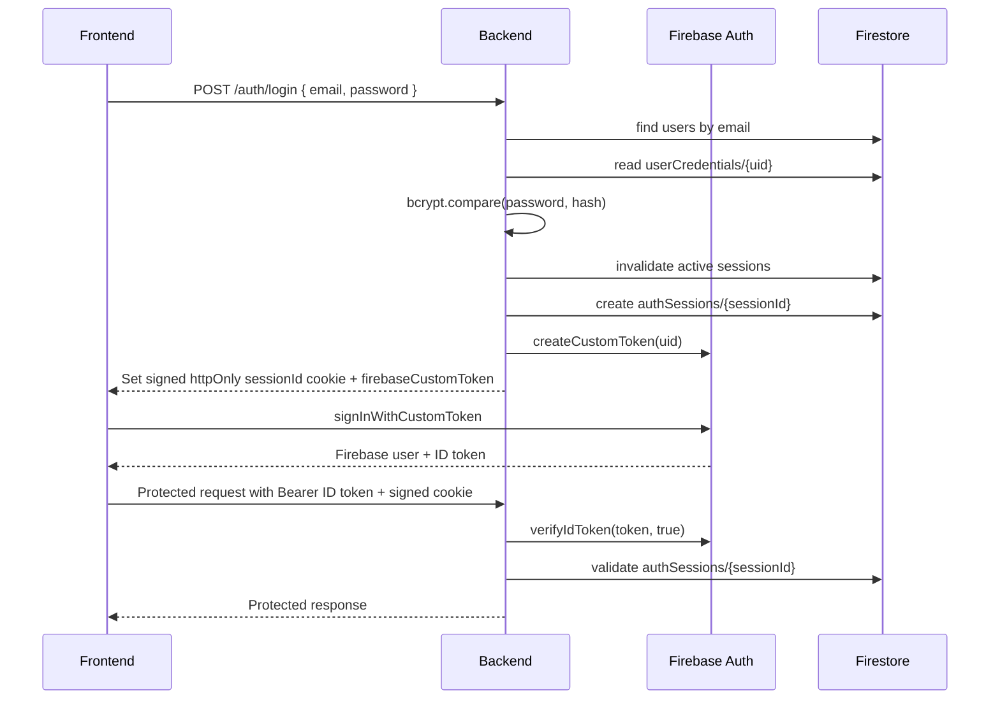
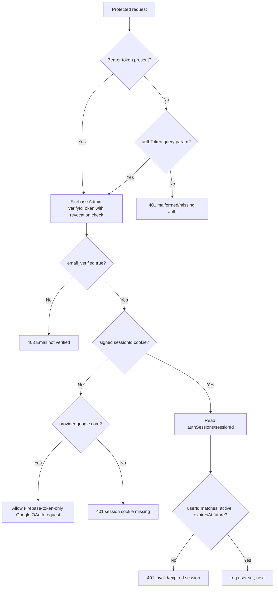

# Security Architecture

## Security Model Summary

The project implements layered security:

- Firebase ID token verification on protected API routes.
- Backend-managed signed session cookies for email/password users.
- Firestore session documents with active/expired checks.
- Email verification requirement.
- Firestore rules that prevent client writes to sensitive backend-owned data.
- Password hashing with bcrypt.
- Account lockout on repeated password failures.
- Strict request validation with Zod.
- Sanitization against dangerous object keys, null bytes, and one SQL-like pattern.
- CORS allowlist with credentials support.
- Helmet security headers.
- Tiered rate limiting.
- Structured error responses with generic production-safe messages.

## Authentication Flow

## Authorization Flow

Authorization is ownership-based rather than role-based. There are no admin roles or role-based access control rules in the current code. Every data operation scopes Firestore paths by `req.user.uid`.

## JWT Handling

`auth.middleware.js` expects a Firebase ID token in `Authorization: Bearer ...` or, for stream compatibility, `authToken` query param. It calls `adminAuth.verifyIdToken(token, true)`, which validates token signature and checks revocation.

The code validates `JWT_AUDIENCE` as an environment variable but does not explicitly use it in token verification.

## Session Handling

Email/password login creates a Firestore document in `authSessions/{sessionId}` and sets a signed cookie:

- `httpOnly: true`
- `secure: true` only in production
- `sameSite: "strict"`
- `maxAge: 1 hour`
- `signed: true`

Session validation checks:

- Firestore session doc exists.
- `sessionData.userId === firebaseUser.uid`.
- `isActive === true`.
- `expiresAt` exists.
- `expiresAt` is in the future.

The middleware implements a sliding session window. If the session is older than 30 minutes, it extends expiry by 1 hour and reissues the cookie.

Limitation: age is calculated from `createdAt`, not `lastActivityAt`, so after the first 30 minutes every request refreshes the session rather than refreshing only after 30 minutes since last refresh.

## Password Storage And Lockout

`auth.service.js` hashes passwords with bcryptjs at 12 salt rounds. It stores hashes in `userCredentials/{uid}`.

Failed login policy:

- Failed passwords increment `failedLoginCount`.
- After 5 failures, `lockedUntil` is set 15 minutes into the future.
- Successful login resets failed count and lock.

Password reset:

- Generates 32 random bytes as 64 hex chars.
- Stores only SHA-256 token hash.
- Token expires after 1 hour.
- Resets password hash, deletes reset token, invalidates sessions.

Production issue: the email provider is a stub and logs reset tokens. Replace this before production use.

## Input Validation

Zod schemas validate:

- Registration, login, forgot-password, reset-password bodies.
- Analysis dataset name, sheet arrays, headers, rows.
- Chat message and analysis ID for `POST /chat`.
- User preferences.

Missing validation:

- `GET /chat/stream` query params are checked for presence but not Zod-validated.
- Route params such as `:analysisId` are not currently validated.
- Reset password complexity is weaker than registration complexity.

## Sanitization

`sanitize.middleware.js` recursively sanitizes body, query, and params:

- Removes object keys `__proto__`, `constructor`, and `prototype`.
- Trims strings.
- Removes null bytes.
- Blocks strings matching `/['"\\;].*--/`.
- Tracks total string length and rejects payloads over 25,000,000 characters with `413`.

Attacks addressed:

- Prototype pollution.
- Null byte injection.
- Some SQL comment-style injection payloads.
- Oversized string payloads.

Limitations:

- Firestore is not SQL, so SQL injection protection is mostly defensive rather than central.
- The SQL pattern is narrow and should not be treated as comprehensive injection prevention.
- Sanitization cannot replace schema validation and safe database APIs.

## CORS

`cors.middleware.js` builds `allowedOrigins` from `ALLOWED_ORIGINS` and appends localhost Vite dev/preview origins in development.

Settings:

- Methods: `GET`, `POST`, `DELETE`, `OPTIONS`.
- Headers: `Content-Type`, `Authorization`.
- Credentials: `true`.
- Preflight cache max age: 86400 seconds.

Security benefit: cross-origin credentialed API use is restricted to known frontend origins.

## Helmet And Security Headers

Helmet configuration in `app.js` includes:

- Content Security Policy.
- `crossOriginEmbedderPolicy: true`.
- `crossOriginOpenerPolicy: same-origin`.
- `referrerPolicy: no-referrer`.
- HSTS in production for one year with subdomains.
- `X-Frame-Options: DENY`.
- `X-Content-Type-Options`.

The API primarily returns JSON, so frontend CSP enforcement for browser-rendered pages depends on the frontend hosting configuration as well.

## Rate Limiting

`rateLimit.middleware.js` defines:

| Limiter | Window | Max | Key | Used By |
|---|---:|---:|---|---|
| Global | 15 minutes | 200 | IP | All routes after middleware mount. |
| Auth | 15 minutes | 20 | IP | All `/auth` routes. |
| AI | 1 minute | 10 | `req.user.uid` or IP | `POST /analyze`. |
| Chat | 1 minute | 5 | `req.user.uid` or IP | `/chat` POST and stream. |

Security benefit: reduces brute force, high-cost AI abuse, and request flooding.

Limitation: express-rate-limit default store is process-local. Multi-instance deployments need shared storage.

## Firestore Rules

`firestore.rules`:

- Denies all client reads/writes to `authSessions` and `userCredentials`.
- Allows verified owner reads of root `users/{userId}`.
- Denies root user writes.
- Allows constrained owner update of `users/{uid}/profile/data`.
- Allows verified owner reads of analyses and messages.
- Denies client writes to analyses, messages, and insight cache.

This complements the backend API by ensuring a malicious client cannot write analysis or credential documents directly through Firebase Client SDK.

## API Protection

Protected routes use `authMiddleware`, then service methods use `req.user.uid` as the Firestore path root. This prevents cross-user access even if a user guesses another `analysisId`, because reads go to `users/{currentUid}/analyses/{analysisId}`.

## XSS And CSRF Considerations

XSS:

- React escapes text by default.
- Chat assistant responses render Markdown through `react-markdown`; raw HTML is not enabled in the inspected code.
- Helmet sets API CSP headers, but SPA HTML security headers are controlled by frontend hosting.

CSRF:

- Cookies use `SameSite=Strict`.
- Protected routes also require a valid Firebase bearer token, which third-party sites cannot normally attach.
- No explicit CSRF token is implemented. Given the bearer-token requirement and strict same-site cookie, risk is reduced.

## Replay Attack Considerations

- Firebase token verification includes revocation checks.
- Sessions have expiry and active flags.
- Password reset tokens are single-use because reset deletes the token doc.
- There is no nonce or request signing for ordinary API requests.

## DOS Protection

Implemented:

- Global request rate limit.
- AI/chat rate limits.
- Body parser 50 MB limit.
- Sanitizer total string cap.
- Frontend upload file size max 5 MB.
- Gemini local RPM gate at 12 RPM.

Limitations:

- No distributed rate-limit store.
- No queue worker isolation for analysis jobs.
- Fire-and-forget analysis jobs run in the same process as HTTP handling.

## Error Exposure

The global error middleware returns generic `Internal server error` for unknown failures. Stack traces are logged only in development for global unhandled errors.

Auth service errors expose controlled codes/messages. Validation errors return field issue details, which is useful for clients but should be monitored to ensure no sensitive internals appear.

## File Upload Security

The frontend validates file extension and 5 MB size in `FileDropZone.jsx`. Files are parsed in-browser and sent as JSON; the backend does not receive multipart uploads or store raw files.

Supported extensions:

- `.csv`
- `.xlsx`
- `.xls`

Limitations:

- Frontend file checks can be bypassed by direct API calls; backend relies on JSON schema/size/sanitization rather than file MIME checks.
- Large parsed JSON can still be expensive within allowed limits.

## Dependency Security

No automated dependency audit configuration is present in the repository. `package-lock.json` exists for both apps, enabling reproducible installs. Recommended production workflow should include `npm audit`, Dependabot/Renovate, and CI gating for critical vulnerabilities.

## Production Hardening Checklist

Implemented:

- Fail-fast environment validation.
- Secure cookies in production.
- HSTS in production.
- CORS allowlist.
- Firebase token revocation checks.
- Password hashing.
- Lockout.
- Rate limiting.
- Firestore rules.

Needs improvement:

- Replace password reset logging stub with real email provider.
- Delete all user-related documents on account deletion.
- Add shared rate-limit/cache store for scaling.
- Validate route params and streaming query params.
- Add production frontend security headers.
- Add dependency scanning.
- Add audit logging policy for security-sensitive events.
- Consider disabling token-in-query auth or limiting it to SSE-only with short-lived stream tokens.

