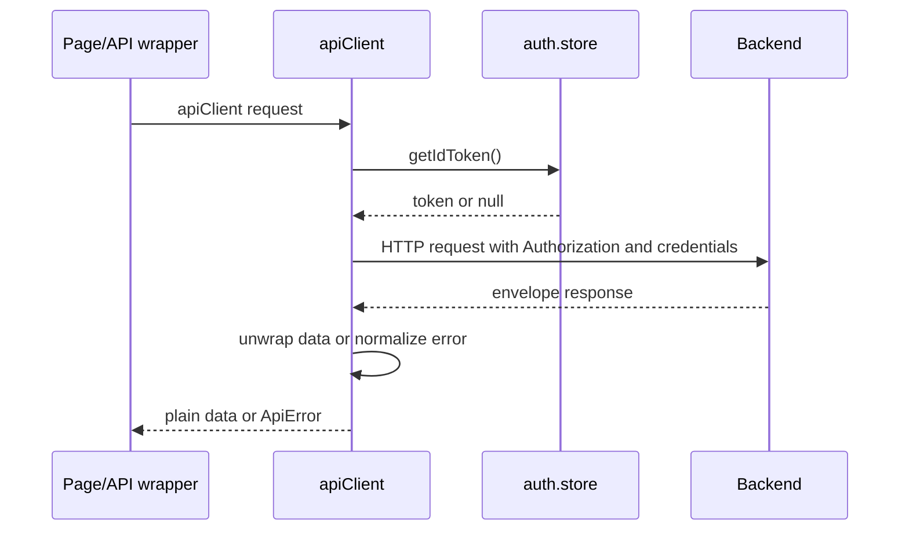
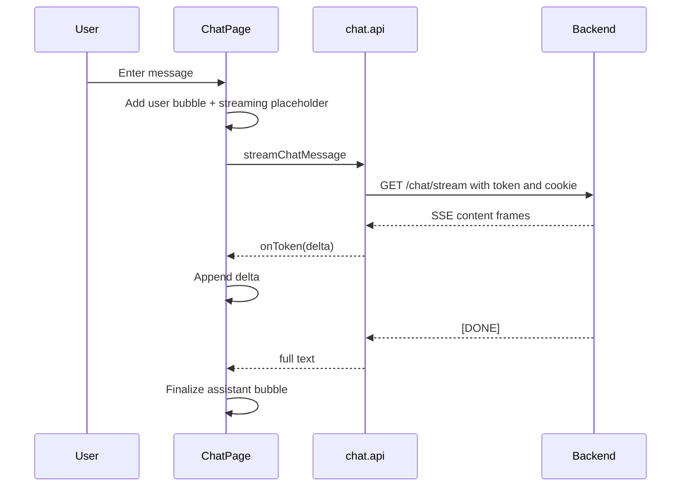
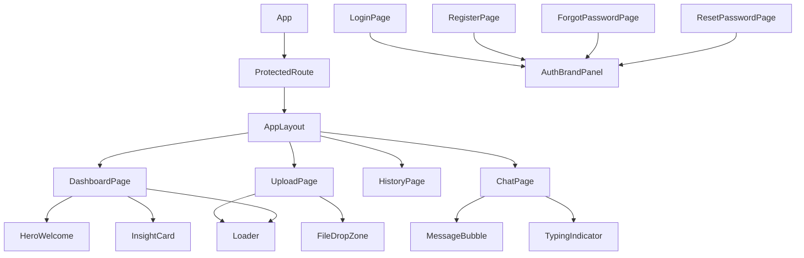

# Frontend Architecture

## Frontend Summary

The frontend is a React 19 single-page application built with Vite. It handles authentication UI, Firebase browser auth state, file parsing, API calls, dashboard rendering, analysis history, and streaming chat.

## Application Entry And Routing

`src/main.jsx` mounts `<App />` into `#root` inside React `StrictMode`.

`src/App.jsx` defines:

- Root redirect from `/` to `/dashboard` or `/login`.
- Public-only routes: `/login`, `/register`, `/forgot-password`.
- Reset route: `/reset-password`.
- Protected routes under `ProtectedRoute` and `AppLayout`: `/dashboard`, `/upload`, `/history`, `/chat`.
- Route-level `ErrorBoundary` wrappers.
- `NotFoundPage`.

```mermaid
graph TD
    APP[App.jsx] --> USEAUTH[useAuth]
    APP --> ROUTER[BrowserRouter]
    ROUTER --> ROOT[/]
    ROUTER --> PUBLIC[PublicOnlyRoute]
    PUBLIC --> LOGIN[/login]
    PUBLIC --> REGISTER[/register]
    PUBLIC --> FORGOT[/forgot-password]
    ROUTER --> RESET[/reset-password]
    ROUTER --> PROTECTED[ProtectedRoute]
    PROTECTED --> LAYOUT[AppLayout]
    LAYOUT --> DASH[/dashboard]
    LAYOUT --> UPLOAD[/upload]
    LAYOUT --> HISTORY[/history]
    LAYOUT --> CHAT[/chat]
```

## Authentication State

`src/hooks/useAuth.js` registers `onAuthStateChanged(auth, callback)` once from `App.jsx`. It:

- Reads the Firebase ID token when a user is present.
- Updates `auth.store`.
- Clears analysis state/history on sign-out.
- Clears analysis state/history on UID change to prevent data leakage between accounts.

`src/store/auth.store.js` holds:

- `user`
- `idToken`
- `isLoading`
- `setUser`
- `clearUser`
- `getIdToken`
- selectors such as `selectAuthStatus`

`getIdToken` refreshes through Firebase user methods and clears the user after repeated token failure.

## Firebase Client

`src/lib/firebase.client.js` initializes Firebase from Vite env vars:

- `VITE_FIREBASE_API_KEY`
- `VITE_FIREBASE_AUTH_DOMAIN`
- `VITE_FIREBASE_PROJECT_ID`
- `VITE_FIREBASE_STORAGE_BUCKET`
- `VITE_FIREBASE_MESSAGING_SENDER_ID`
- `VITE_FIREBASE_APP_ID`

It exports:

- `auth`
- `signInWithGoogle`
- `signInWithEmail`
- `signInWithToken`
- `registerWithEmail`
- `signOut`

The app sets Firebase persistence to `browserSessionPersistence`, so browser auth state is session-only.

## API Integration

`src/api/client.js` creates an Axios instance:

- `baseURL: import.meta.env.VITE_API_BASE_URL`
- `timeout: 15000`
- `withCredentials: true`

Request interceptor:

- Calls `auth.store.getIdToken()`.
- Adds `Authorization: Bearer <token>` when available.
- Logs request metadata in development.

Response interceptor:

- Logs responses.
- Unwraps backend envelope `{ success, data, meta }`.
- Converts errors into `ApiError`.
- On `401`, retries once after token refresh; if refresh fails, clears user and redirects to `/login`.



## API Modules

| Module | Responsibilities |
|---|---|
| `auth.api.js` | Login, register, logout, forgot password, reset password. |
| `analyze.api.js` | Submit analysis, get analysis, list analyses, delete analysis. |
| `chat.api.js` | Non-streaming chat, history fetch, SSE streaming chat through `fetch`. |
| `ApiError.js` | Uniform client error class and conversion helper. |

## State Management

### Auth Store

Authentication store is not persisted. It mirrors Firebase session state and token state.

### Analysis Store

`src/store/analysis.store.js` uses Zustand with `persist`, `createJSONStorage`, `sessionStorage`, and `immer`.

It stores:

- Current analysis fields: `analysisId`, `datasetName`, `rowCount`, `headers`, `insights`, `chartData`, `aiSummary`, `createdAt`, `status`.
- History cache: `historyList`, `historyFetchedAt`.

Actions:

- `setAnalysis`
- `clearAnalysis`
- `setHistory`
- `removeFromHistory`
- `invalidateHistory`
- `clearHistory`

The store is cleared on sign-out and account switch by `useAuth`.

## Protected Routes

`ProtectedRoute.jsx` reads `selectAuthStatus`:

- `loading`: renders full-screen restoring-session spinner.
- not authed: redirects to `/login`.
- authed: renders `<Outlet />`.

`PublicOnlyRoute` in `App.jsx` prevents authenticated users from visiting login/register/forgot password pages.

## Page Architecture

### Login Page

Supports:

- Google popup sign-in via Firebase client.
- Email/password login through backend `/auth/login`.
- Custom token bridge via `signInWithToken(firebaseCustomToken)`.
- User-friendly lockout errors.

### Register Page

Supports:

- Google sign-up.
- Backend `/auth/register` email/password registration.
- Immediate Firebase client sign-in with custom token.

Frontend validation is less strict than backend validation: it checks password length and confirmation, while the backend also requires uppercase and number.

### Forgot Password Page

Calls backend forgot-password endpoint and always shows non-enumerating success copy when the request succeeds.

### Reset Password Page

Reads `token` query param, validates 64 hex characters client-side, submits `token` and `newPassword` to backend, and redirects user to login after success.

### Upload Page

Three-step wizard:

1. Upload file through `FileDropZone`.
2. Parse and preview first 10 rows.
3. Submit for analysis.

It sends:

```js
{
  datasetName: file.name without extension,
  sheets: parsedData.sheets,
  rows: parsedData.rows,
  headers: parsedData.headers
}
```

The legacy `rows` and `headers` fields are included for backward compatibility.

After submit:

- `setAnalysis(result)`.
- `invalidateHistory()`.
- Navigate to `/dashboard`.

### Dashboard Page

Dashboard reads current analysis from `analysis.store`. If none exists, it renders `HeroWelcome`.

If an analysis exists, it renders:

- Analysis context bar and switch dataset dropdown.
- Summary cards.
- Processing banner while `status === "processing"`.
- Column statistics chart from `chartData.barStats`.
- LLM-generated charts from `chartData.charts`.
- Optional time-series chart if `chartData.timeSeries` exists.
- Insight cards.
- Recommended actions.

It uses `useAnalysisPoller` to fetch `GET /analyze/:analysisId` every 4 seconds while processing, stopping after 30 attempts.

### History Page

History cache is considered fresh for 5 minutes.

Behavior:

- If no cache and stale: show page loader.
- If cache exists and stale: render stale cache and background refresh.
- Group analyses by `dataHash`.
- Each card supports Chat, Dashboard, and Delete actions.
- Delete optimistically removes from cache and clears current analysis if it was deleted.

### Chat Page

Features:

- Loads persisted history on mount.
- Adds optimistic user and assistant placeholder messages.
- Streams chat from `/chat/stream` with `fetch`.
- Falls back to `POST /chat` if streaming fails.
- Allows aborting an active stream.
- Renders assistant Markdown with `react-markdown` and `remark-gfm`.
- Enforces 500-character input limit on the client.



## Component Relationships



## File Parser

`src/utils/fileParser.util.js`:

- CSV: Papa Parse with `header: true`, `skipEmptyLines: true`, `dynamicTyping: true`.
- Excel: FileReader + SheetJS `XLSX.read`, then `sheet_to_json` for each worksheet.
- Cleanup removes fully empty columns, removes rows with more than 80 percent nulls, trims strings, and converts missing values to `null`.
- Returns `{ sheets, rows, headers }`, where `rows` and `headers` represent the first non-empty sheet.

```mermaid
flowchart TD
    File[Uploaded File] --> Ext{Extension}
    Ext -->|csv| Papa[Papa.parse]
    Ext -->|xlsx/xls| XLSX[XLSX.read]
    Papa --> Clean[cleanRows]
    XLSX --> Sheets[Parse each worksheet]
    Sheets --> Clean
    Clean --> Output[{ sheets, rows, headers }]
```

## Build Process

Frontend scripts:

- `npm run dev`: Vite dev server.
- `npm run build`: Vite production build into `dist`.
- `npm run lint`: ESLint.
- `npm run preview`: Preview built app.

The app has no explicit test script in the frontend package.

## Rendering Strategy

The frontend is a client-rendered SPA. There is no SSR, Next.js, or server component system. Auth state is restored client-side through Firebase.

## Performance Optimizations

Implemented:

- Client-side file parsing avoids raw file upload storage.
- Session storage persistence avoids re-fetching current analysis on navigation.
- History cache has 5-minute freshness window.
- Dashboard poller stops after bounded attempts.
- Recharts render from compact chart data, not full raw datasets.
- File size is limited to 5 MB.
- Dev logger compiles to no-ops in production builds through `import.meta.env.DEV`.

Potential improvements:

- Split very large page components.
- Use virtualization for large history lists.
- Add abort control for analysis polling requests.
- Add route-level code splitting.
- Add frontend automated tests.

