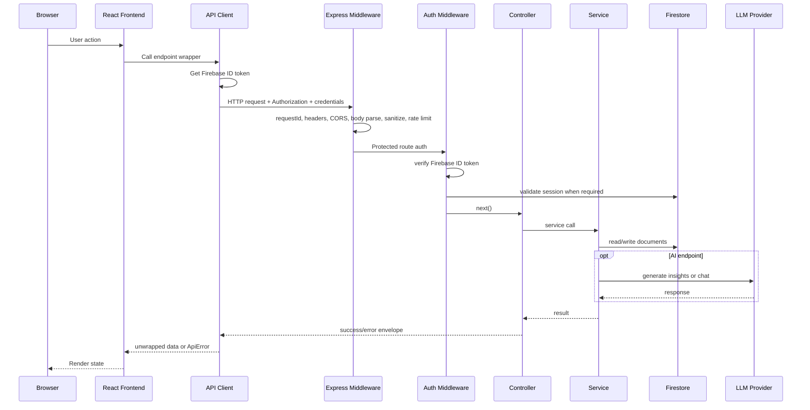
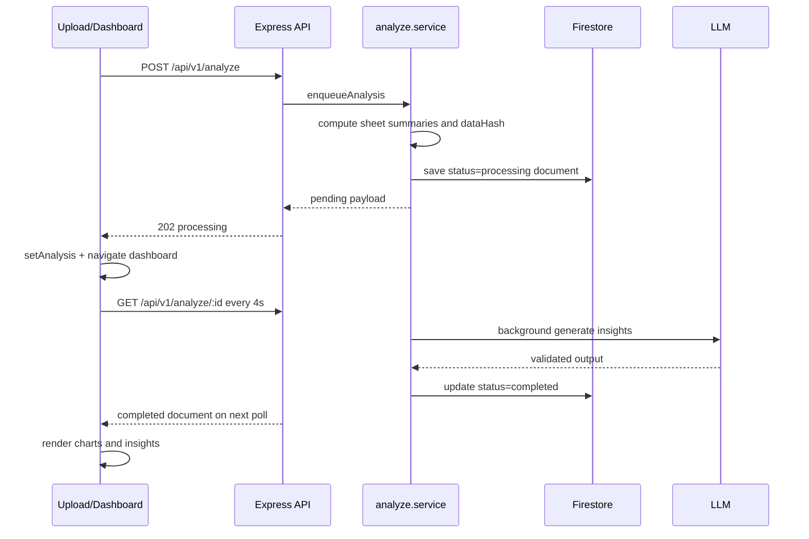
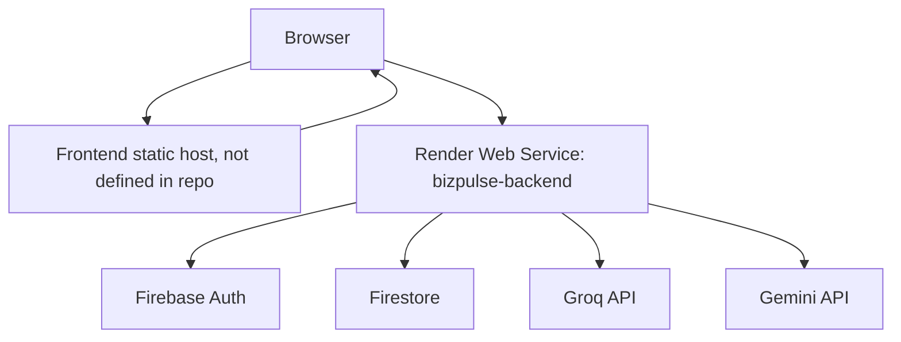

# Features, AI, Request Lifecycle, Performance, And Deployment

## Implemented Features

| Feature | Backend Implementation | Frontend Implementation | Database Involvement |
|---|---|---|---|
| Email/password registration | `auth.service.registerUser`, `auth.controller.register` | `Register.page.jsx`, `auth.api.registerUser`, `signInWithToken` | `users`, `userCredentials`, `users/{uid}/profile/data`, Firebase Auth |
| Email/password login | `auth.service.loginUser`, sessions | `Login.page.jsx`, `auth.api.loginWithEmailPassword` | `authSessions`, `userCredentials`, `users` |
| Google sign-in | `auth.middleware` allows Google provider without session cookie | `signInWithGoogle` on login/register pages | Firebase Auth |
| Password reset | `forgotPassword`, `resetPassword` | Forgot/reset password pages | `passwordResetTokens`, `userCredentials`, `authSessions` |
| Protected API access | `auth.middleware` | Axios interceptor attaches Firebase ID token and cookies | `authSessions` |
| File upload and parsing | Backend receives parsed JSON | `FileDropZone`, `fileParser.util.js`, `Upload.page.jsx` | None before submit |
| Multi-sheet analysis | `analyze.schema`, `analyze.service.normalizeSheets` | XLSX parser returns all sheets | `users/{uid}/analyses` |
| Async analysis jobs | `enqueueAnalysis`, `processAnalysisJob` | `useAnalysisPoller` | `analyses/{analysisId}` status updates |
| AI insights | `llm.service`, `groq.service`, `gemini.service`, `responseMapper` | Dashboard insight cards and charts | `analyses`, `insightCache` |
| History | `GET /analyze`, `cache.service.getAllAnalyses` | `History.page.jsx`, cached in Zustand | `analyses` |
| Chat | `chat.service.sendMessage` | `Chat.page.jsx` | `messages`, parent analysis activity fields |
| Streaming chat | `chat.controller.stream`, `chat.service.streamMessage` | `streamChatMessage` using `fetch` | `messages` after stream completes |
| Analysis deletion | `cache.service.deleteAnalysis` | History delete flow | Deletes analysis doc and messages |
| User preferences | `user.service.updatePreferences` | API wrapper exists indirectly through backend route; no dedicated inspected page uses it | `users/{uid}` |
| Account deletion | `user.service.deleteAccount` | API route exists; no inspected frontend page calls it | Deletes some user data and Firebase Auth user |

## Request Lifecycle



## API Lifecycle For Async Analysis



## Data Flow

```mermaid
flowchart TD
    File[CSV/XLS/XLSX] --> Parser[Frontend parser]
    Parser --> Sheets[{ sheets, rows, headers }]
    Sheets --> AnalyzeAPI[POST /analyze]
    AnalyzeAPI --> Stats[Backend stats builder]
    Stats --> Prompt[Prompt builder]
    Prompt --> Provider[Groq or Gemini]
    Provider --> Validate[JSON parse + Zod validation]
    Validate --> Mapper[Response mapper]
    Mapper --> Firestore[Analysis document]
    Firestore --> Dashboard[Charts/Insights]
    Firestore --> ChatContext[Chat context builder]
    ChatContext --> ChatLLM[Chat LLM]
    ChatLLM --> Messages[Messages subcollection]
```

## AI Components

### LLM Integration

Implemented providers:

- Groq SDK with model `meta-llama/llama-4-scout-17b-16e-instruct`.
- Google Generative AI SDK with `gemini-2.5-flash`.

Provider routing:

- `llm.service.js` uses Groq first when configured and primary.
- Gemini is fallback for recoverable Groq errors.
- If Groq is disabled, Gemini is used directly.

### Prompt Construction

Analysis prompts are built by `buildAnalysisPrompt` in `promptBuilder.util.js`. The prompt includes:

- System instruction requiring valid JSON only.
- Dataset name.
- Sheet count.
- Per-sheet row count, column count, computed column stats, and sample rows.
- Required output schema.
- Instruction to generate exactly 5 insights.
- Enum constraints for severity and type.
- Sheet-name/header correctness instructions.

Chat prompts are built by `buildChatPrompt` in `gemini.service.js`. They include:

- Senior analytics assistant persona.
- Response rules for concise Markdown.
- Multi-sheet instructions when applicable.
- Compressed dataset context.
- Last 5 conversation messages.
- User question.

### Embeddings, Vector DB, RAG

Not present. The repository does not implement embeddings, vector search, hybrid retrieval, RAG citations, or citation generation. Chat context is built directly from persisted analysis summaries and recent messages.

### Context Building

`chat.service.buildChatContext` prefers multi-sheet context:

- Dataset name.
- Sheet count.
- Total row count.
- For each sheet: name, row count, column count, column stats, up to 5 sample rows.

`gemini.service.compressChatContext` trims sample rows to 3 in the prompt.

### Fallback Logic

Recoverable Groq failures fall back to Gemini:

- `GROQ_NOT_CONFIGURED`
- `GROQ_RATE_LIMITED`
- `GROQ_TRANSIENT`
- `LLM_INVALID_OUTPUT`

Gemini itself retries transient and rate-limited errors with controlled behavior. Chat rate limits fail fast rather than waiting long cooldowns.

### Caching

- Per-user Firestore insight cache: `users/{uid}/insightCache/{dataHash}`, 24-hour TTL.
- Process-local chat Q&A cache: 5-minute TTL, max 500 entries.
- Process-local Gemini RPM gate: caps at 12 calls/minute.

### Token Optimization

Implemented:

- Analysis sends summaries and sample rows rather than full raw data.
- Chat compresses context and keeps recent history to last 5 messages.
- Groq insights max tokens reduced to 4096.
- Chat responses capped to 2048 output tokens.

### Evaluation Strategy

No formal LLM evaluation suite is present. Existing tests cover some prompt and service behavior but not output quality, regression scoring, hallucination rate, or provider fallback in integration.

## Feature Workflows

### Upload And Analysis

Problem solved: turn uploaded spreadsheets into actionable insights.

Backend:

- Validates dataset shape.
- Computes deterministic stats.
- Uses cache/LLM.
- Persists status transitions.

Frontend:

- Validates file extension/size.
- Parses client-side.
- Shows preview.
- Submits and polls.

Security:

- Protected route.
- Body validation and sanitization.
- Rate limited.
- Anonymous row cap.

Limitations:

- No server-side file scanning because files are not uploaded as files.
- No queue system for background jobs.
- No pagination for very large history.

### Chat With Data

Problem solved: natural-language follow-up on a dataset.

Backend:

- Builds context from analysis.
- Uses metadata fast path.
- Streams provider output.
- Persists turns.

Frontend:

- Restores history.
- Streams token deltas.
- Renders Markdown.
- Falls back to non-streaming POST.

Security:

- Auth protected.
- Chat body validation on POST.
- Chat limiter.

Limitations:

- Streaming query validation is minimal.
- Prompt context is not backed by retrieval over raw rows.

### History

Problem solved: return to previous analyses and conversations.

Backend:

- Lists Firestore analysis docs.
- Deletes analysis and messages.

Frontend:

- Caches history for 5 minutes.
- Groups by `dataHash`.
- Optimistically removes deleted entries.

Limitations:

- No pagination.
- Hash is based on sheet names, headers, and row counts, not full content.

## Performance Architecture

Implemented techniques:

- Client-side file parsing.
- Body size limits.
- Sanitizer total string cap.
- Async analysis for authenticated users.
- Analysis polling instead of long request wait.
- Firestore insight cache.
- Chat metadata fast path.
- In-memory chat answer cache.
- Gemini local RPM gate.
- Frontend history cache.
- Session storage for current analysis.

Not implemented:

- Redis or distributed cache.
- Worker queue.
- Horizontal rate-limit coordination.
- Response compression middleware.
- Cursor pagination.
- Batch processing queue.
- Raw-row aggregation for time-series charts.

## Deployment Architecture



`render.yaml` defines the backend service:

- Type: web.
- Runtime: Node.
- Region: Singapore.
- Plan: free.
- Build command: `npm install`.
- Start command: `node server.js`.
- Health check: `/health`.

The repository does not include frontend deployment config. The backend README mentions Vercel as a likely frontend host, but no `vercel.json` is present.

